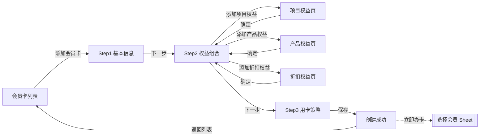
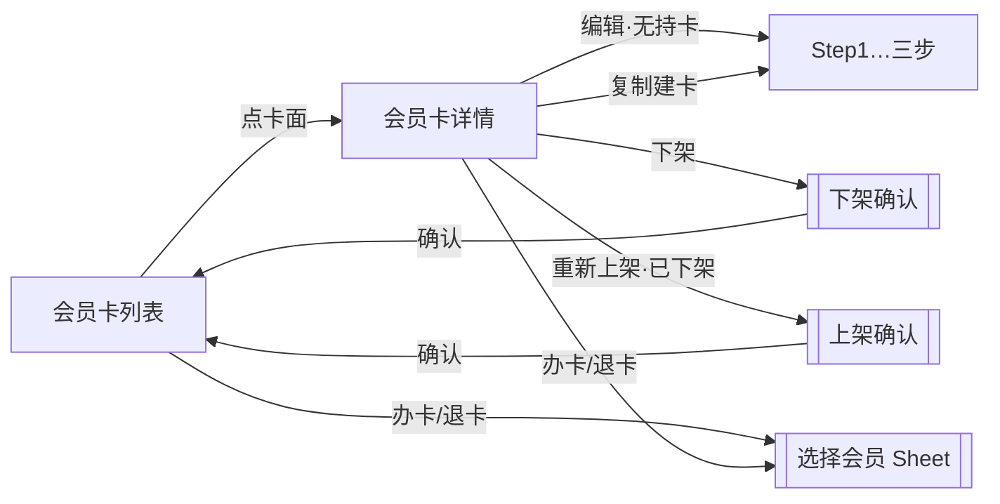

# PRD：会员卡管理（商户端）· 精简版

| 字段 | 内容 |
|------|------|
| 文档版本 | v1.4-lite |
| 日期 | 2026-07-24 |
| 文档类型 | **精简版**（仅模块 1–3；无 3.1 视觉索引） |
| 完整规格 | 同目录 `PRD-会员卡管理.md`（含状态机 / 功能规格 / 接口 / 验收等） |
| 交互原型（唯一可视依据） | 同目录 `demo.html`（中文镜像：`剑琅联盟-RTB重构.html`） |
| 画布 | 390 × 844 |
| 目的 | 快速对齐背景、场景与信息架构；落地细节以完整稿 + 原型为准 |

---

## 怎么读这份 PRD

正文按模块编排。**不用通读全文**，按角色跳章即可。

| # | 模块 | 前端 | 后端 | 测试 | 说明 |
|---|------|:----:|:----:|:----:|------|
| 1 | 背景 / 目标 / 范围 / 能力映射 | ✓ | ✓ | ✓ | 防范围蔓延 |
| 2 | 用户场景与成功标准 | ✓ | 了解 | ✓ | 测「业务对不对」 |
| 3 | 信息架构与页面清单 | ✓ | 了解 | ✓ | 做哪些页 |

**先读这几条（贯穿全文）**

1. 新系统用 **权益组合**（面值 / 项目 / **产品** / 折扣）建卡，**不再选「五种卡类型」**；整套取代旧会员卡系统。  
2. 创建固定 **三步**：基本信息 → 权益组合 → 用卡策略；Step2 **至少开启并配置一类权益**。  
3. **当前有效持卡数 > 0** 时模板 **不可编辑**（可复制建卡、可下架、可经结账办卡/退卡/延期）。  
4. **已下架**不可新办；已持卡仍可退卡/延期；可重新上架或复制建卡。  
5. **办卡**：选择会员 Sheet **单选**一位未持卡会员 → **「去结账」** → 开单结账完成支付 → 办卡成功（来自结账时底栏可为「返回开单」）。  
6. 退卡为 **整卡退**；建议退款可按策略计算，**实际退款金额可改**后确认。  
7. 用卡策略两轨独立；公式随卡型（组合 / 纯折扣 / 不限次）变化；均值分母为面值 + 有限次项目权重 + **产品数量权重**。  
8. 接口路径/字段名以联调为准；本文给 **能力与规则**，标 `【待联调确认】` 处不臆造现网 URL。

交互行为与文案以 **`demo.html` 当前表现** 为准。本文为精简版；状态机、交互细则、功能规格、接口、验收等见完整稿 `PRD-会员卡管理.md`。

---

# 模块 1　背景 / 目标 / 范围 / 能力映射
> 读者：前端 ✓ · 后端 ✓ · 测试 ✓

## 1.1 背景

原先的会员卡系统将卡划分为 **5 种固定类型**，每种类型套用 **预设模板字段**。商户创建会员卡时：

- 只能在类型预设内填字段，**自由度不足**；
- 每次都要面对 **繁复的设置页** 逐项填充，创建成本高。

本期交付的「会员卡管理」将 **整套取代** 上述旧系统（非长期并行两套产品线），对字段按能力重新解构。

## 1.2 目标

| 目标 | 说明 |
|------|------|
| 取代旧系统 | 新建模与流程成为唯一建卡体系 |
| 能力覆盖 | 可配置出与旧五类 **功能等价** 的卡，也可配置旧体系 **无法做出** 的组合卡 |
| 创建更简 | 三步完成：基本信息 → 权益组合 → 用卡策略 |
| 运营闭环 | 列表 / 详情 / 上下架 / 复制 / 办卡 / 延期 / 整卡退卡 |
| 策略可配置 | 退卡消耗与员工业绩规则在建卡时选定并随模板保存 |

## 1.3 本期做（In）

- 会员卡模板：创建、编辑（无持卡时）、复制建卡、在售/已下架列表与详情  
- 权益组合：面值（金额与赠送；**可用于办卡/购卡**，含被购卡无面值；**不可**用于购买价目产品）、项目（每项/共计、购买/赠送/不限次；**每项拆成一项目一票**）、**产品（行内数量，一种产品一票，不可不限量）**、折扣（比例/固定金额）；均可配置多张权益 ticket  
 
- 卡面主题色（5 色）、卡有效期限（日/月/年/永久，受不限次与「是否含项目/折扣」约束）  
- 用卡策略：消耗及退卡计算规则、业绩计算规则（含总权益面值明细）  
- 办卡：单选既存会员 → 去结账支付 → 办卡成功  
- 已持卡：延期、整卡退卡（估值 + 实退可改）  
- 上下架及文案提示  

## 1.4 本期不做（Out）

- **开单结账**全链路规格 — 不在本文展开；但 **办卡必须依赖开单结账模块完成收款**（未就绪时 toast「开单结账模块未就绪」）  
- **价目表**作为独立产品交付 — 不在本文展开；规格见同目录 `PRD-项目创建与管理.md`。建卡「选项目/产品」与「管理价目表」依赖价目数据（项目 Tab / 产品 Tab）  
- **会员管理**（会员 CRUD；办卡仅从既存会员列表 **单选**）  
- 部分退卡、劳动业绩独立运算台、预约联调  
- 原型工具栏「无数据/有数据」造数按钮 — **仅演示**，不进正式产品  

## 1.5 旧能力 ↔ 新组合权益（能力映射，不写废弃产品名）

| 旧体系常见能力（语义） | 新体系如何配置 |
|------------------------|----------------|
| 储值/充值类（买赠面值） | 开启 **面值**：填面值金额；赠送 = 面值 − 购买金额（自动）；面值 **可用于办卡/购卡**（含被购卡无面值），**不可**用于购买价目产品 |
| 次卡/项目次数类 | 开启 **项目**：选适用项目；每项或共计；购买/赠送次数或不定次；保存后每项 = 一项目一 ticket |
| 产品次数/礼品类 | 开启 **产品**：行内设数量（qty≥1 为已选）；一种产品一张 ticket；禁止不限量 |
| 折扣/会员价类 | 开启 **折扣**：选适用项目；标尺折扣或固定金额 |
| 期限卡 | Step1 **有效期限**；含不限次项目时不可为「永久」 |
| 组合（储值+项目+折扣等） | Step2 **同时开启多类权益** 并分别配置 |
| 旧类型无法覆盖的组合 | 任意权益开关组合 + 独立用卡策略 |

映射不足时 **以新字段与原型行为为准**，不编造旧系统字段表。

---

# 模块 2　用户场景与成功标准
> 读者：前端 ✓ · 后端 了解 · 测试 ✓

## 2.1 角色

| 角色 | 说明 |
|------|------|
| 店主（默认） | 可进行本文全部操作 |
| 店员 | **【待产品确认】** 本期原型未表现差异；权限占位见完整稿 |

## 2.2 核心场景

| 场景 | 用户期望 |
|------|----------|
| 首次建卡 | 三步填完保存 → 上架 → 可立即办卡 |
| 配置组合权益 | 面值/项目/产品/折扣按需勾选配置，预览卡面 |
| 有持卡后改规则 | 不能直接编辑模板；复制建卡后改新卡 |
| 停售 | 下架后新客不能办；已持卡不受影响 |
| 再开售 | 重新上架后可再办 |
| 为会员办卡 | 单选未持该卡的会员 → 去结账完成支付 → 办卡成功 |
| 延期 | 对非永久有效持卡设置延期时长；费用 > 0 走开单支付页，支付成功后再写延期；费用为 0 或选永久则立即生效 |
| 退卡 | 看到建议退款与明细，改实际退款后确认整卡退 |

## 2.3 成功标准（可判定）

1. 空店可创建至少一张在售卡并出现在「在售」列表。  
2. Step2 **至少有一类已配置有效内容的权益** 才能进入 Step3 / 保存成功；开关已开但无内容时 **自动关闭该开关**（不拦截下一步；细则见完整稿）。  
3. `当前有效持卡 > 0` 时详情「编辑」不可用，并提示复制建卡。  
4. 已下架卡列表无「办卡」入口；详情可「已持卡管理」（退卡/延期）。  
5. 支付成功办卡后，持卡人数/办卡次数等运营数据按规则增加。  
6. 退卡确认后该会员不再作为有效持卡；实退金额以确认值为准写入结果提示。

---

# 模块 3　信息架构与页面清单
> 读者：前端 ✓ · 后端 了解 · 测试 ✓

## 3.0 页面流（示意）

方块 = 页面；实线箭头 = 主跳转；虚线 = Sheet / 侧页。办卡收款依赖「开单结账」外模块，不在本图展开（细则见完整稿）。

### 建卡主链



### 运营主链



说明：选择会员后「去结账」进入开单结账；退卡走「退卡估值」Sheet。编辑锁定、Tab 在售/已下架等见完整稿模块 4。

```
会员卡管理
 ├─ 列表（在售 / 已下架）
 ├─ 添加/编辑/复制 · Step1 基本信息
 ├─ Step2 权益组合
 │    ├─ 添加/编辑项目权益（标题栏「管理价目表」）
 │    ├─ 添加/编辑产品权益（标题栏「管理价目表」）
 │    └─ 添加/编辑折扣权益（标题栏「管理价目表」）
 ├─ Step3 用卡策略
 ├─ 创建成功
 ├─ 会员卡详情（在售无底栏；已下架有「重新上架 | 已持卡管理」）
 ├─ 办卡成功（底栏：返回列表 / 继续办卡；来自结账时可为「返回开单」）
 └─ Sheets / 弹层
      ├─ 选择会员（办卡 · 单选 · 去结账 | 退卡/延期）
      ├─ 退卡估值
      ├─ 下架确认 / 重新上架确认（居中 sheet）
      ├─ 设置有效期限（不限次与永久冲突）
      ├─ 总权益面值计算明细 / 计次模式说明 / 运营数据说明
      └─ 金额键盘
```

| 页面/层 | 导航标题（原型） | 说明 |
|---------|------------------|------|
| 列表 | 会员卡管理 | Tab：在售 / 已下架；底栏「添加会员卡」；空态可点插图创建 |
| Step1 | 添加会员卡 / 编辑会员卡 | 基本信息 + 卡面模板；步骤条「第 1/3 步 · 基本信息」 |
| Step2 | 权益组合 | 四类权益 Switch（面值/项目/产品/折扣）+ 多 ticket；步骤条第 2/3 步 |
| Step3 | 用卡策略 | 退卡规则 + 业绩规则；步骤条第 3/3 步；保存 |
| 创建成功 | — | 返回列表 / 立即为会员办卡 |
| 详情 | 会员卡详情 | 运营数据 + 卡面信息；在售顶栏下架/编辑 |
| 项目权益页 | 添加/编辑项目权益 | 适用项目 + 分组筛选 + 权益参数；页内「确定」；「管理价目表」 |
| 产品权益页 | 添加/编辑产品权益 | 适用产品 + 分组筛选 + **行内数量步进**；页内「确定」；「管理价目表」 |
| 折扣权益页 | 添加/编辑折扣权益 | 同上结构（含分组筛选；仅服务项目） |
| 办卡成功 | — | 返回列表或返回开单 / 继续办卡 |
| 选择会员 | 选择会员 | 办卡 Tab 单选 +「去结账」；退卡/延期 Tab |
| 退卡估值 | 退卡估值 | 办卡实付 / 消耗 / 明细 / 建议退款 / 实退 |
| 下架/上架 | 下架会员卡 / 重新上架 | 居中确认 sheet |

实现路由建议（名称可调整）：`card-list` / `card-step1` / `card-step2` / `card-step3` / `card-create-success` / `card-detail` / `card-project-benefit` / `card-discount-benefit` / `card-issue-success` + sheets；办卡支付复用开单结账路由。

---

---

# 交付说明（精简版）

| 交付 | 说明 |
|------|------|
| 本文 `PRD-会员卡管理-精简版.md` | 仅模块 1–3（无 3.1） |
| 完整稿 `PRD-会员卡管理.md` | 开发 / 测试落地准稿 |
| 交互原型 `demo.html` | 唯一可视依据 |
