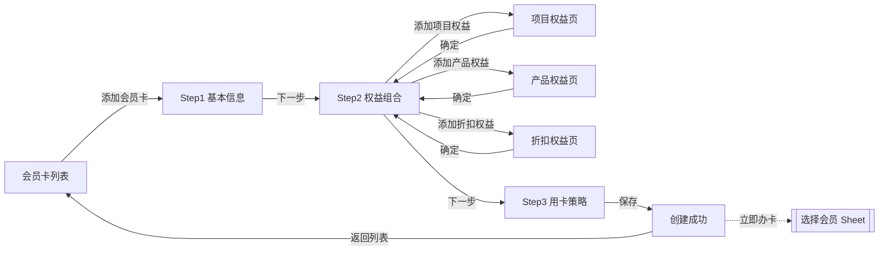
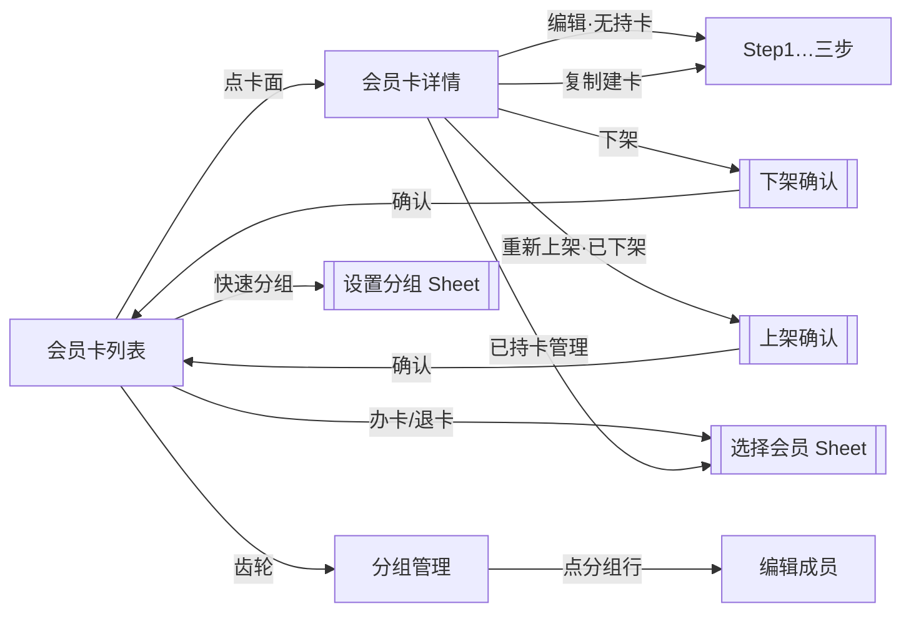

# PRD：会员卡管理（商户端）· 精简版

| 字段 | 内容 |
|------|------|
| 文档版本 | v1.20-lite |
| 日期 | 2026-08-12 |
| 文档类型 | **精简版**（模块 1–3 + **公式摘要** + **本期任务摘要**；无 3.1 视觉索引） |
| 完整规格 | 同目录 `PRD-会员卡管理.md`（含状态机 / 功能规格 / 接口 / 验收 / **模块 8 全量公式** / **模块 13 任务包**） |
| 交互原型（唯一可视依据） | 同目录 `demo.html`（中文镜像：`剑琅联盟-RTB重构.html`） |
| 画布 | 390 × 844 |
| 目的 | 快速对齐背景、场景、信息架构、**关键公式**与**本期目标**；落地细节以完整稿 + 原型为准 |

> **联调一句话**：办卡/收费延期须记账确认回调后入账；**确认办卡**可改应付与办卡日期并必选服务员工；服务员工写单据并同步办卡业绩；退卡仅记实退（纯记账、无资金退回）；金额统一元；旧入口本期全量切新体系。工作台入口为 **「卡管理」**。详见完整稿 §1.6 / §6.10a / §7.7–7.8 / **§8 / §13**。

---

## 怎么读这份 PRD

正文按模块编排。**不用通读全文**，按角色跳章即可。

| # | 模块 | 前端 | 后端 | 测试 | 说明 |
|---|------|:----:|:----:|:----:|------|
| 1 | 背景 / 目标 / 范围 / 能力映射 | ✓ | ✓ | ✓ | 防范围蔓延 |
| 2 | 用户场景与成功标准 | ✓ | 了解 | ✓ | 测「业务对不对」 |
| 3 | 信息架构与页面清单 | ✓ | 了解 | ✓ | 做哪些页 |
| 4 | 公式与策略摘要 | ✓ | **必看** | ✓ | 消耗退卡 / 业绩 / 延期；细则见完整稿 §8 |
| 5 | 本期研发与测试目标摘要 | ✓ | ✓ | ✓ | 任务包索引；细则见完整稿 §13 |

**先读这几条（贯穿全文）**

1. 新系统用 **权益组合**（面值 / 项目 / **产品** / 折扣）建卡，**不再选「五种卡类型」**；整套取代旧会员卡系统。  
2. 创建固定 **三步**：基本信息 → 权益组合 → 用卡策略；Step2 **至少开启并配置一类权益**。  
3. **当前有效持卡数 > 0** 时模板 **不可编辑**（可复制建卡、可下架、可经结账办卡/退卡/延期）。  
4. **已下架**不可新办；已持卡仍可退卡/延期；可重新上架或复制建卡。  
5. **会员卡分组**：列表筛选、分组管理、编辑成员、快速分组；一卡可多组。  
6. **办卡**：选择会员 Sheet **单选**一位未持卡会员 → **「去结账」** → **确认办卡**（会员/卡锁定；**应付**默认可改；**办卡日期**可改；**服务员工**必选 ≥1；**是否选工位**取决于业绩设置·办卡业绩：按工位分配则每人必选工位，平均分配则不要求）→ 开单记账确认 → **记账确认回调**后写持卡与办卡业绩 → 办卡成功（来自结账时底栏可为「返回开单」）。演示种子默认办卡业绩为 **按工位分配**。  
7. 退卡为 **整卡退**；建议退款可按策略计算，**实际退款金额可改**后确认；本期 **仅结束持卡 + 记实退**（纯记账，无资金退回）。  
8. 用卡策略两轨独立；公式随卡型（组合 / 纯折扣 / 不限次）变化；均值分母为面值 + 有限次项目权重 + **产品数量权重**。  
9. **输入边界**（完整稿 **5.5**）：卡名 ≤30；金额 0～999,999.99（**元**）；有效期日/月/年上限 3650/120/10；次数/产品数量 0～999。  
10. 开单记账交接与金额单位已定稿（完整稿 **§7.7 / §7.8**）；其余路径名标 `【待联调确认】` 处不臆造现网 URL。  
11. **旧入口本期全量替换**（完整稿 **§1.6**）：工作台「卡管理」/会员卡管理/顾客详情/开单办卡/旧卡搜索/认领·AI 录卡一律切新体系。  
12. **延期**：纯面值或模板永久仍显示延期入口，点按 toast「该卡永久有效，无需延期」；有期限含折扣展示延期费用，收费须记账确认后再写。  
13. **项目权益 = 独立计次 / 关联计次 双模式**：Step2 四类权益 Switch **默认全部关闭**，打开「项目」开关默认进入 **独立计次**（只设次数，**适用范围 = 会员卡名称（只读不可改）** + 次数；保存后名义项目 = 卡名、**不进价目表**；办卡后开单出**浅金扣次券**一键扣次（单价 = 实付 ÷ 总次数））。**互斥规则：独立计次卡只能有「独立计次」一种权益且只有一个次数池**——其他权益（面值/产品/折扣）已开时禁止切独立计次（toast 提示先关闭）；独立计次模式下其他三个 Switch 置灰禁用（点击 toast「独立计次卡只能配置独立计次权益，其他权益不可开启」）；打开项目 Switch 时若有其他权益已开 → 默认关联计次；保存/下一步防御性强制关闭非法组合。关联计次 = 普通项目权益（每项/共计），**无已保存项时切换即自动展开适用项选择页**（同产品/折扣开关）。  
14. **公式与本期任务**：见本文模块 4–5；全量公式与任务包见完整稿 **§8 / §13**。

交互行为与文案以 **`demo.html` 当前表现** 为准。状态机、交互细则、功能规格、接口、验收等见完整稿 `PRD-会员卡管理.md`。

---

# 模块 1　背景 / 目标 / 范围 / 能力映射
> 读者：前端 ✓ · 后端 ✓ · 测试 ✓

## 1.1 背景

原先的会员卡系统将卡划分为 **5 种固定类型**，每种类型套用 **预设模板字段**。商户创建会员卡时：

- 只能在类型预设内填字段，**自由度不足**；
- 每次都要面对 **繁复的设置页** 逐项填充，创建成本高。

本期交付的「会员卡管理」将 **整套取代** 上述旧系统（非长期并行两套产品线），对字段按能力重新解构。

## 1.2 目标

| 目标 | 说明 |
|------|------|
| 取代旧系统 | 新建模与流程成为唯一建卡体系 |
| 能力覆盖 | 可配置出与旧五类 **功能等价** 的卡，也可配置旧体系 **无法做出** 的组合卡 |
| 创建更简 | 三步完成：基本信息 → 权益组合 → 用卡策略 |
| 运营闭环 | 列表 / 分组 / 详情 / 上下架 / 复制 / 办卡 / 延期 / 整卡退卡 |
| 策略可配置 | 退卡消耗与员工业绩规则在建卡时选定并随模板保存 |

## 1.3 本期做（In）

- 会员卡模板：创建、编辑（无持卡时）、复制建卡、在售/已下架列表与详情  
- **会员卡分组**：自定义分组（名称 ≤20 字、不可重名）；列表筛选轨（全部 + 分组 + 齿轮进管理）；分组管理（拖排序 / 新建 / 重命名 / 删除）；编辑成员（多选卡入组；反选/全选 + **确定**）；列表「快速分组」Sheet（多选加入，可同时属多组）；删除分组 **不删卡**  
- 权益组合：新建默认 **四类 Switch 全部关闭**，按需开启配置；面值（金额与赠送；**仅可用于**抵扣**不含面值**的办卡/购卡、收费延期及项目消费；**不可**用于含面值办卡、**不可**购买价目产品）、项目（**独立计次 / 关联计次 双模式**：打开项目开关默认独立计次 = 只设次数 + 适用范围（=卡名只读），名义项目不进价目表，**与面值/产品/折扣互斥（只能有独立计次一种权益 + 单一次数池）**；关联计次 = 每项/共计、购买/赠送/不限次；**每项拆成一项目一票**）、**产品（行内数量，一种产品一票，不可不限量）**、折扣（比例/固定金额）；均可配置多张权益 ticket  
 
- 卡面主题色（5 色：蜜桃/薄荷/雾霾/香芋/奶茶，默认蜜桃）、卡有效期限（日/月/年/永久；含项目/产品/折扣时受期限约束；含不限次项目时不可为永久）  
- 卡面「期限」展示：纯面值卡（无论是否设有效期）恒为「永久有效」；含面值 + 其他权益且有效期非永久时展示「有效期 ·面值永久有效」（如「1年 ·面值永久有效」）；其余卡展示卡有效期  
- 用卡策略：消耗及退卡计算规则、业绩计算规则（含总权益面值明细）  
- 办卡：单选既存会员 → 「去结账」→ **确认办卡**（应付可改、办卡日期、服务员工）→ 开单记账确认 → **记账确认回调入账** → 办卡成功  
- 已持卡：延期（免费立即写；收费须记账确认后再写；纯面值/模板永久 toast 无需延期）、整卡退卡（估值 + 实退可改；仅记账）  
- 上下架及文案提示  
- **旧入口全量替换**（见完整稿 §1.6）  

## 1.4 本期不做（Out）

- **开单记账页 UI** 全链路 — 不在本文展开；交接契约见完整稿 **§7.7**（未就绪时 toast「开单记账模块未就绪」）  
- **价目表**作为独立产品交付 — 不在本文展开；规格见同目录 `PRD-项目创建与管理.md`。会员卡金额以 **元** 为准（完整稿 §7.8）  
- **会员管理**（会员 CRUD；办卡仅从既存会员列表 **单选**）  
- 部分退卡、劳动业绩独立运算台、预约联调  
- **退款通道**（系统为纯记账，**不存在钱款原路退回的逻辑**；退卡仅记实退，资金由门店线下/财务另处理）  
- **退卡订单入「订单流水·退款类」、退卡联动员工业绩提成冲销** — 后续开发（见完整稿 §6.11 后续扩展）；本期退卡仅记实退、不联动
- 原型工具栏「无数据/有数据」造数按钮 — **仅演示**，不进正式产品  

## 1.5 旧能力 ↔ 新组合权益（能力映射，不写废弃产品名）

| 旧体系常见能力（语义） | 新体系如何配置 |
|------------------------|----------------|
| 储值/充值类（买赠面值） | 开启 **面值**：填面值金额；赠送 = 面值 − 购买金额（自动）；持卡面值 **仅可**抵扣不含面值的办卡/购卡、延期与项目消费；**不可**抵扣含面值新办卡，**不可**购价目产品 |
| 次卡/项目次数类 | 开启 **项目**：选适用项目；每项或共计；购买/赠送次数或不定次；保存后每项 = 一项目一 ticket |
| 产品次数/礼品类 | 开启 **产品**：行内设数量（qty≥1 为已选）；一种产品一张 ticket；禁止不限量 |
| 折扣/会员价类 | 开启 **折扣**：选适用项目；标尺折扣或固定金额 |
| 期限卡 | Step1 **有效期限**；含不限次项目时不可为「永久」；含项目/产品/折扣时须设妥期限 |
| 组合（储值+项目+折扣等） | Step2 **同时开启多类权益** 并分别配置 |
| 旧类型无法覆盖的组合 | 任意权益开关组合 + 独立用卡策略 |

映射不足时 **以新字段与原型行为为准**，不编造旧系统字段表。

## 1.6 旧入口全量替换（摘要）

工作台 **「卡管理」** / 会员卡管理 / 顾客详情 / 开单办卡 / 旧卡搜索详情 / 认领·AI 录卡：本期一律切新模板体系；历史旧类型卡只读兼容，不可新建旧类型。细则见完整稿 §1.6。

---

# 模块 2　用户场景与成功标准
> 读者：前端 ✓ · 后端 了解 · 测试 ✓

## 2.1 角色

| 角色 | 说明 |
|------|------|
| 店主（默认） | 可进行本文全部操作 |
| 店员 | **【待产品确认】** 本期原型未表现差异；权限占位见完整稿 |

## 2.2 核心场景

| 场景 | 用户期望 |
|------|----------|
| 首次建卡 | 三步填完保存 → 上架 → 可立即办卡 |
| 配置组合权益 | 面值/项目/产品/折扣按需勾选配置，预览卡面 |
| 分组运营 | 新建分组 → 编辑成员或快速分组 → 列表按组筛选；空组可「添加卡到本组」 |
| 有持卡后改规则 | 不能直接编辑模板；复制建卡后改新卡 |
| 停售 | 下架后新客不能办；已持卡不受影响 |
| 再开售 | 重新上架后可再办 |
| 为会员办卡 | 单选未持该卡的会员 → 「去结账」→ 确认办卡（改应付/办卡日期、选服务员工；演示默认还须选工位）→ 开单记账确认 → 办卡成功 |
| 延期 | 对有期限权益持卡设置延期时长；含折扣且延期费用 > 0 时走开单同款记账页，记账确认后再写延期；费用为 0 或选永久则立即生效；纯面值/模板永久仅 toast 无需延期 |
| 退卡 | 看到建议退款与明细，改实际退款后确认整卡退；结束持卡并记实退（纯记账，无资金退回） |

## 2.3 成功标准（可判定）

1. 空店可创建至少一张在售卡并出现在「在售」列表。  
2. Step2 **至少有一类已配置有效内容的权益** 才能进入 Step3 / 保存成功；开关已开但无内容时 **自动关闭该开关**（不拦截下一步；细则见完整稿）。  
3. `当前有效持卡 > 0` 时详情「编辑」不可用，并提示复制建卡。  
4. 已下架卡列表无「办卡/退卡」入口；详情可「已持卡管理」（退卡/延期）。  
5. 记账确认办卡后，持卡人数/办卡次数等运营数据按规则增加；入账金额以确认办卡页应付为准。  
6. 退卡确认后该会员不再作为有效持卡；进入退卡成功页，实退金额以确认值为准展示。  
7. 有卡时列表展示分组筛选；空组筛选显示「本组暂无会员卡」并可进入编辑成员。

---

# 模块 3　信息架构与页面清单
> 读者：前端 ✓ · 后端 了解 · 测试 ✓

## 3.0 页面流（示意）

方块 = 页面；实线箭头 = 主跳转；虚线 = Sheet / 侧页。办卡记账依赖「开单记账」外模块，不在本图展开（细则见完整稿）。

### 建卡主链


```mermaid
flowchart LR
  L[会员卡列表] -->|添加会员卡| S1[Step1 基本信息]
  S1 -->|下一步| S2[Step2 权益组合]
  S2 -->|添加项目权益| P[项目权益页]
  P -->|确定| S2
  S2 -->|添加产品权益| G[产品权益页]
  G -->|确定| S2
  S2 -->|添加折扣权益| D[折扣权益页]
  D -->|确定| S2
  S2 -->|下一步| S3[Step3 用卡策略]
  S3 -->|保存| OK[创建成功]
  OK -->|返回列表| L
  OK -.->|立即办卡| M[[选择会员 Sheet]]
```

### 运营主链


```mermaid
flowchart LR
  L[会员卡列表] -->|点卡面| DET[会员卡详情]
  L -->|齿轮| G[分组管理]
  G -->|点分组行| GM[编辑成员]
  L -->|快速分组| GS[[设置分组 Sheet]]
  DET -->|编辑·无持卡| S1[Step1…三步]
  DET -->|复制建卡| S1
  DET -->|下架| OFF[[下架确认]]
  OFF -->|确认| L
  DET -->|重新上架·已下架| ON[[上架确认]]
  ON -->|确认| L
  L -->|办卡/退卡| M[[选择会员 Sheet]]
  DET -->|已持卡管理| M
```

说明：选择会员后「去结账」进入 **确认办卡** 页（不复用开单「添加卡」）；确认后开单记账。退卡走「退卡估值」Sheet。编辑锁定、Tab 在售/已下架、分组筛选见完整稿模块 4。

```
会员卡管理
 ├─ 列表（在售 / 已下架 + 分组筛选轨）
 ├─ 分组管理 / 编辑成员
 ├─ 添加/编辑/复制 · Step1 基本信息
├─ Step2 权益组合
│    ├─ 项目权益（独立计次 / 关联计次 双模式 +「独立计次说明」弹窗）
│    ├─ 添加/编辑项目权益（标题栏「管理价目表」）
│    ├─ 添加/编辑产品权益（标题栏「管理价目表」）
│    └─ 添加/编辑折扣权益（标题栏「管理价目表」）
├─ Step3 用卡策略
 ├─ 创建成功
 ├─ 会员卡详情（在售无底栏；已下架有「重新上架 | 已持卡管理」）
 ├─ 办卡成功（底栏：返回列表 / 继续办卡；来自结账时可为「返回开单」）
 └─ Sheets / 弹层
      ├─ 选择会员（办卡 · 单选 · 去结账 | 退卡/延期）
      ├─ 确认办卡（锁定卡面 · 应付可改 · 办卡日期 · 服务员工 · 确认办卡）
      ├─ 设置分组（快速分组 · 可多选多组）
      ├─ 新建/重命名分组 · 删除分组确认
      ├─ 退卡估值
      ├─ 下架确认 / 重新上架确认（居中 sheet）
      ├─ 持卡延期（行内面板）
      ├─ 设置有效期限（不限次与永久冲突）
      ├─ 总权益面值计算明细 / 计次模式说明 / 独立计次说明 / 运营数据说明
      └─ 金额键盘
```

| 页面/层 | 导航标题（原型） | 说明 |
|---------|------------------|------|
| 列表 | 会员卡管理 | Tab：在售 / 已下架；有卡时显示分组筛选轨（全部+分组+齿轮）；底栏「添加会员卡」；空态可点插图创建 |
| 分组管理 | 分组管理 | 分组列表拖排序；新建；行菜单：编辑成员/重命名/删除 |
| 编辑成员 | 编辑成员 · {组名} | 多选全部模板卡（含已下架标记）入组；顶栏 **反选 / 全选**；底栏 **确定** |
| Step1 | 添加会员卡 / 编辑会员卡 | 基本信息 + 卡面模板；步骤条「第 1/3 步 · 基本信息」；无「适用对象」UI；**返回弹「退出创建？」确认框（取消留步/确认清空回列表）** |
| Step2 | 权益组合 | 四类权益 Switch（面值/项目/产品/折扣）**默认全关**，按需开启 + 多 ticket；**项目展开后为「独立计次 / 关联计次」双 tab**；**独立计次模式下面值/产品/折扣 Switch 置灰禁用（互斥）**；步骤条第 2/3 步 |
| Step3 | 用卡策略 | 退卡规则 + 业绩规则；步骤条第 3/3 步；保存 |
| 创建成功 | — | 返回列表 / **立即办卡** |
| 详情 | 会员卡详情 | 运营数据 + 卡面信息；在售顶栏下架/编辑；已下架顶栏复制建卡 |
| 项目权益页 | 添加/编辑项目权益 | 适用项目 + **价目**分组筛选 + **行右侧打勾圆选** + 权益参数；页内「确定」；「管理价目表」 |
| 产品权益页 | 添加/编辑产品权益 | 适用产品 + 分组筛选 + **行内数量步进**（非勾选）；页内「确定」；「管理价目表」 |
| 折扣权益页 | 添加/编辑折扣权益 | 适用项目 + 分组筛选 + **行右侧橙色 Switch**；权益参数含打折标尺（填充 **橙→红渐变**）或固定金额；「管理价目表」 |
| 办卡成功 | — | 返回列表或返回开单 / 继续办卡；展示服务员工；已记入单据与办卡业绩 |
| 选择会员 | 选择会员 | 办卡 Tab 单选 +「去结账」；退卡/延期 Tab |
| 确认办卡 | 确认办卡 | 会员只读；锁定卡面；**应付**（默认可改，改后「已改」）；**办卡日期**；**服务员工**（必选；工位是否必选见业绩设置·办卡业绩，演示默认按工位）；底栏「确认办卡」；无选卡/补录 |
| 设置分组 | 设置分组 | 标题为卡名；副文案「可同时加入多个分组」；无分组时空态引导新建 |
| 退卡估值 | 退卡估值 | 办卡实付 / 消耗 / 明细 / 建议退款 / 实退（仅记账，无资金退回） |
| 下架/上架 | 下架会员卡 / 重新上架 | 居中确认 sheet |
| 持卡延期 | （行内） | 有期限权益；可含延期费用；永久/纯面值仅 toast |
| 运营数据说明 | 运营数据说明 | 详情 `?` |
| 永久转有限 | 设置有效期限 | 不限次与永久冲突 |

实现路由建议（名称可调整）：`card-list` / `card-groups` / `card-group-members` / `card-step1` / `card-step2` / `card-step3` / `card-create-success` / `card-detail` / `card-project-benefit` / `card-product-benefit` / `card-discount-benefit` / `card-issue-success` / `card-quick-issue` + sheets；办卡记账复用开单记账路由。

---

# 模块 4　公式与策略摘要
> 读者：前端 ✓ · 后端 **必看** · 测试 ✓  
> 算法以 `demo.html` 为准；**逐步公式、明细行与完整算例见完整稿模块 8**。

## 4.1 总权益面值（均值分母）

**计入**：面值 + 有限次项目权重（原价×次数；共计用组内均价×次数）+ 产品（原价×数量）。  
**不计入**：折扣、不限次。

## 4.2 消耗及退卡

\[
\text{建议退款} = \max(0,\ \text{办卡实付} - \text{消耗价值})
\]

| 策略 / 卡型 | 消耗要点 |
|-------------|----------|
| 均值 · 纯折扣 | 实付 ×（已过天数 ÷ 总有效期）；永久按 **1095 天**；已享优惠不计入消耗 |
| 均值 · 组合 | 各项按权重分摊实付，再按已用次数/数量/面值折算消耗；折扣已省可另计行且不占实付份额 |
| 均值 · 仅不限次且分母为空 | 整笔实付按天摊销 |
| 减值 | 项目按原价×已用次数等累计；建议退款公式同上 |
| 独立计次 | 名义项目 = 适用范围（=卡名），不进价目表；开单扣次单价 = 实付 ÷ 总次数，按次扣减剩余；**唯一权益 + 单一次数池（与面值/产品/折扣互斥）** |

实退可改；确认后仅结束持卡并记实退。

## 4.3 业绩

| 类型 | 摘要 |
|------|------|
| 卡模板 · 均值计绩 | 组合同分摊结构；纯折扣 = 项目折后价；不限次劳动按价目原价 |
| 卡模板 · 减值计绩 | 按价目原价口径（配置名「原价模式」） |
| 办卡业绩 | 记账确认后按应付分摊到服务员工；平均分配 / 按工位（演示默认按工位） |
| 独立计次 · 业绩/提成 | 业绩设置 → 办卡业绩 / 劳动业绩 / 按项提成 →「独立计次卡」分组；劳动业绩名义项目单价 = 实付 ÷ 总次数 |

## 4.4 延期费用（含折扣时）

\[
\text{延期费用} = \mathrm{round}\!\left(\text{模板购买金额} \times \frac{\text{延期天数}}{\text{原有效期天数}}\right)
\]

可改为 ≥0；**0 或选永久** → 立即写卡；**>0** → 记账确认后再写。纯面值/模板永久：toast 无需延期。

## 4.5 速查算例

| # | 场景 | 期望方向 |
|---|------|----------|
| A | 纯面值未消费 | 建议退 ≈ 实付 |
| B | 计次减值已用 2×50 | 消耗 ≈ 100 |
| C | 纯折扣永久均值 | 按已过/1095 摊销 |
| F | 买 900、延期 30/365、含折扣 | 默认参考费 = round(900×30/365) |
| G | 独立计次：买 680 / 10 次 | 开单扣次单价 68/次；已用 4 → 剩 6 次 |

---

# 模块 5　本期研发与测试目标摘要
> 读者：前端 ✓ · 后端 ✓ · 测试 ✓  
> **任务包拆解、联调清单见完整稿模块 13**；此处只对齐目标与边界。

## 5.1 本期目标

1. 新权益组合建卡 + 用卡策略可上线运营。  
2. 办卡 / 收费延期记账确认回调入账；退卡仅记账；旧入口全量切新。  
3. 公式与原型一致；完整稿 §10.1 P0 可验收通过。

## 5.2 开发范围（摘要）

| 角色 | 要做 |
|------|------|
| 前端 | 列表分组、三步建卡（含项目独立计次/关联计次双模式 + **互斥规则：独立计次卡唯一权益、其他 Switch 禁用、切 tab 拦截、保存防御**）、详情锁编辑、办卡确认与记账调起、延期/退卡 UI、独立计次扣次券开单、旧入口、文案边界 |
| 后端 | 模板分组、独立计次字段、Finalize 办卡/延期、退卡记账、公式服务与原型一致、旧卡只读兼容 |

## 5.3 测试范围（摘要）

建卡权益（含独立计次/关联计次、**独立计次互斥校验（切tab拦截/其他Switch禁用/保存防御）**、适用范围联动、次数校验、名义项目 ticket）、分组、办卡记账与改应付、独立计次扣次券、锁编辑与上下架、延期（免费/收费/公式）、退卡估值与算例、回归；**不测**退款通道、部分退卡、预约联调。

## 5.4 明确不做

同 §1.4；另见完整稿 §13.5。

---

# 交付说明（精简版）

| 交付 | 说明 |
|------|------|
| 本文 `PRD-会员卡管理-精简版.md` | 模块 1–3 + 公式摘要 + 本期任务摘要 |
| 完整稿 `PRD-会员卡管理.md` | 开发 / 测试落地准稿（含 §8 / §13） |
| 交互原型 `demo.html` | 唯一可视依据 |
