# PRD：会员卡管理（商户端）

| 字段 | 内容 |
|------|------|
| 文档版本 | v1.2 |
| 日期 | 2026-07-22 |
| 交互原型（唯一可视依据） | 同目录 `demo.html`（中文镜像：`剑琅联盟-会员卡-权益组合版.html`） |
| 画布 | 390 × 844 |
| 目的 | 供前端 / 后端 / 测试及 AI 工具落地「会员卡管理」；**只需本文 + 交互原型**，无需其他说明文档 |
| 原型深链 | `demo.html?flow=<节点 id>`（与 FLOW_MAP「会员卡管理」节点一致）；HTML 预览内嵌截图 + 可点进原型 |

---

## 怎么读这份 PRD

正文按模块编排。**不用通读全文**，按角色跳章即可。

| # | 模块 | 前端 | 后端 | 测试 | 说明 |
|---|------|:----:|:----:|:----:|------|
| 1 | 背景 / 目标 / 范围 / 能力映射 | ✓ | ✓ | ✓ | 防范围蔓延 |
| 2 | 用户场景与成功标准 | ✓ | 了解 | ✓ | 测「业务对不对」 |
| 3 | 信息架构与页面清单 | ✓ | 了解 | ✓ | 做哪些页 |
| 4 | 状态机 | ✓ | **必看** | **必看** | 在售/下架、锁编辑、表单模式 |
| 5 | 交互细则 / 异常流 | ✓ | 了解 | ✓ | 校验、toast、拦截 |
| 6 | 功能规格 | ✓ | 了解 | ✓ | 逐屏字段与跳转 |
| 7 | 数据模型与接口约定 | ✓ | **必看** | ✓ | 字段、能力清单、时序 |
| 8 | 业务规则与算例 | ✓ | **必看** | ✓ | 权益、策略、退卡 |
| 9 | 文案清单与权限 | ✓ | 部分 | ✓ | 文案；权限占位 |
| 10 | 验收 P0 + 造数场景 | 了解 | 了解 | **必看** | Given→When→Then |
| 11 | 非功能（极简） | ✓ | ✓ | ✓ | |
| 12 | 交付物 | ✓ | — | ✓ | 仅 PRD + 原型 |

**建议阅读路径**

- **前端**：1 → 3 → 4 → 5 → 6 → 9 → 12（联调再看 7、8）
- **后端**：1 → 4 → 7 → 8（其余了解）
- **测试**：1 → 2 → 4 → 8 → 10（对照 5、6、原型走查）

**先读这几条（贯穿全文）**

1. 新系统用 **权益组合**（面值 / 项目 / 折扣）建卡，**不再选「五种卡类型」**；整套取代旧会员卡系统。  
2. 创建固定 **三步**：基本信息 → 权益组合 → 用卡策略；Step2 **至少开启并配置一类权益**。  
3. **当前有效持卡数 > 0** 时模板 **不可编辑**（可复制建卡、可下架、可经结账办卡/退卡/延期）。  
4. **已下架**不可新办；已持卡仍可退卡/延期；可重新上架或复制建卡。  
5. **办卡**：选择会员 Sheet **单选**一位未持卡会员 → **「去结账」** → 开单结账完成支付 → 办卡成功（来自结账时底栏可为「返回开单」）。  
6. 退卡为 **整卡退**；建议退款可按策略计算，**实际退款金额可改**后确认。  
7. 用卡策略两轨独立；公式随卡型（组合 / 纯折扣 / 不限次）变化；均值分母为面值+有限次项目权重。  
8. 接口路径/字段名以联调为准；本文给 **能力与规则**，标 `【待联调确认】` 处不臆造现网 URL。

交互行为与文案以 **`demo.html` 当前表现** 为准；本文把规则与验收写全，便于无历史上下文的机器与人直接开工。

---

# 模块 1　背景 / 目标 / 范围 / 能力映射
> 读者：前端 ✓ · 后端 ✓ · 测试 ✓

## 1.1 背景

原先的会员卡系统将卡划分为 **5 种固定类型**，每种类型套用 **预设模板字段**。商户创建会员卡时：

- 只能在类型预设内填字段，**自由度不足**；
- 每次都要面对 **繁复的设置页** 逐项填充，创建成本高。

本期交付的「会员卡管理」将 **整套取代** 上述旧系统（非长期并行两套产品线），对字段按能力重新解构。

## 1.2 目标

| 目标 | 说明 |
|------|------|
| 取代旧系统 | 新建模与流程成为唯一建卡体系 |
| 能力覆盖 | 可配置出与旧五类 **功能等价** 的卡，也可配置旧体系 **无法做出** 的组合卡 |
| 创建更简 | 三步完成：基本信息 → 权益组合 → 用卡策略 |
| 运营闭环 | 列表 / 详情 / 上下架 / 复制 / 办卡 / 延期 / 整卡退卡 |
| 策略可配置 | 退卡消耗与员工业绩规则在建卡时选定并随模板保存 |

## 1.3 本期做（In）

- 会员卡模板：创建、编辑（无持卡时）、复制建卡、在售/已下架列表与详情  
- 权益组合：面值（含 **可购买产品**）、项目（每项/共计、购买/赠送/不限次）、折扣（比例/固定金额）；均可配置多张权益 ticket  
- 卡面主题色（5 色）、卡有效期限（日/月/年/永久，受不限次与「是否含项目/折扣」约束）  
- 用卡策略：消耗及退卡计算规则、业绩计算规则（含总权益面值明细）  
- 办卡：单选既存会员 → 去结账支付 → 办卡成功  
- 已持卡：延期、整卡退卡（估值 + 实退可改）  
- 上下架及文案提示  

## 1.4 本期不做（Out）

- **开单结账**全链路规格 — 不在本文展开；但 **办卡必须依赖开单结账模块完成收款**（未就绪时 toast「开单结账模块未就绪」）  
- **价目表**作为独立产品交付 — 不在本文展开；建卡「选项目/产品」与「管理价目表」依赖价目数据（项目 Tab / 产品 Tab）  
- **会员管理**（会员 CRUD；办卡仅从既存会员列表 **单选**）  
- 部分退卡、劳动业绩独立运算台、预约联调  
- 原型工具栏「无数据/有数据」造数按钮 — **仅演示**，不进正式产品  

## 1.5 旧能力 ↔ 新组合权益（能力映射，不写废弃产品名）

| 旧体系常见能力（语义） | 新体系如何配置 |
|------------------------|----------------|
| 储值/充值类（买赠面值） | 开启 **面值**：填面值金额；赠送 = 面值 − 购买金额（自动）；可选 **可购买产品** |
| 次卡/项目次数类 | 开启 **项目**：选适用项目；每项或共计；购买/赠送次数或不定次 |
| 折扣/会员价类 | 开启 **折扣**：选适用项目；标尺折扣或固定金额 |
| 期限卡 | Step1 **有效期限**；含不限次项目时不可为「永久」 |
| 组合（储值+项目+折扣等） | Step2 **同时开启多类权益** 并分别配置 |
| 旧类型无法覆盖的组合 | 任意权益开关组合 + 独立用卡策略 |

映射不足时 **以新字段与原型行为为准**，不编造旧系统字段表。

---

# 模块 2　用户场景与成功标准
> 读者：前端 ✓ · 后端 了解 · 测试 ✓

## 2.1 角色

| 角色 | 说明 |
|------|------|
| 店主（默认） | 可进行本文全部操作 |
| 店员 | **【待产品确认】** 本期原型未表现差异；权限见模块 9.2 占位 |

## 2.2 核心场景

| 场景 | 用户期望 |
|------|----------|
| 首次建卡 | 三步填完保存 → 上架 → 可立即办卡 |
| 配置组合权益 | 面值/项目/折扣按需勾选配置，预览卡面 |
| 有持卡后改规则 | 不能直接编辑模板；复制建卡后改新卡 |
| 停售 | 下架后新客不能办；已持卡不受影响 |
| 再开售 | 重新上架后可再办 |
| 为会员办卡 | 单选未持该卡的会员 → 去结账完成支付 → 办卡成功 |
| 延期 | 对非永久有效持卡设置延期时长（可含参考费用） |
| 退卡 | 看到建议退款与明细，改实际退款后确认整卡退 |

## 2.3 成功标准（可判定）

1. 空店可创建至少一张在售卡并出现在「在售」列表。  
2. Step2 未配置任何权益内容时 **不能** 进入 Step3 / 不能保存成功。  
3. `当前有效持卡 > 0` 时详情「编辑」不可用，并提示复制建卡。  
4. 已下架卡列表无「办卡」入口；详情可「已持卡管理」（退卡/延期）。  
5. 支付成功办卡后，持卡人数/办卡次数等运营数据按规则增加。  
6. 退卡确认后该会员不再作为有效持卡；实退金额以确认值为准写入结果提示。

---

# 模块 3　信息架构与页面清单
> 读者：前端 ✓ · 后端 了解 · 测试 ✓

```
会员卡管理
 ├─ 列表（在售 / 已下架）
 ├─ 添加/编辑/复制 · Step1 基本信息
 ├─ Step2 权益组合
 │    ├─ 添加/编辑项目权益（标题栏「管理价目表」）
 │    └─ 添加/编辑折扣权益（标题栏「管理价目表」）
 ├─ Step3 用卡策略
 ├─ 创建成功
 ├─ 会员卡详情（在售无底栏；已下架有「重新上架 | 已持卡管理」）
 ├─ 办卡成功（底栏：返回列表 / 继续办卡；来自结账时可为「返回开单」）
 └─ Sheets / 弹层
      ├─ 选择会员（办卡 · 单选 · 去结账 | 退卡/延期）
      ├─ 退卡估值
      ├─ 下架确认 / 重新上架确认（居中 sheet）
      ├─ 设置有效期限（不限次与永久冲突）
      ├─ 总权益面值计算明细 / 计次模式说明 / 运营数据说明
      └─ 金额键盘
```

| 页面/层 | 导航标题（原型） | 说明 |
|---------|------------------|------|
| 列表 | 会员卡管理 | Tab：在售 / 已下架；底栏「添加会员卡」；空态可点插图创建 |
| Step1 | 添加会员卡 / 编辑会员卡 | 基本信息 + 卡面模板；步骤条「第 1/3 步 · 基本信息」 |
| Step2 | 权益组合 | 三类权益 Switch + 多 ticket；步骤条第 2/3 步 |
| Step3 | 用卡策略 | 退卡规则 + 业绩规则；步骤条第 3/3 步；保存 |
| 创建成功 | — | 返回列表 / 立即为会员办卡 |
| 详情 | 会员卡详情 | 运营数据 + 卡面信息；在售顶栏下架/编辑 |
| 项目权益页 | 添加/编辑项目权益 | 适用项目 + 权益参数；页内「确定」；「管理价目表」 |
| 折扣权益页 | 添加/编辑折扣权益 | 同上结构 |
| 办卡成功 | — | 返回列表或返回开单 / 继续办卡 |
| 选择会员 | 选择会员 | 办卡 Tab 单选 +「去结账」；退卡/延期 Tab |
| 退卡估值 | 退卡估值 | 办卡实付 / 消耗 / 明细 / 建议退款 / 实退 |
| 下架/上架 | 下架会员卡 / 重新上架 | 居中确认 sheet |

### 3.1 主链路关键页 · 视觉索引（预览可见）

截图来自当前原型（`assets/prd-shots/`）。浏览器打开 **`PRD-会员卡管理.html`** 可直接看到画面；「打开原型」会跳到对应屏（可交互）。Sheet 类从列表/详情进入，不单独占 FLOW_MAP 节点，故无独立截图。

| 节点 | 画面 | 打开原型 |
|------|------|----------|
| 列表 · 在售 | 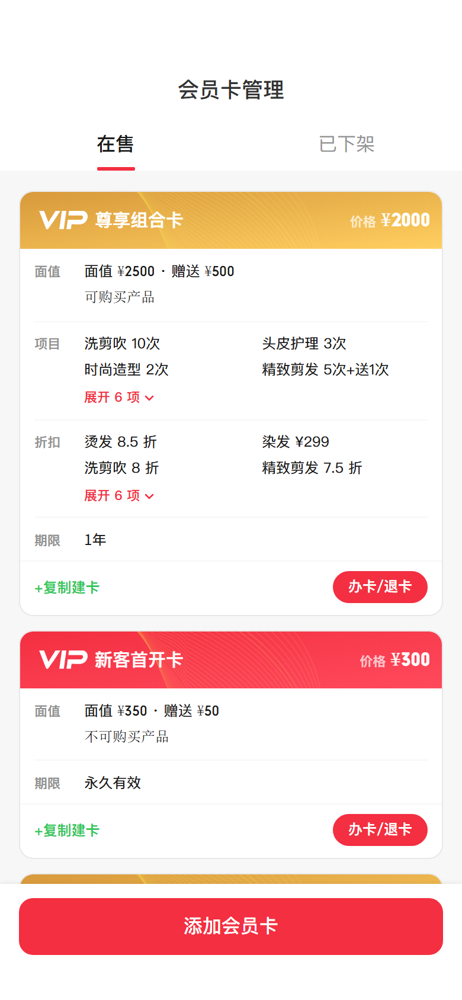 | [demo.html?flow=list-active](demo.html?flow=list-active) |
| 列表 · 已下架 | 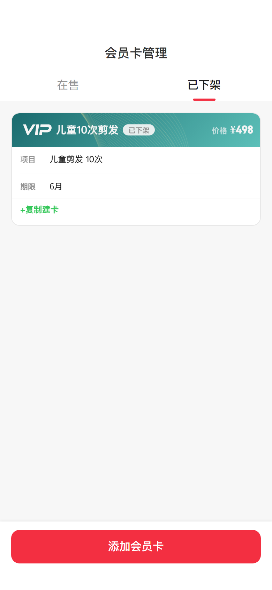 | [demo.html?flow=list-shelved](demo.html?flow=list-shelved) |
| 详情 · 在售 | 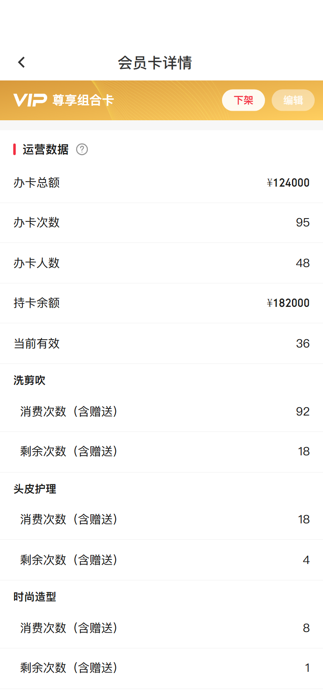 | [demo.html?flow=detail-active](demo.html?flow=detail-active) |
| 详情 · 已下架 | 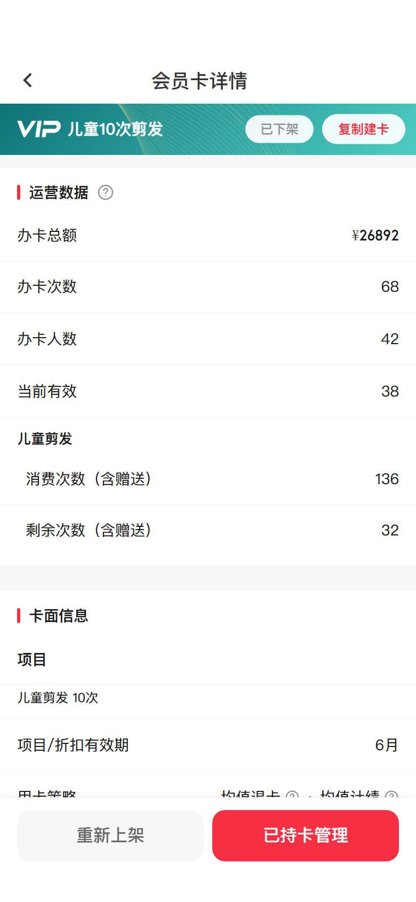 | [demo.html?flow=detail-shelved](demo.html?flow=detail-shelved) |
| Step1 基本信息 | 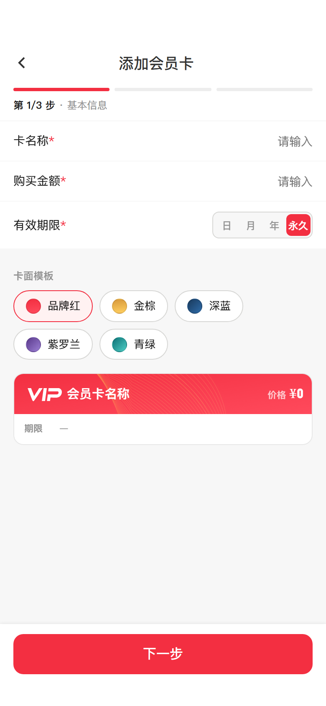 | [demo.html?flow=create-step1](demo.html?flow=create-step1) |
| Step2 权益组合 | 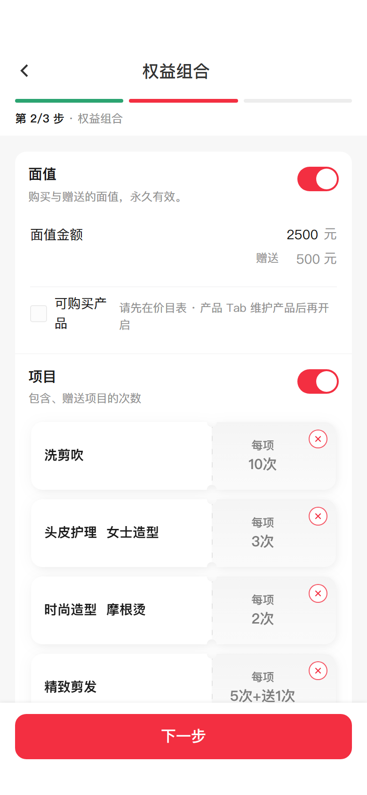 | [demo.html?flow=create-step2](demo.html?flow=create-step2) |
| Step3 用卡策略 | 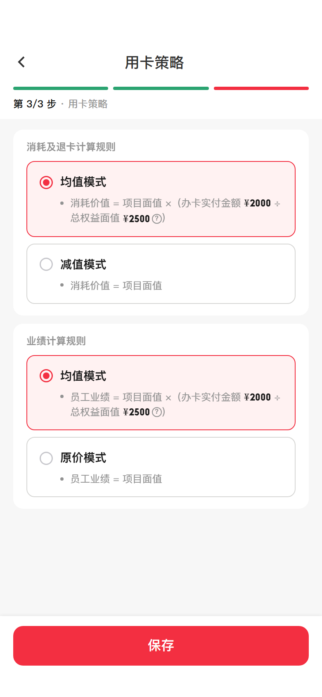 | [demo.html?flow=create-step3](demo.html?flow=create-step3) |
| 创建成功 | 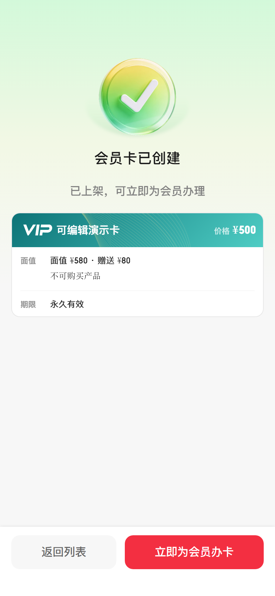 | [demo.html?flow=create-success](demo.html?flow=create-success) |
| 办卡成功 | 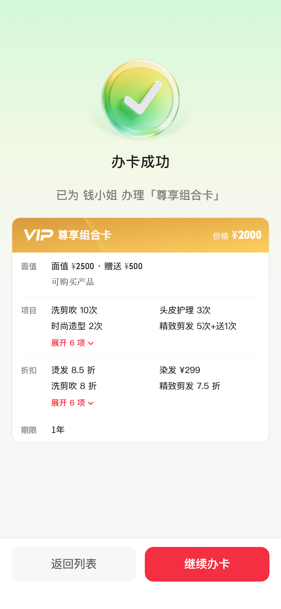 | [demo.html?flow=issue-success](demo.html?flow=issue-success) |
| 添加项目权益 | 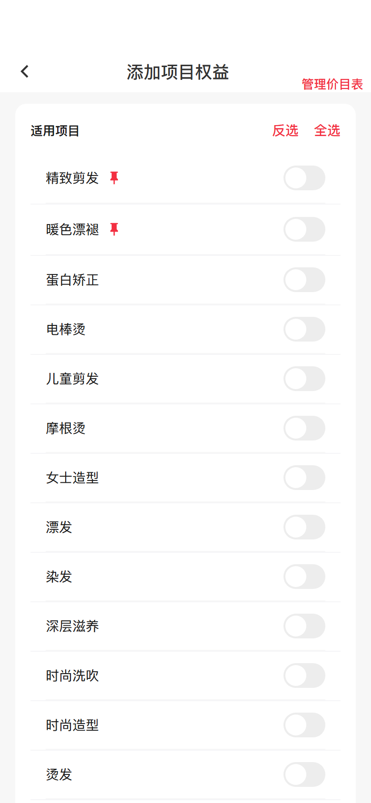 | [demo.html?flow=pick-projects](demo.html?flow=pick-projects) |
| 添加折扣权益 | 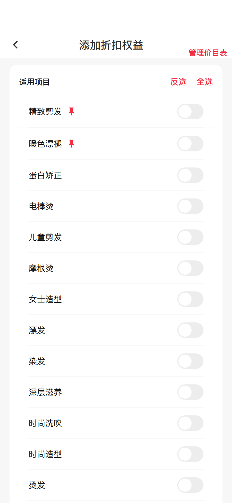 | [demo.html?flow=pick-discount-list](demo.html?flow=pick-discount-list) |

实现路由建议（名称可调整）：`card-list` / `card-step1` / `card-step2` / `card-step3` / `card-create-success` / `card-detail` / `card-project-benefit` / `card-discount-benefit` / `card-issue-success` + sheets；办卡支付复用开单结账路由。

---

# 模块 4　状态机
> 读者：前端 ✓ · 后端 **必看** · 测试 **必看**

## 4.1 模板上架状态

| 状态 | 产品表现 | 含义 |
|------|----------|------|
| 在售 `shelved=false` | 「在售」列表；可办卡；详情可下架/编辑（未锁时） | 新客可办理 |
| 已下架 `shelved=true` | 「已下架」列表；不可新办；详情可重新上架、复制、已持卡管理 | 停售 |

```
在售 ──确认下架──► 已下架 ──确认上架──► 在售
```

- 下架：**不影响**已持卡客户。  
- 已下架：选择会员 Sheet **仅「退卡/延期」**（隐藏办卡 Tab）。

## 4.2 模板编辑锁定

| 条件 | 结果 |
|------|------|
| `当前有效持卡数 validCardCount == 0` | 可进入编辑三步并保存覆盖原模板 |
| `validCardCount > 0` | **不可编辑**；详情「编辑」为可点的禁用样式（`is-disabled`），点击 toast 引导复制建卡 |

```
无持卡 ──编辑──► 三步表单 ──保存修改──► 更新原模板 → 回详情
有持卡 ──点编辑──► toast 拦截（非原生 disabled）──► 引导复制建卡 → 新建模板
```

## 4.3 表单模式 `formMode`

| 模式 | 入口 | 保存结果 |
|------|------|----------|
| `create` | 「添加会员卡」/空态 | 新建在售模板 → 创建成功页 |
| `edit` | 详情「编辑」（未锁定） | 更新原模板 → 详情；toast「已保存」 |
| `duplicate` | 「+复制建卡」 | 新建模板（名称默认「原名（副本）」）；原卡不变 → 创建成功页 |

复制模式三步均展示横幅：`正在基于「{原卡名}」创建新卡，保存后原卡不受影响`。

## 4.4 列表 Tab

`listShelfTab`: `active` | `shelved`，仅切换列表数据源与空态文案，不改模板状态。

## 4.5 持卡相关（实例层）

| 概念 | 说明 |
|------|------|
| 未持卡 | 办卡 Tab 可选（单选） |
| 已持卡（有效） | 退卡/延期 Tab；可退卡；模板含项目/折扣且非永久时可延期 |
| 已失效 | 展示「已失效」；可延期复活（演示数据存在） |
| 纯面值 / 模板永久 | 点延期 → toast「该卡永久有效，无需延期」 |
| 永久有效（延期结果） | 延期时长选「永久」→ 持卡改为永久有效 |
---

# 模块 5　交互细则 / 异常流
> 读者：前端 ✓ · 后端 了解 · 测试 ✓

## 5.1 总原则

1. 列表点卡面进详情；footer 按钮不冒泡进详情。  
2. 创建/编辑/复制均为三步；Step1/2「下一步」、Step3「保存/保存修改」。  
3. Step2 必须至少有一类已开启且内容有效的权益。  
4. 金额类输入使用原型金额键盘交互（正式产品对齐现网数字键盘即可）。  
5. 所有拦截以 toast 或对话框给出 **明确中文原因**（见模块 9）。

## 5.2 离开与返回

- 各步标题栏返回：回到上一步或列表（与原型一致：Step1 回列表，Step2→1，Step3→2）。  
- Sheet 点遮罩关闭：取消当前 sheet，不提交。  
- **【待联调确认】** 三步中途系统返回是否弹「放弃编辑」：原型未做拦截时，正式产品可按现网统一规范补齐。

## 5.3 校验失败（须拦截前进/保存）

| 时机 | 条件 | 提示（原型文案） |
|------|------|------------------|
| Step1 下一步 | 卡名称为空 | 请填写卡名称 |
| Step1 下一步 | 购买金额为空或 ≤0 | 请填写购买金额 |
| Step1/保存 | 开启了项目或折扣且有效期限数量未设妥 | 请设置有效期限（纯面值且永久可无数量） |
| Step2 下一步 | 未选任何权益内容 | 请至少选一项权益内容 |
| Step2 | 开启面值但未填面值金额（含须有输入框值；面值可为 0 的纯折扣场景见模块 8） | 请填写面值金额 |
| Step2 | 开启项目但无已保存项目权益 | 请至少保存一个项目权益 |
| Step2 | 开启折扣但无已保存折扣权益 | 请至少保存一个折扣权益 |
| 项目权益确定 | 未选项目 | 请先选择项目范围 |
| 项目权益确定 | 未设次数且非不限次 | 请设置次数或选择不限次 |
| 折扣确定 | 未选项目 | 请先选择折扣范围 |
| 折扣固定金额 | ≤0 或空 | 请输入大于 0 的固定金额 / 请为{范围}输入大于 0 的固定金额 |
| 折扣比例 | 仍为「原价」未配置 | 请设置折扣 / 请为{范围}设置折扣 |
| 编辑锁定 | 有持卡仍点编辑/保存 | 已有持卡，不可编辑；请复制建卡后修改 |
| 不限次 + 永久 | 冲突 | 弹窗「设置有效期限」；或 toast：不限次项目须先设置卡有效期（不可为永久） / 已有不限次项目，卡有效期不可为永久 |
| 办卡去结账 | 未选会员 | 请选择一位会员 |
| 办卡去结账 | 卡已下架 | 该卡已下架，无法新办 |
| 办卡去结账 | 会员已持卡 | 该会员已持有此卡 |
| 办卡去结账 | 购买金额 ≤0 | 该卡未设置购买金额 |
| 办卡去结账 | 开单模块缺失 | 开单结账模块未就绪 |
| 延期 | 纯面值或模板永久 | 该卡永久有效，无需延期 |
| 延期 | 未设时长 | 请设置延期时长 |
| 延期 | 参考费用为负 | 参考费用不能为负数 |
| 退卡 | 实退为空 | 请填写实际退款金额 |

**不限次冲突弹窗**：标题「设置有效期限」；正文「不限次项目不可使用永久有效，请在此设置卡有效期。」；时长仅日/月/年（默认 1 年），无「永久」。

## 5.4 空态

| 位置 | 文案 |
|------|------|
| 在售空 | 标题「暂无会员卡」；说明点击底部「添加会员卡」开始创建 |
| 已下架空 | 标题「暂无已下架会员卡」；说明下架后的卡会出现在这里… |
| 办卡选人空 | 所有会员均已持有该卡 |
| 卡面预览无权益 | 暂无权益信息 |

---

# 模块 6　功能规格
> 读者：前端 ✓ · 后端 了解 · 测试 ✓

下列字段、按钮、跳转均须与原型一致实现；视觉以原型为准（品牌色 `#F32F41` 等）。

## 6.1 会员卡列表

**原型**：[在售](demo.html?flow=list-active) · [已下架](demo.html?flow=list-shelved)


**结构**

- 标题：会员卡管理  
- Tab：在售 | 已下架  
- 列表项：卡面条（渐变底 + VIP SVG + 卡名 +「价格」标签 + 金额）+ 权益摘要面板 + footer（复制描边 / 办卡实心胶囊）  
- 底栏：添加会员卡  
- 空态：文案 + 可点击虚线卡面插图进入创建  

**在售 footer**：`+复制建卡`、`办卡/退卡`  
**已下架 footer**：仅 `+复制建卡`  

**卡面摘要面板**

- 面值：`面值 ¥X · 赠送 ¥Y`；另示 **可购买产品：是/否**（开启面值时）  
- 项目 / 折扣：双列网格；超过 4 条折叠，「展开 N 项」/「收起」  
- 期限：有项目/折扣展示卡有效期；纯面值「永久有效」；否则「—」  

**跳转**

| 操作 | 结果 |
|------|------|
| 添加会员卡 / 空态插图 | `formMode=create` → Step1 |
| 点卡面（非 footer） | 详情 |
| +复制建卡 | `formMode=duplicate`，卡名「原名（副本）」→ Step1 |
| 办卡/退卡 | 打开选择会员 Sheet（办卡 Tab） |

## 6.2 Step1 基本信息

**原型**：[打开 Step1](demo.html?flow=create-step1)


| 字段 | 必填 | 说明 |
|------|:----:|------|
| 卡名称 | ✓ | placeholder「请输入」 |
| 购买金额 | ✓ | 须 **> 0** |
| 有效期限 | 条件 | 日/月/年/永久（默认永久）。开启项目或折扣时须设数量；纯面值可永久 |
| 卡面模板 | ✓ | 五色，默认品牌红；实时预览 |

步骤条：`第 1/3 步 · 基本信息`。底栏：下一步。无「卡项说明」UI。`audience` 默认 `['all']`，无 Step1 UI。

## 6.3 Step2 权益组合

**原型**：[打开 Step2](demo.html?flow=create-step2)


三类 Switch 可多开；每类可多张 ticket（编辑/删除）。

### 6.3.1 面值

- 描述：购买与赠送的面值，永久有效。  
- 面值金额（可编，可为 0）  
- 赠送（只读）= max(0, 面值 − 购买金额)  
- **可购买产品**：有价目产品时可开；hint「开启后面值可用于购买价目表中的产品」；无产品 hint「请先在价目表 · 产品 Tab 维护产品后再开启」。字段 `benefits.balanceCanBuyProducts`。

### 6.3.2 项目

- +添加项目权益；ticket 展示计次模式与次数摘要。

### 6.3.3 折扣

- +添加折扣权益；新建标尺默认「原价」，须改为非原价或固定金额>0 才算已配置。

底栏：下一步。

## 6.4 项目权益页

**原型**：[打开添加项目权益](demo.html?flow=pick-projects)


- 右侧 **管理价目表** → 价目列表（项目/产品 Tab）  
- 适用项目：仅在售；**反选 | 全选**  
- 计次：每项/共计横向 + `?`；权益次数/赠送次数 + 不限次；不限次时共计禁用  
- 页内「确定」

## 6.5 折扣权益页

**原型**：[打开添加折扣权益](demo.html?flow=pick-discount-list)


- 同结构 + 管理价目表；打折标尺或固定金额；全选可合并为 `__ALL__`（全部项目）；页内「确定」

## 6.6 Step3 用卡策略

**原型**：[打开 Step3](demo.html?flow=create-step3)


| 配置项 | 选项 | 默认 | 详情标签 |
|--------|------|------|----------|
| 消耗及退卡计算规则 | 均值 / 减值 | 均值 | 均值退卡 / 减值退卡 |
| 业绩计算规则 | 均值 / 原价模式 | 均值 | 均值计绩 / **减值计绩** |

均值 hint 随卡型变化（见模块 8）。总权益面值旁 `?` → 明细弹层。底栏：保存 / 保存修改。

## 6.7 创建成功

**原型**：[打开创建成功](demo.html?flow=create-success)


会员卡已创建；已上架，可立即为会员办理。按钮：返回列表 | 立即为会员办卡。

## 6.8 会员卡详情

**原型**：[在售详情](demo.html?flow=detail-active) · [已下架详情](demo.html?flow=detail-shelved)


- 在售顶栏：下架、编辑（锁定为可点禁用样式）  
- 已下架顶栏：已下架标记、复制建卡  
- **仅已下架有底栏**：重新上架 | 已持卡管理  
- 运营数据 + `?` 说明（定义见模块 9）  
- 卡面信息含 **可购买产品**；项目/折扣超 4 展开；用卡策略各段可 `?`

## 6.9 选择会员 Sheet

- 办卡 Tab：**单选**；底栏 **去结账**（未选禁用）→ 开单收款 → 支付成功写持卡并进办卡成功  
- 已持卡管理 / 已下架：隐藏办卡 Tab  
- 退卡/延期：badge 已持卡/已失效；延期含永久；参考费用仅含折扣且非永久时显示  

## 6.10 退卡估值 Sheet

副标题含均值退卡/减值退卡。办卡实付、消耗价值、权益剩余明细、建议退款、实际退款。无分项 fallback 文案见模块 9。确认 toast：`已为 {名} 退卡「{卡名}」，退款 ¥X`。

## 6.11 下架 / 重新上架

居中 sheet；确认后 toast「已下架」/「已重新上架」。

## 6.12 办卡成功

**原型**：[打开办卡成功](demo.html?flow=issue-success)


返回列表或 **返回开单**（来自结账）| 继续办卡。

---

# 模块 7　数据模型与接口约定
> 读者：前端 ✓ · 后端 **必看** · 测试 ✓

> 路径与字段名可按现网命名；下列为 **能力与规则**。标 `【待联调确认】` 的项联调时拍板。

## 7.1 模板（Template）模型

| 字段 | 说明 |
|------|------|
| `id` | 模板 ID |
| `name` | 卡名称 |
| `recharge` | 购买金额（须 >0 方可办卡去结账） |
| `faceAmount` / `giftAmount` | 面值权益开启时的面值与赠送（面值可为 0） |
| `benefits.balance` | bool |
| `benefits.balanceCanBuyProducts` | bool，可购买产品 |
| `benefits.timesOrValidity` | bool |
| `benefits.projectDiscount` | bool |
| `projectItems[]` | 项目权益项 |
| `memberPrices{}` | 折扣；可含 `__ALL__` 表示全部项目 |
| `cardColor` | brand_red / gold / blue / purple / teal |
| `usagePolicy.refundRule` | alloc_pool \| retail |
| `usagePolicy.performanceRule` | alloc_pool \| retail |
| `validity*` | 有效期 |
| `shelved` | 是否下架 |
| `audience` | 默认 ['all'] |
| `source` / `duplicatedFrom` / `createdAt` | 来源与时间 |

### projectItems[] 元素

`id`/`name`、`unlimited`、`purchaseQty`/`giftQty`、`qtyScope`（per_item\|shared）、`sharedGroupId`

### 折扣

- 比例：`{ tickIndex }`；固定：`{ mode:'fixed', amount }`  
- 全选合并：`memberPrices.__ALL__`

## 7.2 持卡实例（示意）

会员 ID、模板 ID、办卡实付、有效期至/永久、余额拆分、项目已用剩余、折扣已用与已省、延期记录等；须支撑模块 8 计算。

## 7.3 接口能力清单

1. 模板列表（在售/已下架）  
2. 模板详情（运营统计、卡面、策略）  
3. 创建 / 更新（无有效持卡）/ 复制模板  
4. 下架 / 重新上架  
5. 价目项目与产品列表  
6. 可办卡会员（排除已持）/ 已持卡会员  
7. **发起办卡结账**（单会员 + 金额）→ 支付成功回调 **确认办卡入账**  
8. 延期  
9. 退卡估值 + 确认退卡  
10. 运营统计  

## 7.4 谁在什么时机写数据

| 时机 | 动作 |
|------|------|
| Step3 保存 create/duplicate | 创建在售模板 |
| Step3 保存 edit | 更新模板（校验无有效持卡） |
| 下架/上架 | 更新 shelved |
| 办卡支付成功 | 写持卡、累加统计 |
| 确认延期 | 更新有效期；可记参考费用 |
| 确认退卡 | 结束持卡；记实退 |

## 7.5 时序（示意）

```
创建：Steps → SaveTemplate → CreateSuccess → optional IssuePicker
办卡：IssuePicker(单选) → 去结账 → PaySuccess → FinalizeIssue → IssueSuccess
退卡：Holders → RefundQuote → ConfirmRefund
```

## 7.6 联调待确认

- [ ] 模板/持卡 API 命名  
- [ ] 办卡结账订单与支付回调  
- [ ] 参考费用是否生成收款  
- [ ] 实退退款通道与幂等  
- [ ] 管理价目表路由与权限  
- [ ] audience 是否暴露 UI  

---

# 模块 8　业务规则与算例
> 读者：前端 ✓ · 后端 **必看** · 测试 ✓

## 8.1 赠送面值与可购买产品

开启面值：`赠送 = max(0, 面值金额 − 购买金额)`。面值金额可为 0。  
`balanceCanBuyProducts` 仅表示面值可否用于购买价目「产品」。

## 8.2 项目计次

| 模式 | 规则 |
|------|------|
| 每项 | 各项目各自次数或不限次 |
| 共计 | 共享次数池；退卡明细标签形如「共计 · 项目A、项目B」 |
| 不限次 | 不可选共计；卡有效期不可永久 |

## 8.3 总权益面值（均值分母）

**仅**面值权重 + **有限次**项目权重；**不含折扣、不含不限次**。

## 8.4 用卡策略公式

**组合卡 · 均值退卡/业绩**

- `结果 = 项目面值 ×（办卡实付 ÷ 总权益面值）`（业绩同结构）  
- 含固定期限不限次时：不限次劳动业绩按价目表原价计  

**纯折扣 · 均值退卡**

- `消耗价值 = 办卡实付 ×（已过天数 ÷ 总有效期）`  
- **永久有效按 1095 天（3 年）折算**  
- 累计已享优惠作信息行，**不计入消耗**  

**纯折扣 · 均值业绩**：`员工业绩 = 项目折后价格`  

**仅不限次且权重池为空 · 均值退卡**：实付按已过/总天数摊销。  

**减值退卡 / 原价业绩**：按项目面值（价目原价×次数等）累计；折扣在 retail 下已省优惠可计入消耗（明细文案区分）。  

**建议退款**：`max(0, 办卡实付 − 消耗价值)`。  

配置「原价模式」在详情展示为 **「减值计绩」**。

## 8.5 办卡约束

- 单次单选一位会员；已持卡不可再选；已下架不可新办；购买金额须 >0；须开单模块就绪。  

## 8.6 算例（测试对照）

**A 纯面值**：购买 1000、面值 1000、未消费 → 建议退款接近 1000。  

**B 项目每项**：实付 500；项目原价 50×10；已用 2 次。减值消耗≈100；均值按分摊。  

**C 纯折扣永久 · 均值**：消耗按已过/1095；已享优惠不计入消耗。  

**D 不限次**：禁永久建卡；延期可选改永久。  

---

# 模块 9　文案清单与权限
> 读者：前端 ✓ · 后端 部分 · 测试 ✓

## 9.1 文案清单（须与原型一致）

| 位置 | 文案 |
|------|------|
| 列表 | 会员卡管理；在售；已下架；添加会员卡 |
| 空·在售 | 暂无会员卡；点击底部「添加会员卡」开始创建 |
| 空·下架 | 暂无已下架会员卡；下架后的卡会出现在这里… |
| 列表操作 | +复制建卡；办卡/退卡 |
| 展开 | 展开 N 项；收起 |
| 面值 | 可购买产品；开启后面值可用于购买价目表中的产品；请先在价目表 · 产品 Tab 维护产品后再开启 |
| 权益页 | 管理价目表；反选；全选；确定 |
| 步骤 | 第 1/3 步 · 基本信息；第 2/3 步 · 权益组合；第 3/3 步 · 用卡策略 |
| 策略 | 均值模式；减值模式；原价模式；均值退卡；减值退卡；均值计绩；减值计绩 |
| 选会员 | 选择会员；办卡；退卡/延期；去结账；搜索姓名或手机 |
| 办卡校验 | 请选择一位会员；该卡已下架，无法新办；该会员已持有此卡；该卡未设置购买金额；开单结账模块未就绪 |
| 退卡 | 退卡估值；办卡实付；消耗价值；建议退款；实际退款；该卡无可分项估值的权益，建议按办卡实付协商退款。；确认退卡 |
| 退卡成功 | 已为 {名} 退卡「{卡名}」，退款 ¥X |
| 延期 | 该卡永久有效，无需延期；已将 {名} 的本卡改为永久有效；延长…（收费/免费） |
| 办卡成功 | 办卡成功；返回列表；返回开单；继续办卡 |
| 不限次弹窗 | 设置有效期限；不限次项目不可使用永久有效，请在此设置卡有效期。 |
| 锁定 | 已有持卡，不可编辑；请复制建卡后修改 |
| 上下架 | 下架会员卡；重新上架；确认下架；确认上架；已下架；已重新上架 |

**运营数据说明（`?`）**

| 词条 | 定义 |
|------|------|
| 办卡总额 | 顾客购买该卡模板的金额合计，不含补录老卡金额与收费延期。 |
| 办卡次数 | 累计办卡笔数；同一顾客多次办卡分别计次。 |
| 办卡人数 | 办过该卡模板的顾客总人数，含补录老卡人数。 |
| 持卡余额 | 当前所有有效持卡账户余额合计，含赠送余额；仅配置面值权益时展示。 |
| 当前有效 | 当前仍有效的持卡数量（未退卡且卡级未过期），不含已失效、已退卡。 |
| 卡有效期 | 模板级有效期，仅约束项目与折扣权益；面值永久有效，不受卡级到期影响。 |
| 消费次数（含赠送） | 按项目统计已消费次数，含赠送。 |
| 剩余次数（含赠送） | 按项目统计仍可用次数，含赠送；不限次显示「不限次」。 |

## 9.2 权限

默认店主可操作；店员另议。

---

# 模块 10　验收标准 / 造数场景
> 读者：前端 了解 · 后端 了解 · 测试 **必看**

## 10.1 P0（Given → When → Then）

| # | 场景 | 前置 | 操作 | 期望 |
|---|------|------|------|------|
| 1 | 空态建卡 | 在售无卡 | 三步合法保存 | 创建成功；列表有卡 |
| 2 | Step2 无权益 | Step1 已填 | 全关下一步 | toast 至少选一项权益 |
| 3 | 面值赠送 | 买 800 面值 1000 | 看赠送 | 200 |
| 4 | 可购买产品 | 有产品数据 | 开启开关 | 列表/详情显示「是」 |
| 5 | 购买金额 ≤0 | Step1 | 填 0 下一步 | 拦截 |
| 6 | 不限次禁永久 | 永久 | 开不限次 | 弹窗改期限 |
| 7 | 策略标签 | Step3 选原价 | 保存看详情 | 减值计绩 |
| 8 | 办卡 | 在售卡 | 单选→去结账→支付成功 | 办卡成功；统计增加 |
| 9 | 重复办卡 | 已持卡 | 办卡 Tab | 该会员不可选 |
| 10 | 锁编辑 | 有效持卡>0 | 点编辑 | toast 引导复制 |
| 11 | 复制 | 任意卡 | 复制保存 | 新卡；原卡不变 |
| 12 | 下架 | 在售 | 确认下架 | 不可新办 |
| 13 | 上架 | 已下架 | 确认上架 | 可办卡 |
| 14 | 延期 | 非永久有期限权益 | 设时长 | 成功 toast |
| 15 | 纯面值延期 | 纯面值持卡 | 点延期 | 无需延期 toast |
| 16 | 退卡 | 有持卡 | 改实退确认 | 退卡成功 |
| 17 | 已下架持卡 | 已下架 | 已持卡管理 | 仅退卡/延期 |
| 18 | 开单未就绪 | 无 BillingDemo | 去结账 | toast 模块未就绪 |

## 10.2 回归

编辑无持卡后详情一致；下架再上架可办；退卡取消不变持卡；折扣原价默认未配置不可保存空规则。

## 10.3 造数

原型「有数据」注入演示卡 + 价目项目（含产品 Tab 以测可购买产品）。正式环境自备等价数据；演示开关不进产品。

---

# 模块 11　非功能（极简）

| 项 | 要求 |
|------|------|
| 提交 | 保存/去结账/退卡防重复；失败可重试 |
| 列表 | 可滚动可接受性能 |
| 兼容 | 对齐现网商户 App WebView |

---

# 模块 12　交付物

| 交付物 | 说明 |
|--------|------|
| `PRD-会员卡管理.md` | 给 AI / 研发的源文件 |
| `PRD-会员卡管理.html` | 阅读预览（非第二份规格） |
| 交互原型 `demo.html` | 唯一可视依据 |

开发与测试只需 **PRD + 原型**。冲突时以原型界面为准修正 PRD。画布 390×844；品牌色 `#F32F41`。

---

## 附录 A · 卡面颜色

| key | 名称 |
|-----|------|
| brand_red | 品牌红（默认） |
| gold | 金棕 |
| blue | 深蓝 |
| purple | 紫罗兰 |
| teal | 青绿 |

## 附录 B · 依赖说明

- 价目：项目/产品勾选与「可购买产品」依赖价目数据；价目产品本身不在本文交付。  
- 会员：办卡单选既存会员。  
- 开单结账：办卡收款与支付成功回调。  
- 支付/退款通道：`【待联调确认】`。
