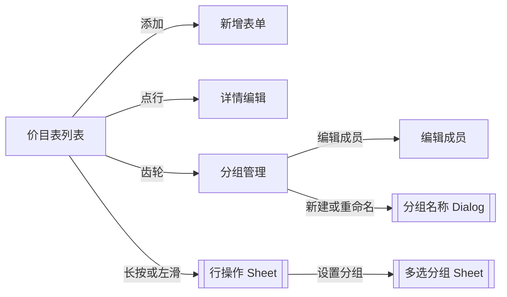

# PRD：项目创建与管理（价目表 · 商户端）· 精简版

| 字段 | 内容 |
|------|------|
| 文档版本 | v1.0-lite |
| 日期 | 2026-07-23 |
| 文档类型 | **精简版**（仅模块 1–3） |
| 完整规格 | 同目录 `PRD-项目创建与管理.md`（含状态机 / 功能规格 / 接口 / 验收等） |
| 交互原型（唯一可视依据） | 同目录 `demo.html`（中文镜像：`剑琅联盟-会员卡-权益组合版.html`；功能链路「项目创建与管理」） |
| 画布 | 390 × 844 |
| 目的 | 快速对齐背景、场景与信息架构；落地细节以完整稿 + 原型为准 |
| 关联（非必读） | 同目录 `PRD-会员卡管理.md` / `PRD-会员卡管理-精简版.md` |

---

## 怎么读这份 PRD

正文按模块编排。**不用通读全文**，按角色跳章即可。

| # | 模块 | 前端 | 后端 | 测试 | 说明 |
|---|------|:----:|:----:|:----:|------|
| 1 | 背景 / 目标 / 范围 / 能力映射 | ✓ | ✓ | ✓ | 重构叙事、防范围蔓延 |
| 2 | 用户场景与成功标准 | ✓ | 了解 | ✓ | 测「业务对不对」 |
| 3 | 信息架构与页面清单 | ✓ | 了解 | ✓ | 做哪些页 |

**先读这几条（贯穿全文）**

1. 本期是对 **旧价目表 / 旧项目管理** 的 **整体重构并覆盖**，不是长期并行两套。新版强调 B 端 **工具属性**：列表 **纯信息、无列表配图装饰**，一屏信息密度更高，操作更紧凑。  
2. 价目分 **项目** 与 **产品** 两个 Tab；均可 **分组筛选**、**多分组归属**、行内 **拖拽排序**（在约束内）、左滑/长按快捷操作。  
3. 项目可被会员卡权益 **按名称绑定**；绑卡后部分字段与删除/上下架 **锁定**（细则见完整稿）。产品亦可标记绑卡，列表展示绑卡标识。  
4. B 端改价、上下架、时长等变更需 **同步顾客端展示**；顾客端具体 UI **不在本文展开**。  
5. 会员卡建卡时「选项目 / 选产品 / 选折扣适用项目」及标题栏「管理价目表」依赖本价目数据；会员卡三步流程见 `PRD-会员卡管理.md`，本文只写联结面。  
6. 原型工具栏「无数据 / 有数据」造数 **仅演示**，不进正式产品。接口路径标 `【待联调确认】`，不臆造现网 URL。

交互行为与文案以 **`demo.html` 当前表现** 为准。本文为精简版；状态机、交互细则、功能规格、接口、验收等见完整稿 `PRD-项目创建与管理.md`。

---

# 模块 1　背景 / 目标 / 范围 / 能力映射
> 读者：前端 ✓ · 后端 ✓ · 测试 ✓

## 1.1 背景

旧价目表 / 旧项目管理在列表中带有图片与较多装饰元素，**内容不够紧凑**，一屏信息量少，操作分散，不符合 B 端管理软件「找得到、改得快」的诉求。

本期在整体产品（含会员卡权益组合）对齐前提下重构价目能力：

- **工具属性更强**：列表纯信息行（名称、时长/规格、价格、状态等），无列表配图堆叠；  
- **操作紧凑**：搜索、Tab、分组条、左滑/长按菜单、拖拽排序集中在一屏；  
- **市场反馈补强**：拖拽排列顺序、更完整的分组管理（新建/重命名/删组不删货、多选成员、条目可多组）；  
- **与会员卡联结**：价目为选权益、折扣适用范围的数据源；支持从权益页「管理价目表」往返。

## 1.2 目标

| 目标 | 说明 |
|------|------|
| 覆盖旧能力 | 新价目成为项目管理的唯一体系 |
| 高密度列表 | 项目/产品双清单，信息行可扫可读 |
| 分组与排序 | 自定义分组 + 桶内拖拽排序 + 置顶 |
| 售卖可控 | 在售/下架；项目可配手机端预约 |
| 与卡对齐 | 绑卡锁定规则清晰；选品只取在售 |

## 1.3 本期做（In）

- 价目表列表：项目 Tab / 产品 Tab、搜索、列头排序、空态  
- 新增 / 编辑 / 删除项目与产品  
- 在售切换、置顶/取消置顶  
- 分组：筛选 Tab、分组管理、编辑成员、条目设置多分组、分组拖拽排序  
- 列表拖拽排序（置顶桶 / 在售桶 / 下架桶内）  
- 左滑快捷操作与长按操作 Sheet  
- 项目绑卡锁定（部分字段）及提示文案  
- 从会员卡权益页「管理价目表」进入并返回  
- B→C 同步生效的产品语义说明（无 C 端页面规格）

## 1.4 本期不做（Out）

- 顾客端 / 小程序预约页、开单页的 UI 规格（仅消费价目结果）  
- 会员卡创建三步、办卡支付、退卡（见 `PRD-会员卡管理.md`）  
- 真实图片上传链路（原型为演示开关「已上传/未上传」）  
- 原型「无数据/有数据」造数开关  
- 审核流、多门店价目同步策略（原型未表现则不写死）

## 1.5 旧 → 新能力映射（不写废弃产品名）

| 旧体系常见能力（语义） | 新体系如何配置 |
|------------------------|----------------|
| 维护服务项目价格/时长 | **项目** Tab：名称、价格、时长、在售、预约、可选图、置顶 |
| 维护可售卖货品 | **产品** Tab：名称、规格、价格、在售、可选图、置顶 |
| 列表浏览与查找 | 搜索 + 列排序 + 分组筛选；信息行无配图 |
| 分类/归类 | **自定义分组**（可多组、可空组、删组保留条目） |
| 调整展示顺序 | **置顶** + **桶内拖拽** `sortOrder` |
| 停售 | **下架**（列表仍可见，选品侧不可选） |
| 被卡引用后的保护 | **绑卡锁定**（名称/在售/预约/删除等受限） |

映射不足时以原型字段与行为为准。

---

# 模块 2　用户场景与成功标准
> 读者：前端 ✓ · 后端 了解 · 测试 ✓

## 2.1 角色

| 角色 | 说明 |
|------|------|
| 店主（默认） | 可进行本文全部操作 |
| 店员 | **【待产品确认】** 原型未表现差异；见完整稿权限占位 |

## 2.2 核心场景

| 场景 | 用户期望 | 成功标准 |
|------|----------|----------|
| 新建项目 | 填名称价格时长等后出现在项目列表在售区 | 列表可见；可被会员卡选项目/折扣 |
| 新建产品 | 填名称规格价格后出现在产品列表 | 列表可见；可被开单/产品权益选用（在售） |
| 改价 | 绑卡或未绑卡均可改价（规则内） | toast 成功；顾客端同步语义成立 |
| 下架 | 停售但仍可在价目表看到 | 状态「已下架」；选品列表不出现 |
| 分组运营 | 建组、把条目加入多组、按组筛选 | 筛选正确；删组不丢条目 |
| 拖拽排序 | 调整同状态区内顺序 | 刷新后顺序保持；搜索/分组筛选时不可拖 |
| 绑卡项目 | 被卡引用后不能乱改关键属性 | 锁定字段点击有 toast；不可删、不可改在售 |
| 从建卡管价目 | 权益页点「管理价目表」补货后返回继续选 | 返回原权益页且列表刷新 |

---

# 模块 3　信息架构与页面清单
> 读者：前端 ✓ · 后端 了解 · 测试 ✓

```
价目表
 ├─ 列表（项目 Tab / 产品 Tab）
 │    ├─ 搜索 · 添加 · 分组条 · 齿轮
 │    ├─ 行：点击进详情 · 拖拽排序 · 左滑/长按操作
 │    └─ 空态
 ├─ 新增项目 / 新增产品
 ├─ 项目详情 / 产品详情
 ├─ 分组管理
 │    └─ 编辑成员
 └─ Sheets / 弹层
      ├─ 行操作 Sheet
      ├─ 分组菜单 Sheet
      ├─ 设置分组（多选）
      ├─ 新建/重命名分组 Dialog
      ├─ 删除分组确认
      ├─ 删除条目确认
      └─ 金额键盘（价格）
```

### 3.0 页面流（示意）



从会员卡权益页进入：


| 页面/层 | 导航标题（原型） | 说明 |
|---------|------------------|------|
| 列表 | 价目表 | Tab 项目/产品；无底栏主按钮（添加在工具栏） |
| 新增 | 新增项目 / 新增产品 | 底栏「保存」 |
| 详情 | 项目详情 / 产品详情 | 底栏「删除 \| 保存」 |
| 分组管理 | 分组管理 | 底栏「新建分组」 |
| 编辑成员 | 编辑成员 · {组名} | 底栏「确定」 |
| 行操作 | 条目标题 | 置顶/分组/上下架/删除 |
| 设置分组 | 条目标题 | 可多选；可「去新建分组」 |
| 分组菜单 | 组名 | 编辑成员 / 重命名 / 删除 |

功能链路演示节点（FLOW_MAP「项目创建与管理」）：`price-list-empty` / `price-list-filled` / `price-list-product` / `price-groups` / `price-add` / `price-add-product` / `price-edit-normal` / `price-edit-bound` / `price-edit-off-sale`。

实现路由建议（名称可调整）：`price-list` / `price-add` / `price-edit` / `price-groups` / `price-group-members` + sheets。

---

---

# 交付说明（精简版）

| 交付 | 说明 |
|------|------|
| 本文 `PRD-项目创建与管理-精简版.md` | 仅模块 1–3 |
| 完整稿 `PRD-项目创建与管理.md` | 开发 / 测试落地准稿 |
| 交互原型 `demo.html` | 唯一可视依据 |
