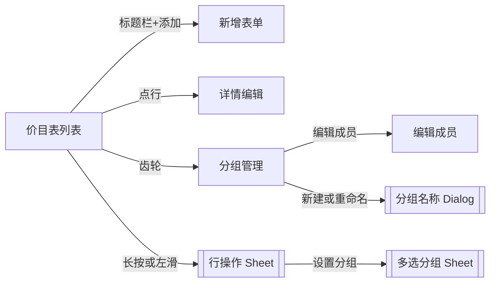

# PRD：项目创建与管理（价目表 · 商户端）· 精简版

| 字段 | 内容 |
|------|------|
| 文档版本 | v1.7-lite |
| 日期 | 2026-08-03 |
| 文档类型 | **精简版**（仅模块 1–3） |
| 完整规格 | 同目录 `PRD-项目创建与管理.md`（含状态机 / 功能规格 / 接口 / 验收等） |
| 交互原型（唯一可视依据） | 同目录 `demo.html`（中文镜像：`剑琅联盟-RTB重构.html`；功能链路「项目创建与管理」） |
| 画布 | 390 × 844 |
| 目的 | 快速对齐背景、场景与信息架构；落地细节以完整稿 + 原型为准 |
| 关联（非必读） | 同目录 `PRD-会员卡管理.md` / `PRD-会员卡管理-精简版.md` |

---

## 怎么读这份 PRD

正文按模块编排。**不用通读全文**，按角色跳章即可。

| # | 模块 | 前端 | 后端 | 测试 | 说明 |
|---|------|:----:|:----:|:----:|------|
| 1 | 背景 / 目标 / 范围 / 能力映射 | ✓ | ✓ | ✓ | 重构叙事、防范围蔓延 |
| 2 | 用户场景与成功标准 | ✓ | 了解 | ✓ | 测「业务对不对」 |
| 3 | 信息架构与页面清单 | ✓ | 了解 | ✓ | 做哪些页 |

**先读这几条（贯穿全文）**

1. 本期是对 **旧价目表 / 旧项目管理** 的 **整体重构并覆盖**，不是长期并行两套。新版强调 B 端 **工具属性**：列表 **纯信息、无列表配图装饰**，一屏信息密度更高，操作更紧凑。  
2. 价目分 **项目** 与 **产品** 两个 Tab；均可 **分组筛选**、**多分组归属**、行内 **拖拽排序**（在约束内）、左滑/长按快捷操作。列表为 **在售区 →「已下架」分隔行 →「已隐藏」折叠**，**无状态列**、**无搜索**。新建：标题栏品牌红「+添加」按钮 **跟当前 Tab 直接新建**（项目 Tab→新增项目，产品 Tab→新增产品），**不弹选择层**；**无右下悬浮球**。  
3. 项目可被会员卡权益 **按名称绑定**（同桶 **名称唯一**）；绑卡后 **锁定名称、手机端可预约、删除**；**在售/下架仍可改**（细则见完整稿）。`boundToCard` **自动派生刷新**。删除锁定以锁标呈现。  
4. B 端改价、上下架、时长、**隐藏**、封面、**产品库存**等变更需 **同步客户端展示**（开单为 **实时目录/价格/库存**；细节【待联调】）；顾客端具体 UI **不在本文展开**。封面正式 OSS **本期不做**。  
5. 会员卡建卡时「选项目 / 选产品 / 选折扣适用项目」及标题栏「管理价目表」依赖本价目数据；从权益页进价目再返回时 **刷新分组 Tab（重置为「全部」）**；会员卡三步流程见 `PRD-会员卡管理.md`，本文只写联结面。  
6. **产品库存规则**（仅产品；完整稿 **8.1**）：  
   - **选填**：空/`null` = **不限购**；`0` = 不可加购；`1`～`999999` = 加购上限；非法输入 toast 拦截。  
   - **价目列表**：空显示「—」，有值（含 0）显示数字；列头「库存」。  
   - **开单**：有上限时展示「库存 N」，达上限「+」禁用；`0` → Toast「库存不足」；超限 →「库存不足，最多 N 件」并钳制。  
   - **支付**：打开/确认前钳制购物车（钳空 →「购物车为空」；仍超 →「库存不足，请返回调整数量」）；支付成功按数量扣减；**办卡 / 续卡不扣**。  
   - 独立「库存管理」模块 **本期不做**。  
7. **可见性**：顾客端 / **开单选品** / **建卡权益选品** 均为 `onSale && !hidden`。开单中价目改价 → 支付 Dialog「支付金额已变化」。  
8. 原型工具栏「无数据 / 有数据」造数 **仅演示**，不进正式产品。接口路径标 `【待联调确认】`，正式文档 **暂无交付时间**。  
9. **本期仅单店**；**店主可编辑价目，店员不可编辑**。

交互行为与文案以 **`demo.html` 当前表现** 为准。本文为精简版；状态机、交互细则、功能规格、接口、验收等见完整稿 `PRD-项目创建与管理.md`。

---

# 模块 1　背景 / 目标 / 范围 / 能力映射
> 读者：前端 ✓ · 后端 ✓ · 测试 ✓

## 1.1 背景

旧价目表 / 旧项目管理在列表中带有图片与较多装饰元素，**内容不够紧凑**，一屏信息量少，操作分散，不符合 B 端管理软件「找得到、改得快」的诉求。

本期在整体产品（含会员卡权益组合）对齐前提下重构价目能力：

- **工具属性更强**：列表纯信息行（名称、时长/规格/库存展示、价格），无列表配图堆叠、无行内状态列；  
- **操作紧凑**：Tab、分组轨、标题栏品牌红「+添加」按钮、左滑/长按菜单、拖拽排序集中在一屏；下架与隐藏以分区/折叠呈现；  
- **市场反馈补强**：拖拽排列顺序、更完整的分组管理（新建/重命名/删组不删货、多选成员、条目可多组）、**隐藏** 与系统「隐藏」分组、**产品可选库存**；  
- **与会员卡 / 开单联结**：价目为选权益、折扣适用范围及 **开单选品** 的数据源；支持从权益页「管理价目表」往返。

## 1.2 目标

| 目标 | 说明 |
|------|------|
| 覆盖旧能力 | 新价目成为项目管理的唯一体系 |
| 高密度列表 | 项目/产品双清单，信息行可扫可读 |
| 分组与排序 | 自定义分组 + 系统「隐藏」组 + 在售/下架桶内拖拽 `sortOrder` |
| 售卖可控 | 在售/下架/隐藏；项目可配手机端预约；产品可选库存限购 |
| 可见性清晰 | 顾客端 / 开单 / 建卡选品均为在售且未隐藏（产品另受库存） |
| 与卡对齐 | 绑卡锁定规则清晰；权益选品只取在售且未隐藏 |

## 1.3 本期做（In）

- 价目表列表：项目 Tab / 产品 Tab、标题栏品牌红「+添加」按钮（跟 Tab 直接新建、不弹窗；**无悬浮球**）、列头排序、空态（**无搜索**）  
- 列表分区：**在售区** → **「已下架」分区** →（「全部」）**「已隐藏」折叠**（无数量）  
- 新增 / 编辑 / 删除项目与产品（表单：基本信息 / 售卖设置 / 高级设置；产品含 **规格/库存选填**；**上传封面图（选填）**最多 1 张）  
- **产品库存规则**（选填；列表列；开单限购与支付扣减要点见先读第 6 条；完整稿 **8.1**）  
- 在售切换、**隐藏 / 取消隐藏**  
- 分组：筛选 Tab（全部 / 自定义 / **隐藏**）、分组管理、编辑成员、条目设置多分组、分组拖拽排序  
- 列表拖拽排序（**在售桶 / 下架桶** 内）  
- 左滑快捷操作与长按操作 Sheet（删除锁定锁标）  
- 项目绑卡锁定（部分字段）及提示文案  
- 从会员卡权益页「管理价目表」进入并返回  
- **开单选品** 联结（仅在售且未隐藏；价目改价支付拦截见完整稿）  
- B→C 同步生效的产品语义说明（无 C 端页面规格）

## 1.4 本期不做（Out）

- 顾客端 / 小程序预约页、开单页的完整 UI 规格（仅约定消费价目结果与库存规则）  
- 独立「库存管理」模块（工作台入口若存在，本期不展开）  
- 会员卡创建三步、办卡支付、退卡（见 `PRD-会员卡管理.md`）  
- 真实图片上传 / 正式 OSS（**本期不做**；原型演示图）  
- 原型「无数据/有数据」造数开关  
- 审核流、**多门店**价目策略（**本期仅单店**）  
- 旧价目迁移方案（**暂无**；后续或 AI 助手补齐）  
- 正式接口文档排期（**暂无具体时间**）

## 1.5 旧 → 新能力映射（不写废弃产品名）

| 旧体系常见能力（语义） | 新体系如何配置 |
|------------------------|----------------|
| 维护服务项目价格/时长 | **项目** Tab：名称、价格、时长、在售、预约、可选封面图 |
| 维护可售卖货品 | **产品** Tab：名称、规格、价格、**可选库存**、在售、可选封面图 |
| 列表浏览与查找 | 列排序 + 分组筛选；信息行无配图、无状态列；**无关键字搜索** |
| 分类/归类 | **自定义分组** + 系统 **隐藏** 组 |
| 调整展示顺序 | **桶内拖拽** `sortOrder`（在售 / 下架两桶） |
| 停售 | **下架**（列表「已下架」分区；顾客端 / 开单 / 权益均不可选） |
| 对 C 端隐藏但 B 端保留 | **隐藏**（底部「已隐藏」折叠；开单不可选） |
| 被卡引用后的保护 | **绑卡锁定**（名称/预约/删除等受限；**在售仍可改**） |

映射不足时以原型字段与行为为准。

---

# 模块 2　用户场景与成功标准
> 读者：前端 ✓ · 后端 了解 · 测试 ✓

## 2.1 角色

| 角色 | 说明 |
|------|------|
| 店主（默认） | 可进行本文全部价目操作 |
| 店员 | **不可编辑/修改价目表** |

## 2.2 核心场景

| 场景 | 用户期望 | 成功标准 |
|------|----------|----------|
| 新建项目 | 填名称价格时长等后出现在项目列表在售区 | 列表可见；可被会员卡选项目/折扣（在售且未隐藏） |
| 新建产品 | 填名称/规格（选填）/价格/库存（选填）后出现在产品列表 | 列表「名称（规格）」+ 库存列；在售未隐藏时可开单/权益选用 |
| 改价 | 绑卡或未绑卡均可改价（规则内） | toast 成功；开单中改价可触发「支付金额已变化」 |
| 下架 | 停售但仍可在价目表看到 | 落入「已下架」分区；顾客端 / 开单 / 权益均不可选 |
| 隐藏 | 对顾客端隐藏但 B 端保留 | 「全部」主列表不显示、底部「已隐藏」折叠可展开；「隐藏」Tab 可见；开单不可选 |
| 产品库存 | 选填库存限制开单加购 | 空=不限购；`0`→「库存不足」；超限→「最多 N 件」；支付前钳制；支付成功扣减（办卡/续卡不扣） |
| 分组运营 | 建组、把条目加入多组、按组筛选 | 筛选正确；删组不丢条目；系统「隐藏」组不可删/改名 |
| 拖拽排序 | 调整同售卖态桶内顺序 | 刷新后顺序保持；自定义分组/「隐藏」Tab/列排序激活时不可拖 |
| 绑卡项目 | 被卡引用后不能乱改关键属性 | 锁定名称/预约/删除有 toast 与锁标；**可改在售/下架** |
| 开单选品 | 开单只选可售货 | 仅 `onSale && !hidden`；产品受库存上限 |
| 从建卡管价目 | 权益页点「管理价目表」补货后返回继续选 | 返回原权益页、列表刷新，**分组 Tab 刷新为「全部」** |

---

# 模块 3　信息架构与页面清单
> 读者：前端 ✓ · 后端 了解 · 测试 ✓

```
价目表
 ├─ 列表（项目 Tab / 产品 Tab）
 │    ├─ 标题栏品牌红「+添加」按钮（跟当前 Tab，不弹窗；无悬浮球）
 │    ├─ 分组轨（灰底白胶囊 · 可横滑 · 全部/自定义/隐藏）· 深灰齿轮
 │    ├─ 在售区 →「已下架」分隔行 →（全部）「已隐藏」折叠
 │    ├─ 行：点击进详情 · 拖拽排序 · 左滑/长按操作（产品含库存列）
 │    └─ 空态（保留空态 CTA）
 ├─ 新增项目 / 新增产品（基本信息含规格/库存选填 · 售卖设置 · 高级设置·封面）
 ├─ 项目详情 / 产品详情
 ├─ 分组管理
 │    └─ 编辑成员（含系统「隐藏」组）
 └─ Sheets / 弹层
      ├─ 行操作 Sheet（单层贴底，无副标题）
      ├─ 分组菜单 Sheet
      ├─ 设置分组（多选，含系统「隐藏」组）
      ├─ 新建/重命名分组 Dialog
      ├─ 删除分组确认
      ├─ 删除条目确认
      └─ 金额键盘（价格）
```

### 3.0 页面流（示意）


```mermaid
flowchart LR
  L[价目表列表] -->|标题栏+添加| Add[新增表单]
  L -->|点行| Edit[详情编辑]
  L -->|齿轮| G[分组管理]
  G -->|编辑成员| M[编辑成员]
  G -->|新建或重命名| D[[分组名称 Dialog]]
  L -->|长按或左滑| A[[行操作 Sheet]]
  A -->|设置分组| IG[[多选分组 Sheet]]
```

从会员卡权益页进入：


```mermaid
flowchart LR
  P[权益选品页] -->|管理价目表| L[价目表列表]
  L -->|返回| P
```

| 页面/层 | 导航标题（原型） | 说明 |
|---------|------------------|------|
| 列表 | 价目表 | Tab 项目/产品；标题栏品牌红「+添加」；同桶名称唯一；店主可编辑/店员不可；本期单店 |
| 新增 | 新增项目 / 新增产品 | 底栏「保存」；表单三段 |
| 详情 | 项目详情 / 产品详情 | 底栏「删除 \| 保存」 |
| 分组管理 | 分组管理 | 底栏「新建分组」 |
| 编辑成员 | 编辑成员 · {组名} | 底栏「确定」 |
| 行操作 | 条目标题 | 设置分组/上下架/隐藏或取消隐藏/删除；取消在 foot |
| 设置分组 | 条目标题 | 可多选（含系统「隐藏」）；可「去新建分组」 |
| 分组菜单 | 组名 | 编辑成员 / 重命名 / 删除（系统组无菜单） |

功能链路演示节点（FLOW_MAP「项目创建与管理」）：`price-list-empty` / `price-list-filled` / `price-list-product` / `price-list-action` / `price-list-hidden-open` / `price-groups` / `price-group-members` / `price-group-menu` / `price-group-create` / `price-group-rename` / `price-item-group` / `price-add` / `price-add-product` / `price-edit-normal` / `price-edit-bound` / `price-edit-off-sale`。开单价目改价拦截演示：`bill-pay-price-changed`。

实现路由建议（名称可调整）：`price-list` / `price-add` / `price-edit` / `price-groups` / `price-group-members` + sheets。

落地细则（状态机、校验、字段表、接口、验收）见完整稿 `PRD-项目创建与管理.md`。

---

# 交付说明（精简版）

| 交付 | 说明 |
|------|------|
| 本文 `PRD-项目创建与管理-精简版.md` | 仅模块 1–3 |
| 完整稿 `PRD-项目创建与管理.md` | 开发 / 测试落地准稿 |
| 交互原型 `demo.html` | 唯一可视依据 |
