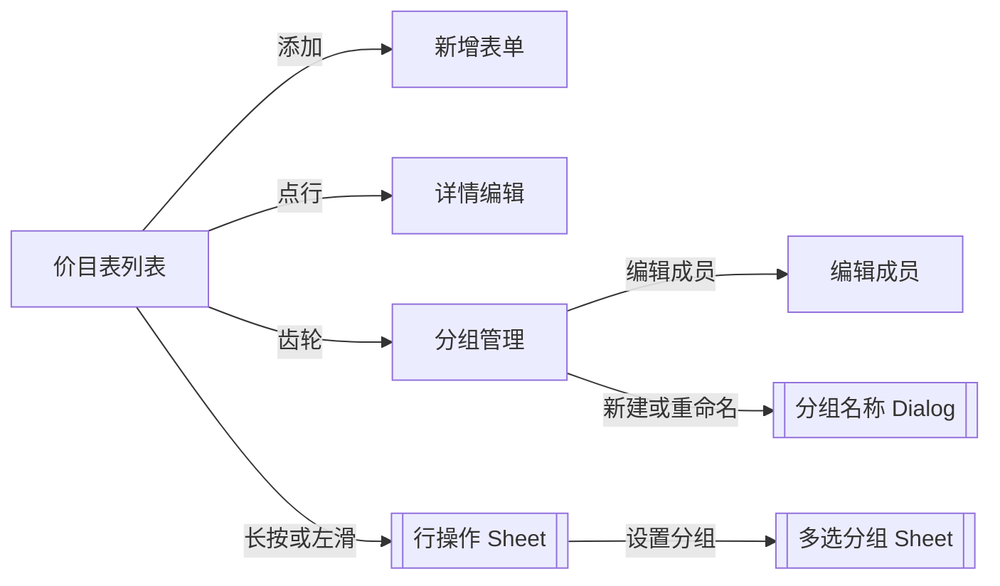

# PRD：项目创建与管理（价目表 · 商户端）

| 字段 | 内容 |
|------|------|
| 文档版本 | v1.2 |
| 日期 | 2026-07-24 |
| 交互原型（唯一可视依据） | 同目录 `demo.html`（中文镜像：`剑琅联盟-RTB重构.html`；功能链路「项目创建与管理」） |
| 画布 | 390 × 844 |
| 目的 | 供前端 / 后端 / 测试及 AI 工具落地「价目表（项目·产品）」；**只需本文 + 交互原型** |
| 关联（非必读） | 同目录 `PRD-会员卡管理.md`（办卡权益选品依赖本文价目数据；会员卡流程以该文档为准） |

---

## 怎么读这份 PRD

正文按模块编排。**不用通读全文**，按角色跳章即可。

| # | 模块 | 前端 | 后端 | 测试 | 说明 |
|---|------|:----:|:----:|:----:|------|
| 1 | 背景 / 目标 / 范围 / 能力映射 | ✓ | ✓ | ✓ | 重构叙事、防范围蔓延 |
| 2 | 用户场景与成功标准 | ✓ | 了解 | ✓ | 测「业务对不对」 |
| 3 | 信息架构与页面清单 | ✓ | 了解 | ✓ | 做哪些页 |
| 4 | 状态机 | ✓ | **必看** | **必看** | 在售/下架/隐藏、绑卡锁、分组 |
| 5 | 交互细则 / 异常流 | ✓ | 了解 | ✓ | 校验、toast、拖拽拦截 |
| 6 | 功能规格 | ✓ | 了解 | ✓ | 逐屏字段与跳转 |
| 7 | 数据模型与接口约定 | ✓ | **必看** | ✓ | 字段、能力清单、时序 |
| 8 | 业务规则 | ✓ | **必看** | ✓ | 排序桶、多分组、可见性矩阵 |
| 9 | 文案清单与权限 | ✓ | 部分 | ✓ | 文案；权限占位 |
| 10 | 验收 P0 + 造数场景 | 了解 | 了解 | **必看** | Given→When→Then |
| 11 | 非功能（极简） | ✓ | ✓ | ✓ | |
| 12 | 交付物 | ✓ | — | ✓ | 仅 PRD + 原型 |

**先读这几条（贯穿全文）**

1. 本期是对 **旧价目表 / 旧项目管理** 的 **整体重构并覆盖**，不是长期并行两套。新版强调 B 端 **工具属性**：列表 **纯信息、无列表配图装饰**，一屏信息密度更高，操作更紧凑。  
2. 价目分 **项目** 与 **产品** 两个 Tab；均可 **分组筛选**、**多分组归属**、行内 **拖拽排序**（在约束内）、左滑/长按快捷操作。  
3. 项目可被会员卡权益 **按名称绑定**；绑卡后 **锁定名称、手机端可预约、删除**（优惠券/商城关联亦会锁定删除）；**在售/下架仍可改**。产品亦可标记绑卡，列表展示绑卡标识；删除锁定规则同原型。  
4. B 端改价、上下架、时长、隐藏等变更需 **同步顾客端展示**；顾客端具体 UI **不在本文展开**。  
5. 会员卡建卡时「选项目 / 选产品 / 选折扣适用项目」及标题栏「管理价目表」依赖本价目数据；会员卡三步流程见 `PRD-会员卡管理.md`，本文只写联结面。  
6. **开单选品** 读取价目表 **实时目录**（含已下架与已隐藏条目）；**建卡权益选品** 仅 `onSale && !hidden`。  
7. 原型工具栏「无数据 / 有数据」造数 **仅演示**，不进正式产品。接口路径标 `【待联调确认】`，不臆造现网 URL。

交互行为与文案以 **`demo.html` 当前表现** 为准。

---

# 模块 1　背景 / 目标 / 范围 / 能力映射
> 读者：前端 ✓ · 后端 ✓ · 测试 ✓

## 1.1 背景

旧价目表 / 旧项目管理在列表中带有图片与较多装饰元素，**内容不够紧凑**，一屏信息量少，操作分散，不符合 B 端管理软件「找得到、改得快」的诉求。

本期在整体产品（含会员卡权益组合）对齐前提下重构价目能力：

- **工具属性更强**：列表纯信息行（名称、时长/规格、价格、状态等），无列表配图堆叠；  
- **操作紧凑**：搜索、Tab、分组条、左滑/长按菜单、拖拽排序集中在一屏；  
- **市场反馈补强**：拖拽排列顺序、更完整的分组管理（新建/重命名/删组不删货、多选成员、条目可多组）、**隐藏** 与系统「隐藏」分组；  
- **与会员卡 / 开单联结**：价目为选权益、折扣适用范围及 **开单选品** 的数据源；支持从权益页「管理价目表」往返。

## 1.2 目标

| 目标 | 说明 |
|------|------|
| 覆盖旧能力 | 新价目成为项目管理的唯一体系 |
| 高密度列表 | 项目/产品双清单，信息行可扫可读 |
| 分组与排序 | 自定义分组 + 系统「隐藏」组 + 在售/下架桶内拖拽 `sortOrder` |
| 售卖可控 | 在售/下架/隐藏；项目可配手机端预约 |
| 可见性清晰 | 顾客端 / 开单 / 建卡选品三套范围分明（见模块 4.6） |
| 与卡对齐 | 绑卡锁定规则清晰；权益选品只取在售且未隐藏 |

## 1.3 本期做（In）

- 价目表列表：项目 Tab / 产品 Tab、搜索、列头排序、空态  
- 新增 / 编辑 / 删除项目与产品  
- 在售切换、**隐藏 / 取消隐藏**  
- 分组：筛选 Tab（全部 / 自定义 / **隐藏**）、分组管理、编辑成员、条目设置多分组、分组拖拽排序  
- 列表拖拽排序（**在售桶 / 下架桶** 内）  
- 左滑快捷操作与长按操作 Sheet  
- 项目绑卡锁定（部分字段）及提示文案  
- 从会员卡权益页「管理价目表」进入并返回  
- **开单选品** 联结（读取完整价目目录）  
- B→C 同步生效的产品语义说明（无 C 端页面规格）

## 1.4 本期不做（Out）

- 顾客端 / 小程序预约页、开单页的 UI 规格（仅消费价目结果）  
- 会员卡创建三步、办卡支付、退卡（见 `PRD-会员卡管理.md`）  
- 真实图片上传链路（原型为演示开关「已上传/未上传」）  
- 原型「无数据/有数据」造数开关  
- 审核流、多门店价目同步策略（原型未表现则不写死）

## 1.5 旧 → 新能力映射（不写废弃产品名）

| 旧体系常见能力（语义） | 新体系如何配置 |
|------------------------|----------------|
| 维护服务项目价格/时长 | **项目** Tab：名称、价格、时长、在售、预约、可选图 |
| 维护可售卖货品 | **产品** Tab：名称、规格、价格、在售、可选图 |
| 列表浏览与查找 | 搜索 + 列排序 + 分组筛选；信息行无配图 |
| 分类/归类 | **自定义分组**（可多组、可空组、删组保留条目）+ 系统 **隐藏** 组 |
| 调整展示顺序 | **桶内拖拽** `sortOrder`（在售 / 下架两桶） |
| 停售 | **下架**（列表仍可见；顾客端不可见；开单仍可选；权益选品不可选） |
| 对 C 端隐藏但 B 端保留 | **隐藏**（`hidden=true` / 系统「隐藏」组） |
| 被卡引用后的保护 | **绑卡锁定**（名称/预约/删除等受限；**在售仍可改**） |

映射不足时以原型字段与行为为准。

---

# 模块 2　用户场景与成功标准
> 读者：前端 ✓ · 后端 了解 · 测试 ✓

## 2.1 角色

| 角色 | 说明 |
|------|------|
| 店主（默认） | 可进行本文全部操作 |
| 店员 | **【待产品确认】** 原型未表现差异；见模块 9.2 |

## 2.2 核心场景

| 场景 | 用户期望 | 成功标准 |
|------|----------|----------|
| 新建项目 | 填名称价格时长等后出现在项目列表在售区 | 列表可见；可被会员卡选项目/折扣（在售且未隐藏） |
| 新建产品 | 填名称规格价格后出现在产品列表 | 列表可见；开单可选；产品权益选用（在售且未隐藏） |
| 改价 | 绑卡或未绑卡均可改价（规则内） | toast 成功；顾客端同步语义成立 |
| 下架 | 停售但仍可在价目表看到 | 状态「已下架」；顾客端不可见；开单仍可选；权益选品不可选 |
| 隐藏 | 对顾客端隐藏但 B 端保留 | `hidden=true`；「全部」主列表不显示、底部折叠可展开；「隐藏」Tab 可见；开单仍可选 |
| 分组运营 | 建组、把条目加入多组、按组筛选 | 筛选正确；删组不丢条目；系统「隐藏」组不可删/改名 |
| 拖拽排序 | 调整同售卖态桶内顺序 | 刷新后顺序保持；搜索/分组筛选/「隐藏」Tab 时不可拖 |
| 绑卡项目 | 被卡引用后不能乱改关键属性 | 锁定名称/预约/删除有 toast；**可改在售/下架** |
| 开单选品 | 开单时能选到下架/隐藏条目 | 读取价目实时目录，不受 `onSale`/`hidden` 过滤 |
| 从建卡管价目 | 权益页点「管理价目表」补货后返回继续选 | 返回原权益页且列表刷新 |

---

# 模块 3　信息架构与页面清单
> 读者：前端 ✓ · 后端 了解 · 测试 ✓

```
价目表
 ├─ 列表（项目 Tab / 产品 Tab）
 │    ├─ 搜索 · 添加 · 分组条（全部 / 自定义 / 隐藏）· 齿轮
 │    ├─ 行：点击进详情 · 拖拽排序 · 左滑/长按操作
 │    └─ 空态
 ├─ 新增项目 / 新增产品
 ├─ 项目详情 / 产品详情
 ├─ 分组管理
 │    └─ 编辑成员（含系统「隐藏」组）
 └─ Sheets / 弹层
      ├─ 行操作 Sheet
      ├─ 分组菜单 Sheet
      ├─ 设置分组（多选，含系统「隐藏」组）
      ├─ 新建/重命名分组 Dialog
      ├─ 删除分组确认
      ├─ 删除条目确认
      └─ 金额键盘（价格）
```

### 3.0 页面流（示意）



从会员卡权益页进入：


| 页面/层 | 导航标题（原型） | 说明 |
|---------|------------------|------|
| 列表 | 价目表 | Tab 项目/产品；无底栏主按钮（添加在工具栏） |
| 新增 | 新增项目 / 新增产品 | 底栏「保存」 |
| 详情 | 项目详情 / 产品详情 | 底栏「删除 \| 保存」 |
| 分组管理 | 分组管理 | 底栏「新建分组」 |
| 编辑成员 | 编辑成员 · {组名} | 底栏「确定」；系统「隐藏」组可编辑成员 |
| 行操作 | 条目标题 | 设置分组/上下架/隐藏或取消隐藏/删除 |
| 设置分组 | 条目标题 | 可多选（含系统「隐藏」）；可「去新建分组」 |
| 分组菜单 | 组名 | 编辑成员 / 重命名 / 删除（系统组无菜单） |

功能链路演示节点（FLOW_MAP「项目创建与管理」）：`price-list-empty` / `price-list-filled` / `price-list-product` / `price-groups` / `price-add` / `price-add-product` / `price-edit-normal` / `price-edit-bound` / `price-edit-off-sale`。

实现路由建议（名称可调整）：`price-list` / `price-add` / `price-edit` / `price-groups` / `price-group-members` + sheets。

---

# 模块 4　状态机
> 读者：前端 ✓ · 后端 **必看** · 测试 **必看**

## 4.1 售卖状态 `onSale`

| 状态 | 产品表现 | 含义 |
|------|----------|------|
| 在售 `true` | 状态胶囊「在售」 | 对外可售（仍须未隐藏才顾客端可见） |
| 已下架 `false` | 「已下架」；行样式弱化 | 停售；价目表仍保留 |

```
在售 ──下架──► 已下架 ──上架──► 在售
```

- 绑卡 **项目/产品**：**允许** 改在售/下架（左滑、行操作 Sheet、详情表单 Switch 均可）。  
- 项目下架时：**手机端可预约** 强制关闭并锁定，直至重新在售。

## 4.2 隐藏状态 `hidden`

| 字段 | 说明 |
|------|------|
| `hidden: boolean` | 条目是否对顾客端隐藏 |
| 系统组 | 每桶固定 `g_sys_hidden_project` / `g_sys_hidden_product`，名称「隐藏」，`system: true` |
| 双向同步 | 加入/移出系统「隐藏」组 ↔ 切换 `hidden` |

- 系统「隐藏」组：**不可重命名、不可删除**；Tab 排在自定义组 **之后**；分组管理页 **不可拖拽** 排序。  
- 列表筛选：Tab「**全部**」主列表排除 hidden，**底部**提供可折叠「已隐藏 N」展开查看；Tab「**隐藏**」仅 hidden；自定义组 Tab 仅显示 **非 hidden** 成员。

## 4.3 绑卡锁定（项目为主）

绑定依据：项目/产品 **名称** 出现在会员卡模板权益引用中（项目次数、折扣键、产品权益等）时，同步 `boundToCard` 及模板名列表。

| 条件 | 结果（项目） |
|------|----------------|
| 未绑卡 | 表单字段均可按规则编辑；可删；可上下架 |
| 已绑卡 | **不可改**：名称、手机端可预约；**不可删除** |
| 已绑卡仍可改 | 价格、时长、项目图片（演示）、**在售/下架** |

产品：列表可显示绑卡标识；**在售/下架不受绑卡限制**；删除若同时关联优惠券/商城则一并锁定（toast 区分来源）。产品详情通知条隐藏。

## 4.4 表单模式

| 模式 | 入口 | 保存结果 |
|------|------|----------|
| 新增 | 工具栏添加 / 空态 CTA | 写入对应 catalog；toast「项目已创建」/「产品已创建」；回列表 |
| 编辑 | 点行 | 更新原条目；toast「保存成功」；回列表 |

## 4.5 分组生命周期

```
无组 ──新建──► 有组（可空成员）
有组 ──编辑成员──► 更新 itemIds（系统「隐藏」组同步 hidden）
有组 ──重命名──► 同 id 改名（桶内唯一；系统组不可）
有组 ──删除──► 组消失；条目仍在价目表；若当前筛选该组则回「全部」
```

条目可同时属于 **多个** 自定义分组；「全部」「隐藏」不是可编辑的自定义分组实体。

## 4.6 可见性矩阵（跨端）

| 状态 | 顾客端 | 开单选品 | 建卡权益选品（项目/产品/折扣） |
|------|--------|----------|-------------------------------|
| 在售且未隐藏 | 可见（项目预约另需 `bookable`） | 可选 | 可选 |
| 已下架（含绑卡下架） | 不可见 | **仍可选** | 不可选 |
| 隐藏（`hidden=true` / 系统「隐藏」组） | 不可见 | **仍可选** | 不可选 |

**顾客端可见**（项目/产品）：`onSale && !hidden`。  
**顾客端可预约**（仅项目）：`onSale && !hidden && bookable`。

## 4.7 列表排序相关状态

- `sortOrder`：桶内顺序（**在售桶** / **下架桶** 两桶隔离）。  
- 列头排序 `catalogColSort`：临时视图排序；开启时禁止拖拽。  
- 搜索关键字、自定义分组筛选、或当前为「**隐藏**」Tab 时禁止拖拽。

---

# 模块 5　交互细则 / 异常流
> 读者：前端 ✓ · 后端 了解 · 测试 ✓

## 5.1 通用

- 返回：列表返回到来源（会员卡权益页或默认首页）；子页返回上一级。  
- 金额：价格走金额键盘；须为 ≥0 的有效数字。  
- 演示图：点选切换「未上传 / 已上传 1 张」，**非正式上传**。

## 5.2 校验失败（保存）

| 条件 | 提示 |
|------|------|
| 项目名称为空 | 请填写项目名称 |
| 产品名称为空 | 请填写产品名称 |
| 价格无效 | 请填写有效价格 |
| 项目时长无效或不足 1 分钟 | 请填写项目时长 |
| （时长滚轮遗留）不足 5 分钟 | 时长至少5分钟 |

时长上限原型按最多 **480 分钟（8 小时）** 约束；快捷芯片：30 分 / 1 小时 / 1.5 小时 / 2 小时。

## 5.3 分组异常

| 条件 | 提示 |
|------|------|
| 名称为空 | 请输入分组名称 |
| 桶内重名 | 分组名称已存在 |
| 名称长度 | 最多 20 字 |

## 5.4 拖拽拦截

| 条件 | 提示 |
|------|------|
| 搜索未清空 **或** 当前非「全部」分组 **或** 当前为「隐藏」Tab | 请清空搜索后再排序 |
| 列排序激活 | 请先取消列排序后再手动排序 |

## 5.5 绑卡 / 下架 / 隐藏拦截（节选）

| 时机 | 提示 |
|------|------|
| 改绑卡项目名称 | 该项目已绑定会员卡，项目名称不可修改 |
| 改绑卡预约 | 该项目已绑定会员卡，预约设置不可修改 |
| 下架时点预约 | 项目已下架，请先开启「在售」后再设置手机端预约 |
| 删绑卡项 | 该项目已绑定会员卡，不可删除 |
| 删关联优惠券/商城项 | 已关联优惠券/商城，不可删除 |
| 隐藏条目 | 已隐藏 |
| 取消隐藏 | 已取消隐藏 |

## 5.6 空态

见模块 6.1；搜索无结果引导换关键词或清空。「隐藏」Tab 空态引导左滑或编辑表单移入隐藏。

---

# 模块 6　功能规格
> 读者：前端 ✓ · 后端 了解 · 测试 ✓

下列字段、按钮、跳转均须与原型一致；视觉以原型为准（品牌色 `#F32F41` 等）。

## 6.1 价目表列表

**结构**

- 标题：价目表  
- Tab：项目 | 产品（独立记住各 Tab 的当前分组筛选）  
- 搜索：项目搜名称；产品搜名称或规格  
- 工具栏添加：`+ 添加项目` / `+ 新增产品`  
- 可关闭提示条：`长按项目可拖动排序 · 左滑快捷操作`（关闭状态可本地记忆）  
- 分组条：`全部` + 自定义组 + 系统 **隐藏** + 齿轮「分组管理」  
- **「全部」Tab**：主列表为未隐藏条目；列表**最底部**折叠条「已隐藏 N」，展开后可查看/操作隐藏条目（搜索命中隐藏项时自动展开）  
- 表头可点循环排序：升序 → 降序 → 取消  
  - 项目列：名称 / 时长 / 价格(¥) / 状态  
  - 产品列：名称 / 规格 / 价格(¥) / 状态  
- 行：拖拽把手、名称、时长或规格、价格、状态；可选绑卡标  
- 默认排序：在售优先 → 桶内 `sortOrder` → 名称  

**空态**

| 条件 | 标题 | 说明 | CTA |
|------|------|------|-----|
| 整表无数据 | 暂无项目 / 暂无产品 | 项目：添加后可在「选择项目」与办卡中使用；产品：添加后可在开单结账中使用 | 添加 |
| 某自定义组无成员 | 本组暂无… | 可将价目表中的条目加入本组 | 添加…到本组 → 编辑成员 |
| 「隐藏」Tab 无成员 | 暂无隐藏… | 左滑条目或编辑表单可将项目/产品移入隐藏 | — |
| 搜索无命中 | 暂无匹配… | 试试其他关键词，或清空搜索 | — |

**行进入**：点击主区域 → 详情。  
**左滑**：分组 · 下架/上架 · 隐藏/取消隐藏 · 删除。  
**长按**：无垂直拖动则打开行操作 Sheet（副文案：长按后滑动可排序 · 也可左滑快捷操作）。

## 6.2 新增 / 编辑 · 项目

| 字段 | 必填 | 默认（新增） | 说明 |
|------|:----:|--------------|------|
| 项目名称 | ✓ | 空 | 最多 30 字；绑卡后锁定 |
| 项目价格 | ✓ | 空 | 元；金额键盘；≥0 |
| 项目时长 | ✓ | 60 分钟 | 分钟/小时；≥1 分钟 |
| 在售 | — | 开 | 绑卡 **不锁定** |
| 手机端可预约 | — | 开 | hint：打开后项目会在小程序-预约中显示；下架或绑卡时锁定 |
| 项目图片（选填） | — | 未上传 | 演示开关；不影响保存 |

分类写入默认「其他」（对用户可无独立控件）。

**详情通知条（仅项目）**

| 场景 | 文案 |
|------|------|
| 普通 | 修改后将在价目表及顾客端同步生效，请确认价格与时长无误 |
| 绑卡 | 该项目已绑定会员卡，可修改价格、服务时长、项目照片与在售/下架；名称、预约设置与删除仍不可改 |
| 已下架 | 该项目已下架，顾客端不可预约；开启「在售」后可重新售卖 |

底栏：删除（确认「确认删除？」「删除后不可恢复，是否继续？」）| 保存。

## 6.3 新增 / 编辑 · 产品

| 字段 | 必填 | 默认（新增） | 说明 |
|------|:----:|--------------|------|
| 产品名称 | ✓ | 空 | |
| 规格 | — | 空 | placeholder「如 500ml」；最多 20；空展示「—」 |
| 产品价格 | ✓ | 空 | 同价格规则 |
| 在售 | — | 开 | |
| 产品图片（选填） | — | 未上传 | 演示开关 |

无时长、无预约开关。分类默认「产品」。详情页可不展示项目类通知条。

## 6.4 分组管理

- 列表行：拖拽把手（系统「隐藏」组为**等宽空白占位**，名称与普通组左对齐）· 组名 · `{n} 个项目|个产品` · 更多菜单（系统组为等宽空白占位，无「⋯」）  
- 空态：暂无分组 / 创建分组后可快速筛选价目表  
- 底栏：新建分组 → Dialog（最多 20 字，不可与已有分组重名）  
- 菜单：编辑成员 / 重命名 / 删除（**系统「隐藏」组** 仅可 **编辑成员**）  
- 删除确认：仅删除分组，不会删除项目/产品  
- 组顺序：自定义组在分组管理页拖拽排序；系统「隐藏」组 **固定末尾**  
- 「隐藏」分组 Tab 与列表底部「已隐藏」折叠条展示隐藏图标（`assets/catalog/hide.svg`）  

## 6.5 编辑成员

- 标题：编辑成员 · {组名}  
- 列出当前 Tab 桶内 **全部** 价目（含绑卡标与价格；含 hidden 条目）；已选 N · 反选 · 全选  
- 系统「隐藏」组：勾选即移入隐藏 / 取消即取消隐藏  
- 无可选项：暂无可选项目/产品  
- 确定 → toast「已更新成员」→ 回分组管理  

## 6.6 设置分组（条目）

- 副标题：可同时加入多个分组  
- 多选 **全部** 分组（含系统「隐藏」）；确定 →「已更新分组」并同步 `hidden`  
- 无自定义组：暂无自定义分组 +「去新建分组」  

## 6.7 拖拽排序（列表）

仅在同一 `sort-bucket` 内重排并写回 `sortOrder`：

| 桶 | 条件 |
|----|------|
| sale | 在售 |
| off | 已下架 |

不可跨桶；搜索 / 自定义分组 / 「隐藏」Tab / 列排序激活时拦截（文案见模块 5）。

## 6.8 与会员卡 / 开单联结

| 入口 | 行为 |
|------|------|
| 添加项目权益 / 添加产品权益 / 添加折扣权益 标题「管理价目表」 | `openPriceCatalog`，记录返回页；返回后刷新对应选择列表 |
| 权益选择列表 | **仅** `onSale && !hidden`；可按项目或产品 **自定义** 分组 Tab 筛选（**不展示** 系统「隐藏」Tab） |
| 分组空 | 本组暂无…；请在「管理价目表」中将项目/产品加入本组 |
| **开单选品** | 通过 `CardCatalogBridge.getBillProjects` / `getBillProducts` 读取价目 **全量** 实时目录（含已下架、已隐藏）；改价后开单价格同步 |

会员卡权益组合、办卡支付等 **不在本文展开**（见 `PRD-会员卡管理.md`）。

---

# 模块 7　数据模型与接口约定
> 读者：前端 ✓ · 后端 **必看** · 测试 ✓

## 7.1 项目 `Project`

| 字段 | 类型 | 说明 |
|------|------|------|
| id | string | 唯一 |
| name | string | 展示与绑卡匹配键 |
| price | number | 金额，建议存分或两位小数【待联调确认】 |
| duration | number | 分钟 |
| onSale | boolean | |
| hidden | boolean | 对顾客端隐藏；与系统「隐藏」组成员同步 |
| bookable | boolean | 手机端可预约 |
| hasImage | boolean | 是否有图（正式环境应为图片 URL 列表【待联调确认】） |
| category | string | 默认「其他」 |
| boundToCard | boolean | 派生或落库【待联调确认】 |
| boundToCoupon / boundToMall | boolean | 删除锁定来源【待联调确认】 |
| boundTemplateIds / Names | string[] | 引用模板 |
| sortOrder | number | 桶内序 |

## 7.2 产品 `Product`

| 字段 | 类型 | 说明 |
|------|------|------|
| id | string | |
| name | string | |
| spec | string | 可空 |
| price | number | |
| onSale | boolean | |
| hidden | boolean | 同项目 |
| category | string | 默认「产品」 |
| hasImage | boolean | |
| bound* | 同项目 | |
| sortOrder | number | |

## 7.3 分组 `CatalogGroup`

| 字段 | 类型 | 说明 |
|------|------|------|
| id | string | 系统隐藏组：`g_sys_hidden_project` / `g_sys_hidden_product` |
| name | string | 桶内唯一，≤20 字 |
| system | boolean | 系统固定组（「隐藏」）；不可重命名/删除 |
| itemIds | string[] | 成员 id；允许空 |

桶：`project` | `product` 两套分组互不影响。

## 7.4 能力清单（路径【待联调确认】）

| 能力 | 说明 |
|------|------|
| 列表查询 | 按类型、关键字、分组、排序 |
| 创建/更新/删除项目或产品 | 校验；删前校验绑卡/优惠券/商城 |
| 上下架 / 隐藏 | |
| 更新 sortOrder（批量） | 桶内重排 |
| 分组 CRUD | 删组不删货；系统组只读除成员 |
| 设置组成员 / 条目多分组 | 含系统「隐藏」同步 |
| 绑卡状态查询或同步 | 与会员卡模板引用对齐 |
| 开单价目桥接 | 全量目录供开单模块消费 |
| 变更后通知顾客端缓存/展示 | 同步策略【待联调确认】 |

## 7.5 时序（示意）

```
商户保存项目
  → API 更新价目
  → 写库成功
  → 异步/同步刷新顾客端可见价目【待联调确认】
  → 开单模块读取最新目录【待联调确认】
  → 客户端 toast 成功并回列表

商户从权益页打开价目表
  → 带 returnContext
  → 编辑保存
  → 返回权益页
  → 重新拉取 onSale&&!hidden 列表与分组
```

---

# 模块 8　业务规则
> 读者：前端 ✓ · 后端 **必看** · 测试 ✓

1. **权益选品范围**：会员卡/折扣/产品权益选择器只展示 `onSale=true && hidden=false`。  
2. **开单选品范围**：读取价目全量目录（含已下架、已隐藏）；与顾客端/权益选品 **解耦**。  
3. **顾客端可见**：`onSale && !hidden`；项目预约另需 `bookable`。  
4. **绑卡匹配**：以 **名称** 与模板权益引用对齐；改名锁定避免孤儿引用。  
5. **绑卡上下架**：绑卡 **不** 阻止改 `onSale`。  
6. **删组**：只移除分组实体与成员关系，不删除项目/产品。  
7. **多分组**：同一条目可出现在多个 `itemIds` 中；加入系统「隐藏」组即 `hidden=true`。  
8. **排序桶**：**在售** / **下架** 两桶隔离；`sortOrder` 仅在桶内生效。  
9. **下架与预约**：项目下架 ⇒ `bookable=false` 且不可开，直到重新在售。  
10. **B→C 同步**：价格、时长、在售、隐藏等变更「在价目表及顾客端同步生效」；顾客端页面结构不在范围。  
11. **列排序 vs 手动排序**：列排序为临时视图；手动拖拽前须取消列排序并清空搜索、回到「全部」。  
12. **产品无预约字段**；项目才有「手机端可预约」。  
13. **权益选品分组 Tab**：仅自定义组 +「全部」；**不展示** 系统「隐藏」Tab。

---

# 模块 9　文案清单与权限
> 读者：前端 ✓ · 后端 部分 · 测试 ✓

## 9.1 文案清单（须与原型一致）

**导航/按钮**：价目表、项目、产品、分组管理、编辑成员、新增项目、新增产品、项目详情、产品详情、保存、删除、新建分组、确定、取消、全选、反选、设置分组、下架、上架、隐藏、取消隐藏、分组、重命名、编辑成员、去新建分组、添加项目、新增产品、基本信息、售卖设置、高级、在售、已下架、手机端可预约、规格、时长、价格(¥)、状态、全部。

**Toast**：请输入分组名称、分组名称已存在、已重命名、已新建分组、已删除分组、已更新成员、已更新分组、已隐藏、已取消隐藏、已上架、已下架、保存成功、项目已创建、产品已创建、已删除、请填写项目名称、请填写产品名称、请填写有效价格、请填写项目时长、时长至少5分钟、请清空搜索后再排序、请先取消列排序后再手动排序、已添加演示图片、已移除图片；以及模块 5.5 绑卡/预约/删除拦截句。

**Dialog/Sheet**：确认删除？、删除后不可恢复，是否继续？、删除分组？、仅删除分组，不会删除项目/产品。、最多 20 字，不可与已有分组重名、可同时加入多个分组、暂无自定义分组、长按后滑动可排序 · 也可左滑快捷操作、长按项目可拖动排序 · 左滑快捷操作、打开后项目会在小程序-预约中显示、未上传，不影响保存、已上传 1 张；模块 6.2 三条详情通知。

**空态**：暂无项目/产品、暂无隐藏项目/产品、本组暂无项目/产品、暂无匹配项目/产品、暂无分组、创建分组后可快速筛选价目表、暂无可选项目/产品、可将价目表中的条目加入本组、左滑条目或编辑表单可将项目/产品移入隐藏、添加后可在「选择项目」与办卡中使用、添加后可在开单结账中使用、请在「管理价目表」中将项目/产品加入本组。

## 9.2 权限（占位）

本期按 **店主可操作全文** 实现；店员差异 **【待产品确认】**，原型未表现。

---

# 模块 10　验收 P0 + 造数场景
> 读者：测试 **必看**

## 10.1 造数

| 场景 | 说明 |
|------|------|
| 空数据 | 项目/产品/分组皆空（原型「无数据」） |
| 有数据 | 演示多项项目与产品、多分组（含空组）、含下架/隐藏/绑卡样例（原型「有数据」） |

正式环境自备等价数据；演示开关不进产品。

## 10.2 Given → When → Then（P0）

1. **Given** 项目 Tab 为空，**When** 保存合法新项目，**Then** 列表出现且为在售，可被选项目（未隐藏时）。  
2. **Given** 产品 Tab，**When** 保存带规格产品，**Then** 列表规格列展示正确。  
3. **Given** 未绑卡在售项目，**When** 下架，**Then** 状态已下架；顾客端不可见；开单仍可选；权益选品不可见。  
4. **Given** 绑卡项目，**When** 尝试删除或改名称/预约，**Then** toast 拦截且数据不变。  
5. **Given** 绑卡项目，**When** 改在售/下架并保存或左滑，**Then** 操作成功。  
6. **Given** 绑卡项目，**When** 改价格并保存，**Then** 保存成功。  
7. **Given** 已下架项目详情，**When** 查看预约开关，**Then** 关闭且不可开，直到重新在售。  
8. **Given** 条目，**When** 左滑隐藏或加入系统「隐藏」组，**Then** 「全部」主列表不显示但底部「已隐藏」折叠可展开；「隐藏」Tab 显示；顾客端不可见；开单仍可选。  
9. **Given** 隐藏条目，**When** 取消隐藏，**Then** 回到「全部」主列表可见（在售时顾客端可见）。  
10. **Given** 新建分组并编辑成员勾选多项，**When** 确定，**Then** 按组筛选只显示非 hidden 成员。  
11. **Given** 条目属于两组，**When** 删除其中一组，**Then** 条目仍在，另一组关系保留。  
12. **Given** 在售区两行，**When** 拖拽换序，**Then** 刷新后顺序保持。  
13. **Given** 搜索有关键字或当前「隐藏」Tab，**When** 拖拽，**Then** toast「请清空搜索后再排序」。  
14. **Given** 列排序激活，**When** 拖拽，**Then** toast「请先取消列排序后再手动排序」。  
15. **Given** 从添加项目权益进「管理价目表」并新增项目，**When** 返回，**Then** 回到权益页且可选到新在售未隐藏项目。  
16. **Given** 已下架或已隐藏产品，**When** 开单选品，**Then** 仍可选中且价格为价目表实时价格。

---

# 模块 11　非功能（极简）
> 读者：前端 ✓ · 后端 ✓ · 测试 ✓

- 画布与动效对齐原型 390×844。  
- 列表需支撑门店常见百级条目的滚动与搜索（具体分页【待联调确认】）。  
- 埋点：无专表；若现网统一规范另案。  
- 图片正式上传的大小/格式限制【待联调确认】（原型未做强校验）。

---

# 模块 12　交付物

| 交付 | 说明 |
|------|------|
| 本文 `PRD-项目创建与管理.md` | 开发与测试准稿 |
| 交互原型 `demo.html` | 唯一可视依据；功能链路「项目创建与管理」 |

开发与测试只需 **PRD + 原型**。与会员卡交叉时，会员卡流程以 `PRD-会员卡管理.md` 为准，价目数据与锁定规则以本文为准。冲突时以原型界面为准修正 PRD。
