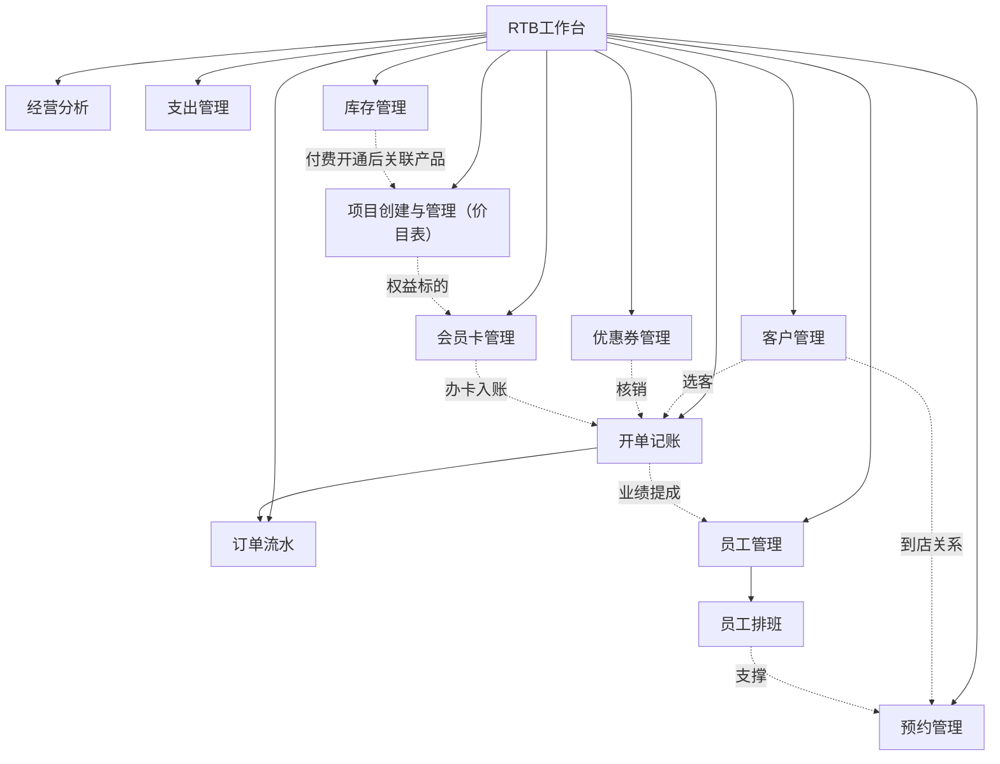
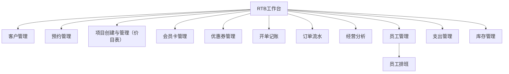
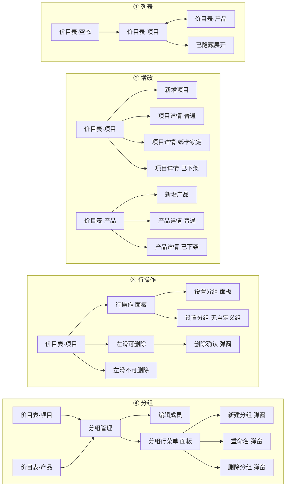
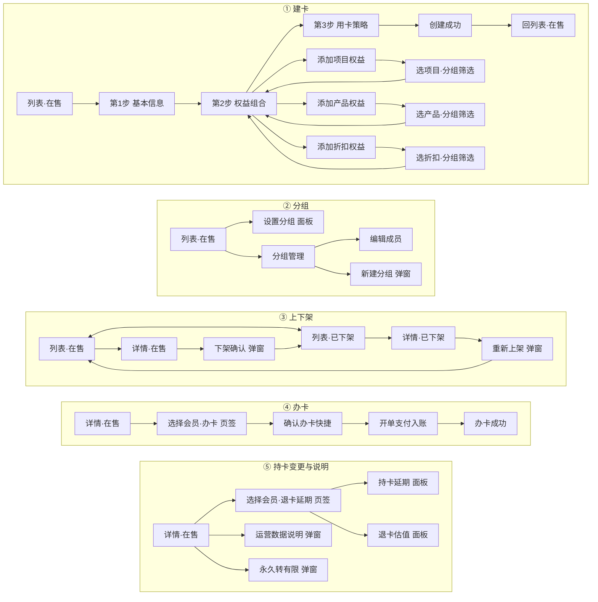
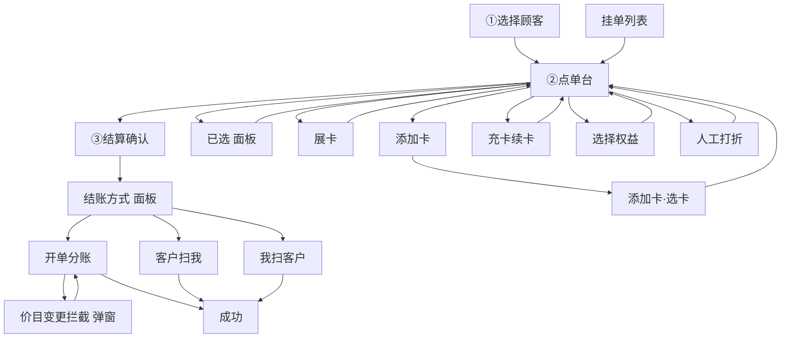
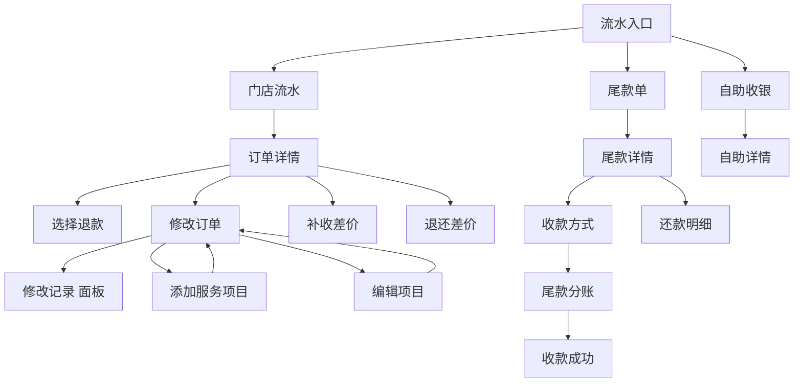
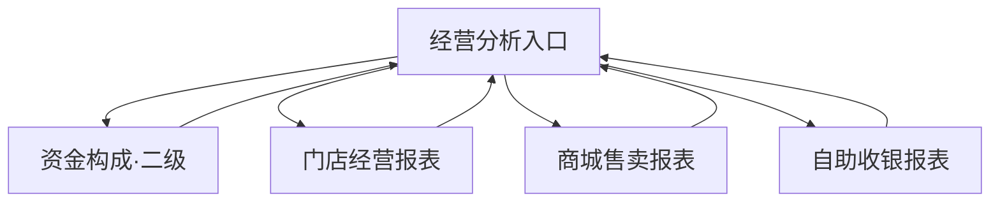
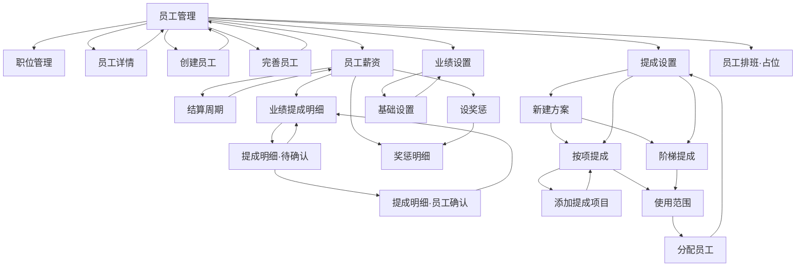
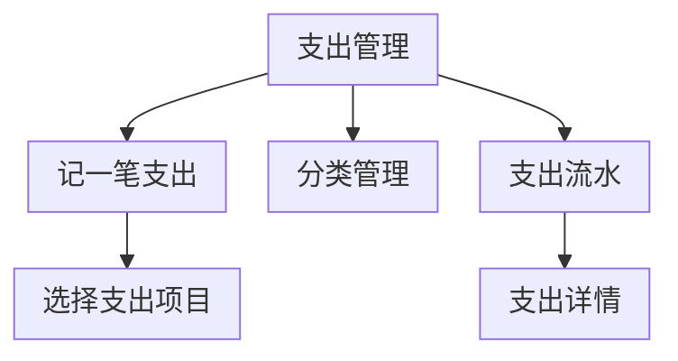
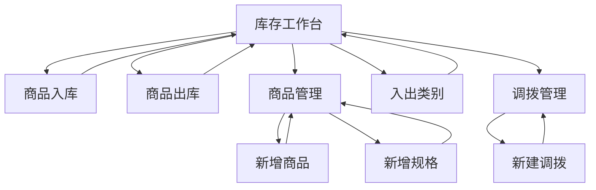

# RTB产品计划概览

## 一、产品总览

### 定位

- **产品**：剑琅联盟 · 门店经营（RTB 重构原型）
- **端**：商户端 B 端（手机框原型）
- **覆盖**：客户 · 预约 · 价目 · 会员卡 · 优惠券 · 开单 · 流水 · 经营分析 · 员工管理（含排班） · 支出管理 · 库存管理

### 模块一览

| 模块 | 节点数 | 职责 | 入口 |
| --- | ---: | --- | --- |
| RTB工作台 | 1 | 门店经营模块总入口 | 默认入口 / `?flow=workbench` |
| 客户管理 | 0 | 会员/顾客档案与到店关系（占位） | — |
| 预约管理 | 0 | 预约排程与到店衔接（占位） | — |
| 项目创建与管理（价目表） | 23 | 价目表：项目/产品创建、分组与售卖状态 | RTB工作台「价目表」 / `price-list-filled` |
| 会员卡管理 | 28 | 卡模板权益组合、办卡/延期/退卡与上下架 | RTB工作台「卡管理」 / `list-active` |
| 优惠券管理 | 0 | 优惠券发放与核销规则（占位） | — |
| 开单记账 | 17 | 选客→点单→结算→分账的开单主链路 | RTB工作台「开单」 / `bill-pick` |
| 订单流水 | 18 | 门店流水、改单退款、尾款与自助收银 | RTB工作台或开单成功后 / `flow-hub` |
| 经营分析 | 5 | 门店/商城/自助经营报表与资金构成 | RTB工作台 / `biz-hub` |
| 员工管理 | 21 | 员工档案、薪资提成、业绩与提成方案；含下级「员工排班」（占位） | RTB工作台「员工管理」 / `staff-list` |
| 支出管理 | 6 | 门店支出记账、分类与流水 | RTB工作台「支出管理」 / `expense-list` |
| 库存管理 | 9 | 付费升级能力：入出库、商品规格与门店调拨；开通后引导与价目表产品关联，实现库存与价目同步 | RTB工作台「库存管理」 / `stock-hub` |
| **合计** | **128** | 已落地 FLOW 节点（另 3 模块占位；排班计入员工管理子能力） | — |

### 模块关系（总图）



---

## 二、功能链路流程图

说明：

- 每节含 **主链路图**、**关键支线**、**页面清单速查**
- **已落地模块**：主链路为单张全量流程图，覆盖该模块附录全部 flow 节点及跳转（含面板 / 弹窗 / 拦截态）；**节点仅用中文**（英文 flow id 见下方页面清单与附录）；图内字号加大便于阅读
- **关键支线**：仅补非页面跳转的规则与约束（锁定、支付回调、付费开通等）
- **占位模块**（客户 / 预约 / 优惠券）：主链路仍为 `—`
- 完整节点表见 [五、附录](#五附录flow全量索引)；**模块关系（总图）不变**


### 2.1 RTB工作台

#### 主链路



#### 关键支线

- RTB工作台为星型分发入口；各模块可独立深链，不强制经 RTB工作台。

#### 页面清单速查

| flow id | 中文标签 | screen |
| --- | --- | --- |
| `workbench` | RTB工作台 · 入口 | `screen-workbench` |

### 2.2 客户管理

#### 主链路

—

#### 关键支线

—

#### 页面清单速查

| flow id | 中文标签 | screen |
| --- | --- | --- |
| — | — | — |

### 2.3 预约管理

#### 主链路

—

#### 关键支线

—

#### 页面清单速查

| flow id | 中文标签 | screen |
| --- | --- | --- |
| — | — | — |

### 2.4 项目创建与管理（价目表）

#### 主链路



#### 关键支线

- 绑卡项目：左滑删除锁定，详情关键字段不可误改
- 列表结构：项目 / 产品分页签；在售 → 已下架 → 已隐藏折叠
- 分组拖拽排序：隐藏相关组禁拖并有真实文案
- 新增 / 详情保存后回到对应项目或产品列表

#### 页面清单速查

| flow id | 中文标签 | screen |
| --- | --- | --- |
| `price-list-empty` | 价目表 · 空态 | `screen-p-list` |
| `price-list-filled` | 价目表 · 项目 | `screen-p-list` |
| `price-list-product` | 价目表 · 产品 | `screen-p-list` |
| `price-groups` | 价目表 · 分组管理 | `screen-p-groups` |
| `price-group-members` | 分组 · 编辑成员 | `screen-p-group-members` |
| `price-add` | 新增项目 · 空表单 | `screen-p-add` |
| `price-add-product` | 新增产品 · 空表单 | `screen-p-add` |
| `price-edit-normal` | 项目详情 · 普通 | `screen-p-edit` |
| `price-edit-bound` | 项目详情 · 绑卡锁定 | `screen-p-edit` |
| `price-edit-off-sale` | 项目详情 · 已下架 | `screen-p-edit` |
| `price-edit-product` | 产品详情 · 普通 | `screen-p-edit` |
| `price-edit-product-off-sale` | 产品详情 · 已下架 | `screen-p-edit` |
| `price-list-action` | 价目表 · 行操作 Sheet | `screen-p-list` |
| `price-list-swipe` | 价目表 · 左滑可删除 | `screen-p-list` |
| `price-list-swipe-locked` | 价目表 · 左滑不可删除 | `screen-p-list` |
| `price-list-hidden-open` | 价目表 · 已隐藏展开 | `screen-p-list` |
| `price-item-group` | 价目表 · 设置分组 Sheet | `screen-p-list` |
| `price-item-group-empty` | 设置分组 · 无自定义组 | `screen-p-list` |
| `price-group-menu` | 分组 · 行菜单 Sheet | `screen-p-groups` |
| `price-group-create` | 分组 · 新建 Dialog | `screen-p-groups` |
| `price-group-rename` | 分组 · 重命名 Dialog | `screen-p-groups` |
| `price-group-delete` | 分组 · 删除确认 Dialog | `screen-p-groups` |
| `price-item-delete` | 价目表 · 删除确认 Dialog | `screen-p-list` |

### 2.5 会员卡管理

#### 主链路



#### 关键支线

- 第2步至少配置一类权益方可进入第3步
- 持卡数 > 0 时模板关键字段锁定（见 PRD）；下架后可重上架或克隆
- 办卡付款对齐开单结账契约：支付成功回调后才入账并进入办卡成功页

#### 页面清单速查

| flow id | 中文标签 | screen |
| --- | --- | --- |
| `list-active` | 会员卡列表 · 在售 | `screen0` |
| `list-shelved` | 会员卡列表 · 已下架 | `screen0` |
| `card-groups` | 会员卡 · 分组管理 | `screen-card-groups` |
| `card-group-members` | 会员卡 · 编辑成员 | `screen-card-group-members` |
| `card-group-create` | 会员卡 · 新建分组 Dialog | `screen-card-groups` |
| `card-item-group` | 会员卡 · 设置分组 Sheet | `screen0` |
| `detail-active` | 会员卡详情 · 在售 | `screen6` |
| `detail-shelved` | 会员卡详情 · 已下架 | `screen6` |
| `create-step1` | Step1 基本信息 | `screen10` |
| `create-step2` | Step2 权益组合 | `screen9` |
| `create-step3` | Step3 用卡策略 | `screen11` |
| `create-success` | 创建成功 | `screen7` |
| `issue-success` | 办卡成功 | `screen8` |
| `pick-projects` | 添加项目权益 | `screen2` |
| `pick-projects-group` | 选项目 · 分组筛选 | `screen2` |
| `pick-products` | 添加产品权益 | `screen2p` |
| `pick-products-group` | 选产品 · 分组筛选 | `screen2p` |
| `pick-discount-list` | 添加折扣权益 | `screen4` |
| `pick-discount-group` | 选折扣 · 分组筛选 | `screen4` |
| `card-issue-new` | 选择会员 · 办卡 Tab | `screen6` |
| `card-quick-issue` | 确认办卡（快捷） | `screen-quick-issue` |
| `card-issue-holders` | 选择会员 · 退卡/延期 Tab | `screen6` |
| `card-extend` | 持卡延期 · 行内面板 | `screen6` |
| `card-refund` | 退卡估值 Sheet | `screen6` |
| `card-shelf` | 下架确认 Dialog | `screen6` |
| `card-reshelf` | 重新上架 Dialog | `screen6` |
| `card-stats-help` | 运营数据说明 Dialog | `screen6` |
| `card-unlimited-validity` | 永久转有限 Dialog | `screen6` |

### 2.6 优惠券管理

#### 主链路

—

#### 关键支线

—

#### 页面清单速查

| flow id | 中文标签 | screen |
| --- | --- | --- |
| — | — | — |

### 2.7 开单记账

#### 主链路



#### 关键支线

- 挂单 / 取挂单与点单台共用购物车态
- 价目变更拦截：分账前金额与价目不一致时阻断，确认后回到分账
- 扫码收款为结账旁路，支付成功后同样进入成功页

#### 页面清单速查

| flow id | 中文标签 | screen |
| --- | --- | --- |
| `bill-pick` | ① 选择顾客 | `screen-pick` |
| `bill-bill` | ② 点单台 | `screen-bill` |
| `bill-detail` | ③ 结算确认 | `screen-detail` |
| `bill-cart` | 已选 | `cartSheetMask` |
| `bill-checkout` | 结账方式 | `checkoutMask` |
| `bill-pay` | 开单分账 | `payMask` |
| `bill-pay-price-changed` | 价目变更拦截 Dialog | `payAmountChangedMask` |
| `bill-success` | 成功 | `screen-success` |
| `bill-scan-me` | 客户扫我 | `screen-scan-me` |
| `bill-scan-cust` | 我扫客户 | `screen-scan-cust` |
| `bill-expand` | 展卡 | `screen-bill` |
| `bill-add-card` | 添加卡 | `screen-add-card` |
| `bill-add-card-group` | 添加卡 · 选卡 | `screen-add-card-pick` |
| `bill-card-asset` | 充卡/续卡 | `screen-bill-card-asset` |
| `bill-benefit` | 选择权益 | `screen-pick-benefit` |
| `bill-discount` | 人工打折 | `screen-discount` |
| `bill-hold` | 挂单列表 | `screen-holds` |

### 2.8 订单流水

#### 主链路



#### 关键支线

- 改单保存后可能触发补收 / 退还差价，再走支付旁路
- 尾款单与门店流水并列入口，还款明细从尾款详情进入

#### 页面清单速查

| flow id | 中文标签 | screen |
| --- | --- | --- |
| `flow-hub` | 流水入口 | `screen-flow-hub` |
| `flow-list` | 门店流水 | `screen-flow-list` |
| `flow-detail` | 订单详情 | `screen-flow-detail` |
| `flow-refund` | 选择退款 | `screen-flow-refund` |
| `flow-edit` | 修改订单 | `screen-flow-edit` |
| `flow-edit-log` | 修改记录 | `flowEditLogMask` |
| `flow-edit-add` | 添加服务项目 | `screen-flow-edit-add` |
| `flow-edit-item` | 编辑项目 | `screen-flow-edit-item` |
| `flow-diff-collect` | 补收差价 | `flowDiffPayMask` |
| `flow-diff-refund` | 退还差价 | `flowDiffPayMask` |
| `flow-weikuan` | 尾款单 | `screen-flow-weikuan` |
| `flow-weikuan-detail` | 尾款详情 | `screen-flow-weikuan-detail` |
| `flow-weikuan-checkout` | 收款方式 | `weikuanCheckoutMask` |
| `flow-weikuan-pay` | 尾款分账 | `weikuanPayMask` |
| `flow-weikuan-success` | 收款成功 | `screen-flow-weikuan-success` |
| `flow-weikuan-repay` | 还款明细 | `screen-flow-weikuan-repay` |
| `flow-self` | 自助收银 | `screen-flow-self` |
| `flow-self-detail` | 自助详情 | `screen-flow-self-detail` |

### 2.9 经营分析

#### 主链路



#### 关键支线

- 三类报表与资金构成并列，无强制先后；均可从入口直达或返回入口
- 报表内页签 / 筛选项为页内态，不单独占用 FLOW 节点

#### 页面清单速查

| flow id | 中文标签 | screen |
| --- | --- | --- |
| `biz-hub` | 经营分析入口 | `screen-biz-hub` |
| `biz-pie` | 资金构成 · 二级 | `screen-biz-hub` |
| `biz-store` | 门店经营报表 | `screen-biz-store` |
| `biz-mall` | 商城售卖报表 | `screen-biz-mall` |
| `biz-self-rpt` | 自助收银报表 | `screen-biz-self-rpt` |

### 2.10 员工管理

#### 主链路



#### 关键支线

- 提成明细：店主改数须填原因 → 待确认草稿；**员工同意后才计入合计**（可驳回；店主可撤回）
- 职位权限能力点与开单 / 价目 / 卡等模块联动（见原型权限表）
- **员工排班**为下级子模块占位：班次与出勤，不单独占工作台一级入口、无 FLOW 节点

#### 页面清单速查

| flow id | 中文标签 | screen |
| --- | --- | --- |
| `staff-list` | 员工管理 | `screen-emp-list` |
| `staff-roles` | 职位管理 | `screen-emp-roles` |
| `staff-detail` | 员工详情 | `screen-emp-detail` |
| `staff-create` | 创建员工 | `screen-emp-form` |
| `staff-refine` | 完善员工 | `screen-emp-form` |
| `staff-salary` | 员工薪资 | `screen-emp-salary` |
| `staff-pay-cycle` | 结算周期 | `screen-emp-pay-cycle` |
| `staff-salary-detail` | 员工业绩提成明细 | `screen-emp-salary-detail` |
| `staff-salary-detail-pending` | 提成明细·待确认 | `screen-emp-salary-detail` |
| `staff-salary-detail-staff` | 提成明细·员工确认 | `screen-emp-salary-detail` |
| `staff-reward-detail` | 奖惩明细 | `screen-emp-reward-detail` |
| `staff-rewards` | 设奖惩 | `screen-emp-rewards` |
| `staff-ach` | 业绩设置 | `screen-emp-ach` |
| `staff-ach-adv` | 基础设置 | `screen-emp-ach` |
| `staff-comm` | 提成设置 | `screen-emp-comm` |
| `staff-comm-create` | 新建方案 | `screen-emp-comm` |
| `staff-comm-item` | 按项提成 | `screen-emp-comm-item` |
| `staff-comm-ladder` | 阶梯提成 | `screen-emp-comm-ladder` |
| `staff-comm-item-pick` | 添加提成项目 | `screen-emp-comm-scope` |
| `staff-comm-scope` | 使用范围 | `screen-emp-comm-scope` |
| `staff-comm-assign` | 分配员工 | `screen-emp-comm-assign` |
| — | 员工排班（子模块 · 占位） | — |

### 2.11 支出管理

#### 主链路



#### 关键支线

- 记一笔 / 分类 / 详情完成后均返回支出列表；选支出项目后回填到记一笔页
- 记支出旁路选择器：支付方式、经手人、日期（页内态，无独立 FLOW）
- 列表支持日期范围筛选（含自定义区间）

#### 页面清单速查

| flow id | 中文标签 | screen |
| --- | --- | --- |
| `expense-list` | 支出管理 | `screen-exp-list` |
| `expense-add` | 记一笔支出 | `screen-exp-add` |
| `expense-types` | 选择支出项目 | `screen-exp-types` |
| `expense-cats` | 分类管理 | `screen-exp-cats` |
| `expense-flow` | 支出流水 | `screen-exp-flow` |
| `expense-detail` | 支出详情 | `screen-exp-detail` |

### 2.12 库存管理

#### 主链路



#### 关键支线

- **付费升级**：未开通时入口不可用或不可见（以产品策略为准）
- 开通后引导：库存商品 ↔ 价目表「产品」关联，关联后数量/规格与价目同步
- 扫码添加入库在演示中降级为提示；选货旁路存在于导航但未列入 FLOW 地图

#### 页面清单速查

| flow id | 中文标签 | screen |
| --- | --- | --- |
| `stock-hub` | 库存工作台 | `screen-stock-hub` |
| `stock-in` | 商品入库 | `screen-stock-in` |
| `stock-out` | 商品出库 | `screen-stock-out` |
| `stock-goods` | 商品管理 | `screen-stock-goods` |
| `stock-product` | 新增商品 | `screen-stock-product` |
| `stock-sku` | 新增规格 | `screen-stock-sku` |
| `stock-types` | 入出类别 | `screen-stock-types` |
| `stock-transfer` | 调拨管理 | `screen-stock-transfer` |
| `stock-transfer-add` | 新建调拨 | `screen-stock-transfer-add` |

---

## 三、设计亮点与相对老版改进

### A. 跨模块原则

- **权益能力模型打通**：价目（项目/产品）→ 会员卡权益组合 → 开单扣减/办卡，同一套能力语义
- **演示数据同源**：卡 / 价目 / 开单 / 员工管理 / 支出管理等共用演示池，便于联调演示
- **设计规范对齐**：视觉与组件跟随剑琅联盟设计规范；原型以手机框交付
- **深链可测**：FLOW 地图节点均可 `?flow=` 直达，便于评审与截图

### B. 会员卡

- **建模**：固定「五类卡」→ **权益组合**（面值 / 项目 / 产品 / 折扣），可配出旧类型等价卡，也可配旧体系做不出的组合卡
- **创建**：固定三步 —— 基本信息 → 权益组合 → 用卡策略；Step2 至少一类权益
- **产品线**：整套取代旧系统，**非**长期双轨；旧入口本期切新体系
- **运营闭环**：列表分组、上下架、克隆、办卡（经开单支付入账）、延期、全额退卡估值
- **锁定**：持卡数 > 0 时模板关键编辑锁定；下架可重上架 / 克隆
- **历史**：旧已发卡可只读兼容；**不可**再新建旧类型卡

### C. 价目表 / 项目创建

- **定位**：整体重构覆盖旧价目/项目管理，强调 B 端 **工具属性**
- **列表**：纯信息行（名称、时长/规格、价格）；无列表配图堆叠、无行内状态列；一屏密度更高
- **结构**：项目 / 产品分 Tab；在售 → 已下架 → 已隐藏折叠
- **分组**：自定义多组、隐藏组、拖拽排序（隐藏相关禁拖并有真实文案）
- **语义映射（摘要）**：停售 → 下架；C 端隐藏 → 隐藏且开单仍可选；绑卡锁定防误删误改
- **范围**：不做列表关键词搜索、不做 FAB；库存字段不在价目表落地（见纠偏）

### D. 本版能力亮点

#### 开单记账

- 主链路清晰：选客 → 点单 → 结算确认 → 分账 → 成功
- 权益与人工打折、展卡/加卡/充续卡与点单同屏能力打通
- 挂单 / 取挂单；扫码收款双路径
- 办卡付款对齐开单结账契约（支付成功回调后才入账）

#### 订单流水

- 门店流水详情上的退款、改单、差价补退
- 尾款单完整收款链路
- 自助收银列表与详情

#### 经营分析

- 入口聚合：门店经营 / 商城售卖 / 自助收银报表
- 资金构成二级钻取

#### 员工管理 · 人效

- 档案 + 职位权限 + 薪资结算周期
- **员工排班**（子模块 · 占位）：班次与出勤安排，归员工管理下级，支撑预约到店
- 业绩设置与多种提成方案（按项 / 阶梯）及分配
- **业绩提成明细逐条展示**；店主改数须填原因，形成待确认草稿；**员工同意后才计入合计**（可驳回 / 店主可撤回）
- 奖惩独立明细与录入

#### 支出管理 / 库存管理

- 支出管理：记一笔、分类、流水、详情与日期筛选
- 库存管理：RTB工作台分发入库/出库/商品/调拨；规格与入出类别
- 库存管理为**付费升级**能力；开通后引导关联价目表「产品」，实现库存与价目同步
- 未开通时入口不可用或不可见（以产品策略为准）；价目表不内嵌库存字段

---

## 四、开发规划顺序

按**逻辑前置后置**排期，减少开发/测试中因主数据或单据缺失导致的联调空洞。前 3 项已确认锁定。

| 序 | 模块 | 前置依赖（为何在此） |
| ---: | --- | --- |
| 1 | 项目创建与管理（价目表） | 已确认 · 卡权益标的、开单点单根基 |
| 2 | 会员卡管理 | 已确认 · 依赖价目项目/产品 |
| 3 | 开单记账 | 已确认 · 依赖价目 + 卡权益扣减 |
| 4 | 客户管理 | 办卡持卡人、选客、预约/发券主数据；开单阶段可用散客顶住 |
| 5 | 员工管理（含排班） | 开单分账/业绩、权限与薪资前置；排班为下级子能力，依赖员工档案，再支撑预约 |
| 6 | 订单流水 | 依赖开单落单；退改/尾款在真实单据上测 |
| 7 | 优惠券管理 | 发放→客户；核销→开单；标的可挂已有价目 |
| 8 | 预约管理 | 依赖客户 + 员工排班（+ 价目服务项） |
| 9 | 经营分析 | 依赖流水/开单数据沉淀 |
| 10 | 支出管理 | 弱依赖交易主链；经手人可挂员工 |
| 11 | 库存管理 | 付费升级；开通后关联价目「产品」，宜主交易稳定后 |

---

## 五、附录：FLOW 全量索引

已落地 **128** 个地图节点（含浮层 / Dialog 深链态）；客户 / 预约 / 优惠券为一级占位分组，员工排班为员工管理下级占位。顺序：计划模块序（占位穿插）+ 其余与原型 FLOW 地图一致。

深链模板：

```text
http://localhost:8765/剑琅联盟-RTB重构.html?flow=<id>
http://localhost:8765/剑琅联盟-RTB重构.html?flow=<id>&capture=1
```

### RTB工作台（1）

| flow id | 中文标签 | screen |
| --- | --- | --- |
| `workbench` | RTB工作台 · 入口 | `screen-workbench` |

### 客户管理（0）

| flow id | 中文标签 | screen |
| --- | --- | --- |
| — | — | — |

### 预约管理（0）

| flow id | 中文标签 | screen |
| --- | --- | --- |
| — | — | — |

### 项目创建与管理（价目表）（23）

| flow id | 中文标签 | screen |
| --- | --- | --- |
| `price-list-empty` | 价目表 · 空态 | `screen-p-list` |
| `price-list-filled` | 价目表 · 项目 | `screen-p-list` |
| `price-list-product` | 价目表 · 产品 | `screen-p-list` |
| `price-groups` | 价目表 · 分组管理 | `screen-p-groups` |
| `price-group-members` | 分组 · 编辑成员 | `screen-p-group-members` |
| `price-add` | 新增项目 · 空表单 | `screen-p-add` |
| `price-add-product` | 新增产品 · 空表单 | `screen-p-add` |
| `price-edit-normal` | 项目详情 · 普通 | `screen-p-edit` |
| `price-edit-bound` | 项目详情 · 绑卡锁定 | `screen-p-edit` |
| `price-edit-off-sale` | 项目详情 · 已下架 | `screen-p-edit` |
| `price-edit-product` | 产品详情 · 普通 | `screen-p-edit` |
| `price-edit-product-off-sale` | 产品详情 · 已下架 | `screen-p-edit` |
| `price-list-action` | 价目表 · 行操作 Sheet | `screen-p-list` |
| `price-list-swipe` | 价目表 · 左滑可删除 | `screen-p-list` |
| `price-list-swipe-locked` | 价目表 · 左滑不可删除 | `screen-p-list` |
| `price-list-hidden-open` | 价目表 · 已隐藏展开 | `screen-p-list` |
| `price-item-group` | 价目表 · 设置分组 Sheet | `screen-p-list` |
| `price-item-group-empty` | 设置分组 · 无自定义组 | `screen-p-list` |
| `price-group-menu` | 分组 · 行菜单 Sheet | `screen-p-groups` |
| `price-group-create` | 分组 · 新建 Dialog | `screen-p-groups` |
| `price-group-rename` | 分组 · 重命名 Dialog | `screen-p-groups` |
| `price-group-delete` | 分组 · 删除确认 Dialog | `screen-p-groups` |
| `price-item-delete` | 价目表 · 删除确认 Dialog | `screen-p-list` |

### 会员卡管理（28）

| flow id | 中文标签 | screen |
| --- | --- | --- |
| `list-active` | 会员卡列表 · 在售 | `screen0` |
| `list-shelved` | 会员卡列表 · 已下架 | `screen0` |
| `card-groups` | 会员卡 · 分组管理 | `screen-card-groups` |
| `card-group-members` | 会员卡 · 编辑成员 | `screen-card-group-members` |
| `card-group-create` | 会员卡 · 新建分组 Dialog | `screen-card-groups` |
| `card-item-group` | 会员卡 · 设置分组 Sheet | `screen0` |
| `detail-active` | 会员卡详情 · 在售 | `screen6` |
| `detail-shelved` | 会员卡详情 · 已下架 | `screen6` |
| `create-step1` | Step1 基本信息 | `screen10` |
| `create-step2` | Step2 权益组合 | `screen9` |
| `create-step3` | Step3 用卡策略 | `screen11` |
| `create-success` | 创建成功 | `screen7` |
| `issue-success` | 办卡成功 | `screen8` |
| `pick-projects` | 添加项目权益 | `screen2` |
| `pick-projects-group` | 选项目 · 分组筛选 | `screen2` |
| `pick-products` | 添加产品权益 | `screen2p` |
| `pick-products-group` | 选产品 · 分组筛选 | `screen2p` |
| `pick-discount-list` | 添加折扣权益 | `screen4` |
| `pick-discount-group` | 选折扣 · 分组筛选 | `screen4` |
| `card-issue-new` | 选择会员 · 办卡 Tab | `screen6` |
| `card-quick-issue` | 确认办卡（快捷） | `screen-quick-issue` |
| `card-issue-holders` | 选择会员 · 退卡/延期 Tab | `screen6` |
| `card-extend` | 持卡延期 · 行内面板 | `screen6` |
| `card-refund` | 退卡估值 Sheet | `screen6` |
| `card-shelf` | 下架确认 Dialog | `screen6` |
| `card-reshelf` | 重新上架 Dialog | `screen6` |
| `card-stats-help` | 运营数据说明 Dialog | `screen6` |
| `card-unlimited-validity` | 永久转有限 Dialog | `screen6` |

### 优惠券管理（0）

| flow id | 中文标签 | screen |
| --- | --- | --- |
| — | — | — |

### 开单记账（17）

| flow id | 中文标签 | screen |
| --- | --- | --- |
| `bill-pick` | ① 选择顾客 | `screen-pick` |
| `bill-bill` | ② 点单台 | `screen-bill` |
| `bill-detail` | ③ 结算确认 | `screen-detail` |
| `bill-cart` | 已选 | `cartSheetMask` |
| `bill-checkout` | 结账方式 | `checkoutMask` |
| `bill-pay` | 开单分账 | `payMask` |
| `bill-pay-price-changed` | 价目变更拦截 Dialog | `payAmountChangedMask` |
| `bill-success` | 成功 | `screen-success` |
| `bill-scan-me` | 客户扫我 | `screen-scan-me` |
| `bill-scan-cust` | 我扫客户 | `screen-scan-cust` |
| `bill-expand` | 展卡 | `screen-bill` |
| `bill-add-card` | 添加卡 | `screen-add-card` |
| `bill-add-card-group` | 添加卡 · 选卡 | `screen-add-card-pick` |
| `bill-card-asset` | 充卡/续卡 | `screen-bill-card-asset` |
| `bill-benefit` | 选择权益 | `screen-pick-benefit` |
| `bill-discount` | 人工打折 | `screen-discount` |
| `bill-hold` | 挂单列表 | `screen-holds` |

### 订单流水（18）

| flow id | 中文标签 | screen |
| --- | --- | --- |
| `flow-hub` | 流水入口 | `screen-flow-hub` |
| `flow-list` | 门店流水 | `screen-flow-list` |
| `flow-detail` | 订单详情 | `screen-flow-detail` |
| `flow-refund` | 选择退款 | `screen-flow-refund` |
| `flow-edit` | 修改订单 | `screen-flow-edit` |
| `flow-edit-log` | 修改记录 | `flowEditLogMask` |
| `flow-edit-add` | 添加服务项目 | `screen-flow-edit-add` |
| `flow-edit-item` | 编辑项目 | `screen-flow-edit-item` |
| `flow-diff-collect` | 补收差价 | `flowDiffPayMask` |
| `flow-diff-refund` | 退还差价 | `flowDiffPayMask` |
| `flow-weikuan` | 尾款单 | `screen-flow-weikuan` |
| `flow-weikuan-detail` | 尾款详情 | `screen-flow-weikuan-detail` |
| `flow-weikuan-checkout` | 收款方式 | `weikuanCheckoutMask` |
| `flow-weikuan-pay` | 尾款分账 | `weikuanPayMask` |
| `flow-weikuan-success` | 收款成功 | `screen-flow-weikuan-success` |
| `flow-weikuan-repay` | 还款明细 | `screen-flow-weikuan-repay` |
| `flow-self` | 自助收银 | `screen-flow-self` |
| `flow-self-detail` | 自助详情 | `screen-flow-self-detail` |

### 经营分析（5）

| flow id | 中文标签 | screen |
| --- | --- | --- |
| `biz-hub` | 经营分析入口 | `screen-biz-hub` |
| `biz-pie` | 资金构成 · 二级 | `screen-biz-hub` |
| `biz-store` | 门店经营报表 | `screen-biz-store` |
| `biz-mall` | 商城售卖报表 | `screen-biz-mall` |
| `biz-self-rpt` | 自助收银报表 | `screen-biz-self-rpt` |

### 员工管理（21）

| flow id | 中文标签 | screen |
| --- | --- | --- |
| `staff-list` | 员工管理 | `screen-emp-list` |
| `staff-roles` | 职位管理 | `screen-emp-roles` |
| `staff-detail` | 员工详情 | `screen-emp-detail` |
| `staff-create` | 创建员工 | `screen-emp-form` |
| `staff-refine` | 完善员工 | `screen-emp-form` |
| `staff-salary` | 员工薪资 | `screen-emp-salary` |
| `staff-pay-cycle` | 结算周期 | `screen-emp-pay-cycle` |
| `staff-salary-detail` | 员工业绩提成明细 | `screen-emp-salary-detail` |
| `staff-salary-detail-pending` | 提成明细·待确认 | `screen-emp-salary-detail` |
| `staff-salary-detail-staff` | 提成明细·员工确认 | `screen-emp-salary-detail` |
| `staff-reward-detail` | 奖惩明细 | `screen-emp-reward-detail` |
| `staff-rewards` | 设奖惩 | `screen-emp-rewards` |
| `staff-ach` | 业绩设置 | `screen-emp-ach` |
| `staff-ach-adv` | 基础设置 | `screen-emp-ach` |
| `staff-comm` | 提成设置 | `screen-emp-comm` |
| `staff-comm-create` | 新建方案 | `screen-emp-comm` |
| `staff-comm-item` | 按项提成 | `screen-emp-comm-item` |
| `staff-comm-ladder` | 阶梯提成 | `screen-emp-comm-ladder` |
| `staff-comm-item-pick` | 添加提成项目 | `screen-emp-comm-scope` |
| `staff-comm-scope` | 使用范围 | `screen-emp-comm-scope` |
| `staff-comm-assign` | 分配员工 | `screen-emp-comm-assign` |

##### 下级 · 员工排班（占位 · 0）

| flow id | 中文标签 | screen |
| --- | --- | --- |
| — | 员工排班 | — |

### 支出管理（6）

| flow id | 中文标签 | screen |
| --- | --- | --- |
| `expense-list` | 支出管理 | `screen-exp-list` |
| `expense-add` | 记一笔支出 | `screen-exp-add` |
| `expense-types` | 选择支出项目 | `screen-exp-types` |
| `expense-cats` | 分类管理 | `screen-exp-cats` |
| `expense-flow` | 支出流水 | `screen-exp-flow` |
| `expense-detail` | 支出详情 | `screen-exp-detail` |

### 库存管理（9）

| flow id | 中文标签 | screen |
| --- | --- | --- |
| `stock-hub` | 库存工作台 | `screen-stock-hub` |
| `stock-in` | 商品入库 | `screen-stock-in` |
| `stock-out` | 商品出库 | `screen-stock-out` |
| `stock-goods` | 商品管理 | `screen-stock-goods` |
| `stock-product` | 新增商品 | `screen-stock-product` |
| `stock-sku` | 新增规格 | `screen-stock-sku` |
| `stock-types` | 入出类别 | `screen-stock-types` |
| `stock-transfer` | 调拨管理 | `screen-stock-transfer` |
| `stock-transfer-add` | 新建调拨 | `screen-stock-transfer-add` |
