# RTB现有产品概览

> **定位说明**：本文描述 **剑琅联盟现网老版本**（已上线商户端），与《RTB产品重构计划概览》（未上线、开发中重构原型）对照阅读。  
> **材料来源**：[剑琅联盟-功能与页面分析.md](../剑琅联盟-功能与页面分析.md)（APK 逆向 · 约 `5.0.10`）+ 前线任务快照（薛鼎 · 15 条）。链路多为 Activity 命名与 DEX 邻近引用推断，文中标注「现网推断」，**非**运行时精确跳转。  
> **快照说明**：第四章前线进度取自任务文档某一时刻，**非**实时看板。

## 一、产品总览

### 定位

- **产品**：剑琅联盟 · 门店经营（现网商户端）
- **端**：Android 原生为主 + DCloud/uni-app 混合 + 内嵌 H5
- **包体参考**：`com.jiyong.rta.next.debug` · 版本 `5.0.10`（分析样本）
- **覆盖（对照重构席位）**：客户 · 预约 · 价目（项目与产品） · 会员卡 · 优惠券 · 开单 · 流水 · 经营分析 · 员工管理（含排班能力若有则并入口径） · 支出（弱/分散） · 库存（并入项目与产品）

### 模块一览

与《RTB产品重构计划概览》**模块席位对齐**，职责与入口改为现网表述。Activity / Fragment 数为分析报告归类合计，便于感知规模（非整 App 仅 RTB）。

| 模块 | Activity | Fragment | 职责（现网） | 入口（现网） |
| --- | ---: | ---: | --- | --- |
| RTB工作台 | 25 | 26 | RTB/RTS 首页与门店经营分发（「首页与工作台」归类） | 登录开店后首页 / 工作台 |
| 客户管理 | 18 | 14 | 客户档案、标签、搜索、服务日志 | 工作台 / 客户 |
| 预约管理 | 7 | 12 | 预约日历、新建/编辑、详情、员工/项目选择 | 工作台 / 预约 |
| 项目创建与管理（价目表） | 16 | 9 | 价目列表、分类、增改；库存相关页并入本模块 | 工作台 / 项目·价目 |
| 会员卡管理 | 45 | 59 | 储值/次卡/套餐/周期卡等办退充延与权益 | 工作台 / 卡管理 |
| 优惠券管理 | 25 | 15 | Rose 券管理、核销、短信营销（含 uni-app） | 营销 / 券管理 |
| 开单记账 | 22 | 12 | 项目开单、券开单、订单确认与支付完成 | 工作台 / 开单 |
| 订单流水 | 15 | 29 | 流水单、筛选、增改流水与业绩相关页 | 工作台 / 流水 |
| 经营分析 | 13 | 8 | 营收/客流/卡项/经营类报表 | 工作台 / 报表·经营 |
| 员工管理 | 10 | 15 | 员工档案、薪资、提成规则；排班若存在则归本模块口径 | 工作台 / 员工 |
| 支出管理 | — | — | **弱存在**：分析未独立成模块；可能分散在流水/记账侧 | 待业务确认入口 |
| 库存管理 | （计入价目） | （计入价目） | **合并于「项目与产品」**：入库相关 Activity 挂价目增改链路 | 价目/产品侧库存入口 |
| **参考合计（上表有数模块）** | **约 196** | **约 175** | 仅对照席位相关归类；全包另有商城/联盟/店铺等 | — |

### 模块关系（总图）

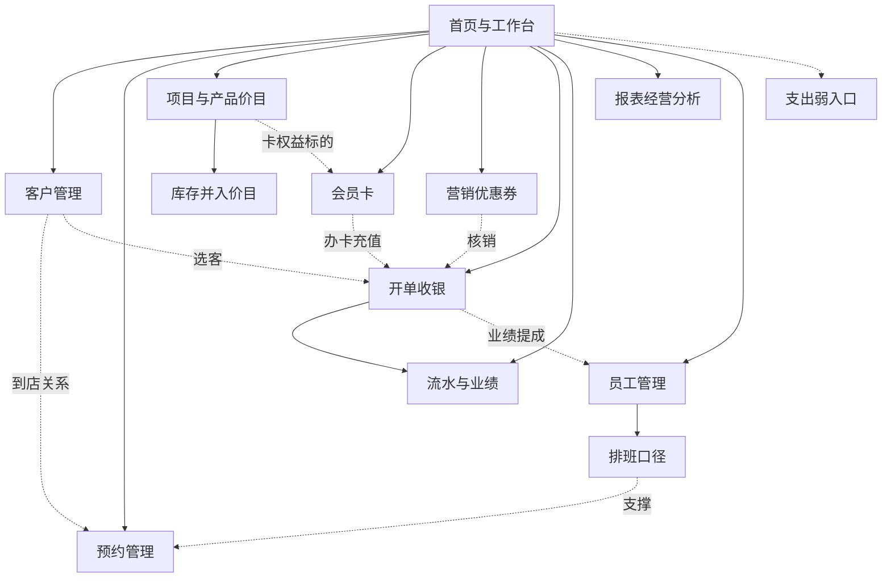

---

## 二、功能链路流程图

说明：

- 每节含 **主链路图**（分泳道）、**关键支线**、**页面清单速查**（代表性 Activity，非全量）
- 主链路节点 **仅用中文**；同能力多皮肤页（如延期蓝/橙/粉）合并为一节点；英文类名见速查表
- 链路为 **现网推断**：按 Activity/Fragment 名归组，非运行时精确跳转
- 完整模块规模见 [五、附录](#五附录现网模块与页面规模对照)

### 2.1 RTB工作台

#### 主链路

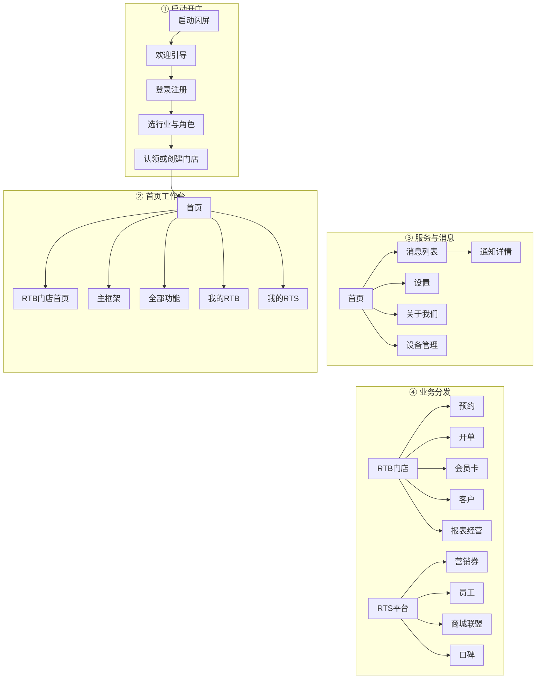

#### 关键支线

- 现网为 **RTB 门店业务 + RTS 平台能力** 双栈分发，规模大于重构原型「纯 RTB 工作台」。
- 深链以原生 Activity 跳转为主，无重构原型的 `?flow=` 地图。
- 现网推断。

#### 页面清单速查

| 代表页面 | 说明 |
| --- | --- |
| SplashActivity / Login 相关 | 启动与登录 |
| ClaimStoreActivity | 认领/创建门店 |
| RtbHomeActivity / MainActivity / HomeFragment | 首页与主框架 |
| AllFunctionsActivity | 全部功能 |
| MessageActivity / NotificationDetailActivity | 消息 |
| SettingActivity / DeviceManagementActivity | 设置与设备 |
| MyRtbFragment / MyRtsFragment | RTB / RTS 分发 |

### 2.2 客户管理

#### 主链路

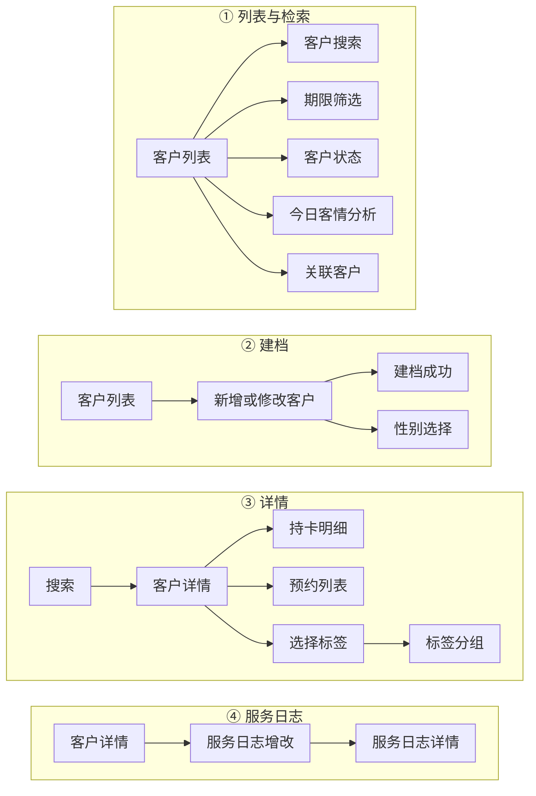

#### 关键支线

- 开单侧可走散客；前线：散客默认性别等问题见第四章。
- 另有好友搜索、门店分享搜客、推荐新客等交叉页，图中未全铺。
- 现网推断。

#### 页面清单速查

| 代表页面 | 说明 |
| --- | --- |
| CustomersActivity / RtbCustomerListActivity | 客户列表 |
| RtbCustomerSearchActivity / TermScreenActivity | 搜索与筛选 |
| RtbCustomerAddOrModifyActivity | 新增/修改 |
| CustomerDetailActivity | 客户详情 |
| SelectLabelActivity | 标签 |
| AddOrEditServiceLogActivity / ServiceLogDetailsActivity | 服务日志 |
| CustomerStatusActivity / TodayCustomerAnalysisActivity | 状态与今日分析 |
| AssociatedCustomersActivity | 关联客户 |

### 2.3 预约管理

#### 主链路

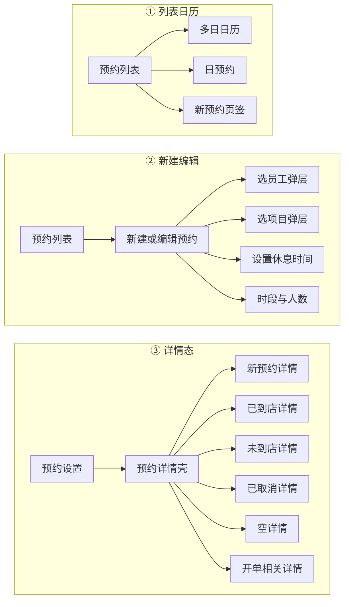

#### 关键支线

- 前线诉求：预约成功后店铺消息通知（待开始，见第四章）。
- 详情多 Fragment 态按命名归组，跳转边为推断。
- 现网推断。

#### 页面清单速查

| 代表页面 | 说明 |
| --- | --- |
| AppointmentListActivity / AppointmentActivity | 列表入口 |
| MultiCalendarActivity | 多日日历 |
| AppointmentSetActivity / AppointmentSetFragment | 新建/编辑 |
| DialogFragmentAppointmentEmployee / Project | 选员工/项目 |
| AppointmentDetailActivity + 各详情 Fragment | 详情多状态 |
| SetBreakTimeFragment / TimeAndNumberOfPeopleSetFragment | 休息与人数时段 |

### 2.4 项目创建与管理（价目表）

#### 主链路

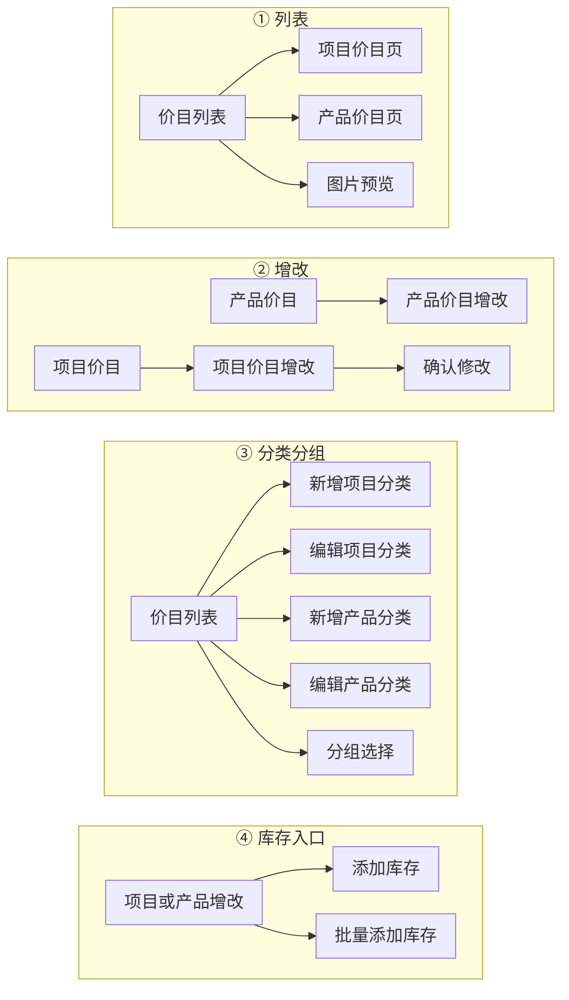

#### 关键支线

- 现网「项目与产品」同时承载价目与部分库存入口；独立库存席位见 2.12。
- 前线已完成：绑卡后改项目名、大类选错可改等（见第四章）。
- 商城/联盟侧项目详情等交叉页未全铺。
- 现网推断。

#### 页面清单速查

| 代表页面 | 说明 |
| --- | --- |
| ProjectPriceListActivity | 价目列表 |
| ProjectPriceFragment / ProductPriceFragment | 项目/产品 Tab |
| ProjectPriceAddModifyActivity / ProductPriceAddModifyActivity | 增改 |
| AddProjectCategoryActivity / ProjectEditCategoryActivity | 项目分类 |
| AddProductCategoryActivity / ProductEditCategoryActivity | 产品分类 |
| ProjectGroupSelectFragment | 分组选择 |
| …AddInventory… / …AddInventoryMany… | 库存（并入） |
| PreviewImageActivity | 图片预览 |
| ConfirmProjectModifyFragment | 确认修改 |

### 2.5 会员卡管理

#### 主链路

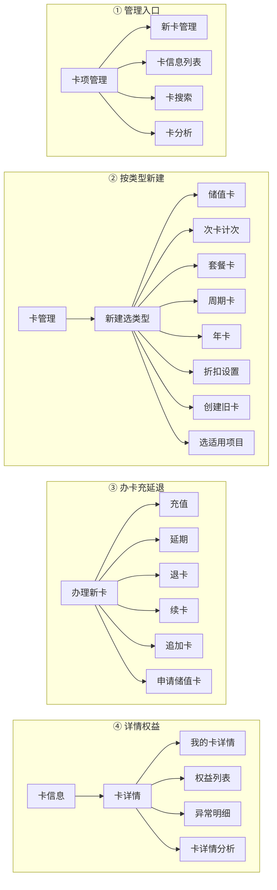

#### 关键支线

- 充值/延期/退卡等存在多色皮肤 Activity，图中 **合并为单节点**。
- 卡种 Fragment 详情（储值/次卡/套餐/周期等）归入「卡详情」能力，不逐类型展开。
- 前线：项目减金额已完成；开单侧计次/权益入口走新版开单（进行中）。
- 现网推断。

#### 页面清单速查

| 代表页面 | 说明 |
| --- | --- |
| CardManageActivity / NewCardManageActivity | 卡管理 |
| AddCardActivity / JiCiCardAddActivity / PackageCardActivity / CycleCardActivity / CreateYearCardActivity | 按类型新建 |
| SelectApplicableItemsActivity | 适用项目 |
| HandNewCardActivity / RtbHandleCardActivity / ApplyForStoredValueCardActivity | 办卡 |
| CardRechargeActivity / CardDelayActivity / RefundCardActivity / ContinuationCardActivity | 充/延/退/续（含皮肤变体） |
| CardDetailActivity / MyCardDetailActivity / CardInformationListActivity | 详情与列表 |
| CardSearchActivity / CardAnalysisActivity | 搜索与分析 |
| AppendCardActivity / CreateOldCardActivity / DiscountSettingActivity | 追加/旧卡/折扣 |

### 2.6 优惠券管理

#### 主链路

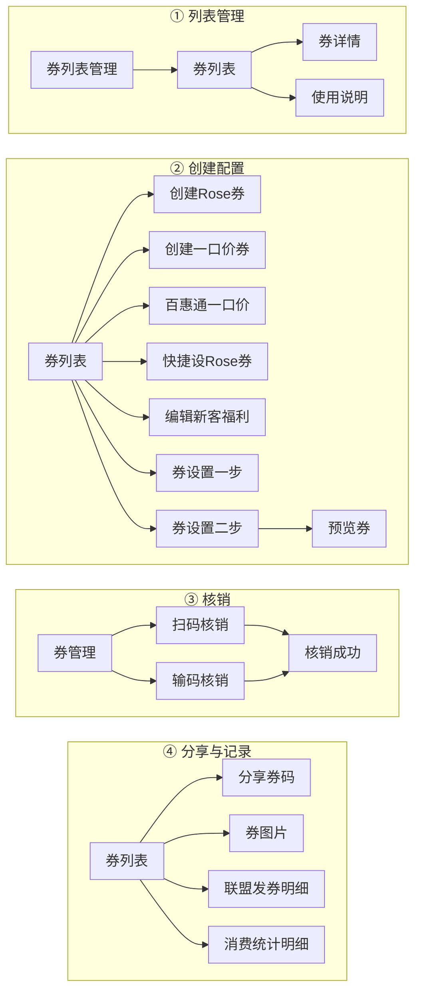

#### 关键支线

- uni-app 营销短信为独立子包（模版/待发送/历史等），本图不展开。
- 前线：美发师无优惠券设置 → 已关闭（产品设计如此）。
- 现网推断。

#### 页面清单速查

| 代表页面 | 说明 |
| --- | --- |
| CouponListManagerActivity / CouponListActivity | 列表管理 |
| CreateRoseCouponActivity / CreateOnePriceCouponActivity / CreateBaiHuiTongOnePriceCouponActivity | 创建 |
| QuicklySetRoseCouponActivity / EditCouponNewWelfareActivity | 快捷/新客福利 |
| CouponSetOneActivity / CouponSetTwoActivity / PreviewCouponActivity | 设置与预览 |
| ScanQrVerifyActivity / InputVerifyActivity / CouponVerifySuccessActivity | 核销 |
| ShopShareCouponQrActivity / CouponPictureActivity | 分享与图片 |
| AllianceCouponSendDetailActivity | 联盟发券 |
| uni-app 营销短信路由 | 短信子包 |

### 2.7 开单记账

#### 主链路

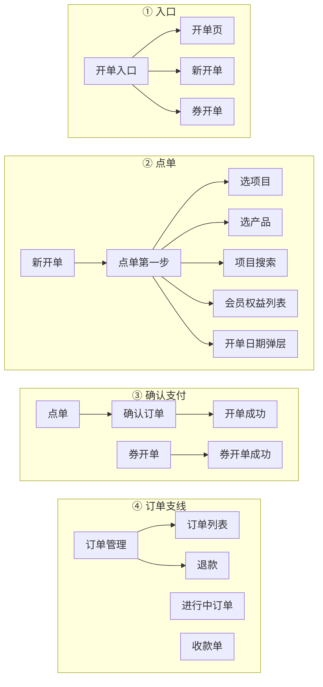

#### 关键支线

- 现网步骤偏「先选项目再扣卡结账」；前线多条开单体验需求指向 **新版开单（预计 9 月）**。
- 散客性别默认等见第四章待确认。
- 支付第三方页（微信/支付宝入口）未画入主图。
- 现网推断。

#### 页面清单速查

| 代表页面 | 说明 |
| --- | --- |
| RtbBillActivity / RtbBillingActivity / RtbBillNewActivity | 开单入口/页 |
| BillingFirstActivity + Project/Product Fragment | 点单 |
| ProjectSearchActivity / MemberShipCardRightsListActivity | 搜索与权益 |
| BillingSecondActivity | 确认订单 |
| BillingSuccessfulActivity / VoucherBillingSuccessfulActivity | 成功 |
| VoucherBillingActivity | 券开单 |
| OrderManageActivity / OrderRefundActivity / RunningOrderActivity | 订单与退款 |
| CollectionBillActivity | 收款单 |

### 2.8 订单流水

#### 主链路

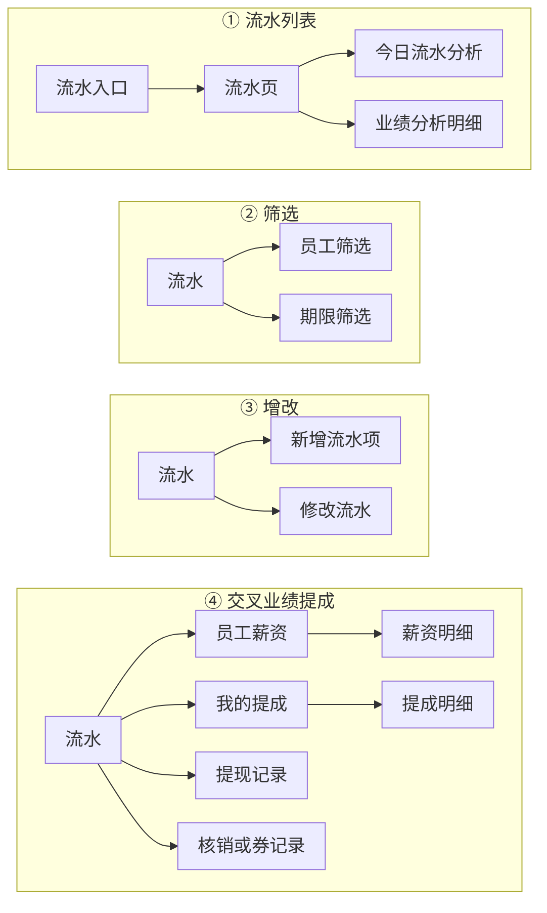

#### 关键支线

- 「流水与业绩」分析归类含薪资/提成/券记录；与员工模块交叉，图中单独泳道标出。
- 前线：老板端点员工看提成等见第四章。
- 现网推断。

#### 页面清单速查

| 代表页面 | 说明 |
| --- | --- |
| TurnoversActivity / WaterActivity | 流水入口 |
| WaterEmployeeActivity / WaterTermScreenActivity | 筛选 |
| WaterAddItemActivity / WaterModifyActivity | 增改 |
| TodayTurnoverAnalysisActivity / PerformanceAnalysisDetailReportActivity | 分析 |
| EmployeeSalaryActivity / MyCommissionActivity / CommissionDetailsActivity | 薪资提成交叉 |
| WithdrawalsRecordActivity | 提现记录 |
| CouponVerifyRecordsActivity / CouponRecordActivity | 券记录交叉 |

### 2.9 经营分析

#### 主链路

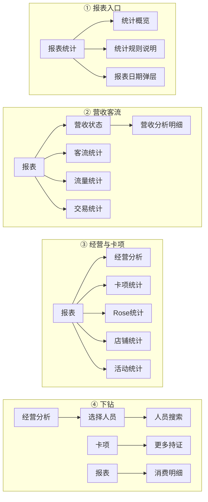

#### 关键支线

- 前线：首页「门店经营/业绩构成/项目排名」跳转期望跟首页改版（待确认）。
- 首页经营分析 Fragment 与报表模块交叉。
- 现网推断。

#### 页面清单速查

| 代表页面 | 说明 |
| --- | --- |
| ReportFormStatisticsActivity / StatisticsFragment | 报表入口 |
| StatisticsOverviewFragment / StatisticsPassengerFlowFragment | 概览与客流 |
| RevenueStatusActivity / RevenueAnalysisDetailReportActivity | 营收 |
| BusinessAnalysisActivity / ManagementAnalysisFragment | 经营分析 |
| StatisticsCardsFragment / StatisticsRoseActivity / StatisticsActivity | 卡项/Rose/店铺统计 |
| ChoosePersonnelActivity / PersonnelSearchActivity / MoreHoldingSecuritiesActivity | 下钻 |
| ActivityStatisticsActivity / ConsumeDetailFragment | 活动与消费明细 |

### 2.10 员工管理（含排班口径）

#### 主链路

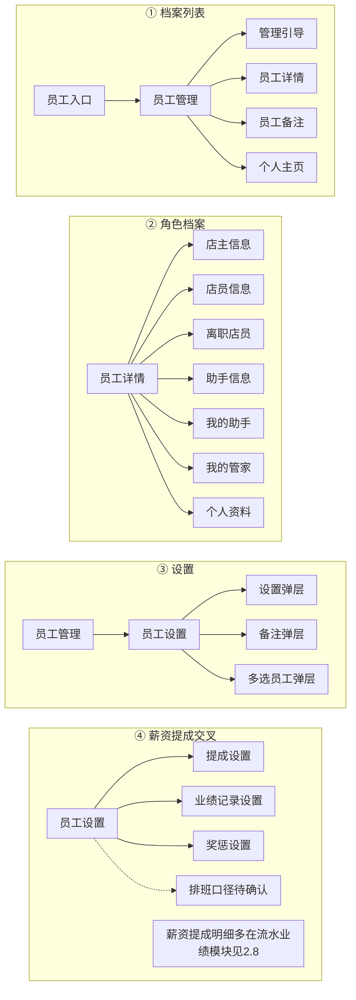

#### 关键支线

- 员工模块 Activity 偏档案/设置；**薪资明细、提成明细、奖惩详情** 大量 Fragment 落在「流水与业绩」归类，见 2.8 交叉泳道。
- 「员工排班」现网材料未单独成章；节点保留为待确认口径。
- 前线：自定义结算周期等进行中/待确认（第四章）。
- 现网推断。

#### 页面清单速查

| 代表页面 | 说明 |
| --- | --- |
| EmployeeActivity / EmployeeManageFragment | 员工入口 |
| EmployeeDetailActivity + 各角色 Info Fragment | 详情与角色 |
| EmployeeSettingActivity / EmployeeSettingDlgActivity | 设置 |
| PersonalActivity + PersonalProfile* | 个人主页/资料 |
| EmployeeNotesActivity | 备注 |
| EmployeeSettingCommissionFragment / Record* / Punish* | 提成业绩奖惩设置 |
| EmployeeSalary* / Commission*（流水模块） | 明细交叉见 2.8 |

### 2.11 支出管理

#### 主链路

—

#### 关键支线

- APK 模块地图 **无独立「支出管理」归类**；可能弱入口或并入流水/其他记账。
- 对照重构席位保留；待业务确认现网入口后可补链路。

#### 页面清单速查

| 代表页面 | 说明 |
| --- | --- |
| — | 弱/待确认 |

### 2.12 库存管理

#### 主链路

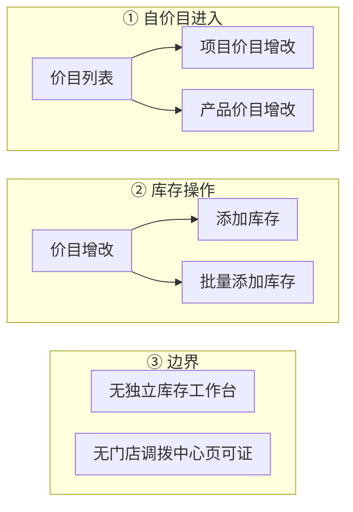

#### 关键支线

- 现网库存能力 **挂在项目与产品/价目增改**，非重构计划中的独立付费库存工作台。
- 「无调拨中心」仅表示分析归类中未见对应 Activity，不排除其他入口。
- 现网推断。

#### 页面清单速查

| 代表页面 | 说明 |
| --- | --- |
| ProjectPriceAddModifyActivity / ProductPriceAddModifyActivity | 价目增改入口 |
| ProjectPriceAddModifyAddInventoryActivity | 加库存 |
| ProjectPriceAddModifyAddInventoryManyActivity | 批量加库存 |

---

## 三、现网能力与已知痛点摘要

### A. 跨模块原则（现网）

- **双栈**：门店 RTB + 平台 RTS（商城/联盟/部分营销）并存，心智与入口比重构原型更重。
- **卡种驱动**：会员卡按类型（储值/次卡/套餐/周期等）铺页面，规模大、组合能力受类型约束。
- **开单路径偏长**：常见先选项目再匹配扣卡；前线明确要求缩短步骤，由新版开单承接。
- **价目与库存耦合**：库存页挂在价目增改，而非独立库存中心。

### B. 相对重构方向的差距（摘要）

| 维度 | 现网倾向 | 重构计划倾向（对照） |
| --- | --- | --- |
| 会员卡 | 固定卡类型体系 | 权益组合建模，取代旧类型长期双轨 |
| 价目 | 传统列表/分类/库存字段混入 | 工具化列表、状态分层、库存独立付费模块 |
| 开单 | 步骤多、卡项后置感强 | 选客→点单→结算→分账；卡与权益同屏 |
| 工作台 | RTB+RTS 大入口 | 聚焦门店经营模块星型分发 |

### C. 已知痛点（来自前线，详见第四章）

- **开单体验**：计次/权益入口、步骤过多 → 进行中（新版开单 · 预计 9 月）
- **首页报表跳转**：期望进详情而非仅业绩板块 → 待确认（跟首页改版）
- **员工提成**：自定义结算周期、明细可读性、老板端下钻 → 进行中/待确认
- **散客性别默认**：默认女可改 → 待确认
- **预约通知**：成功后店铺消息 → 待开始
- **已关闭/暂不修**：美发师无券设置（设计如此）；减少开单签名次数、积分兑换 → 暂不修复

---

## 四、前线反馈与处理进度

来源：前线任务文档（负责人 **薛鼎** · 共 **15** 条）。  
**汇总**：进行中 4 · 待确认 4 · 待开始 1 · 已完成 3 · 已关闭 1 · 暂不修复 2；**待办 9**（进行中+待确认+待开始）；**无延期项**。  
快照非实时看板。

### 4.1 进行中（4）

| 序号 | 问题描述 | 门店 | 类型 | 处理进度 | 关联模块 |
| ---: | --- | --- | --- | --- | --- |
| 1 | 计次卡模版变成项目模版，次数在开单时直接更改 | 臻美坊 | 需求 | 新版开单可先选卡再操作适用项目，预计 9 月上线 | 开单 / 会员卡 |
| 2 | 开单时增加会员具体已有权益购买内容列的入口 | 臻美坊 | 需求 | 同上，预计 9 月上线 | 开单 / 会员卡 |
| 3 | 开单步骤多，需先选项目再选对应扣卡项结账 | 臻美坊 | 需求 | 同上，预计 9 月上线 | 开单 |
| 4 | 员工业绩提成薪资支持自定义日期范围结算周期 | 高美丝造型 | 需求 | （无今日进展） | 员工 |

### 4.2 待确认（4）

| 序号 | 问题描述 | 门店 | 类型 | 处理进度 | 关联模块 |
| ---: | --- | --- | --- | --- | --- |
| 5 | 首页「门店经营/业绩构成/项目排名」跳转业绩板块而非详情页 | 销售体验 | 需求 | leon：跟首页改版来做 | 工作台 / 经营分析 |
| 6 | 员工业绩提成明细时间模块颜色需要加深 | 艾美造型（喜哥） | 优化 | （无） | 员工 / 流水 |
| 7 | 散客大部分为男性但开单默认被选为女性 | 艾美造型（喜哥） | 优化 | 系统默认女性可手动修改，沿用上次散客性别 | 开单 / 客户 |
| 8 | 老板端门店业绩页应可直接点击员工查看业绩提成 | 艾美造型（喜哥） | 需求 | 如何更方便地看到（待确认方案） | 经营分析 / 员工 |

### 4.3 待开始（1）

| 序号 | 问题描述 | 门店 | 类型 | 处理进度 | 关联模块 |
| ---: | --- | --- | --- | --- | --- |
| 9 | 预约成功后店铺增加消息通知功能 | 艾美造型（喜哥） | 需求 | 推送（待开始） | 预约 / 消息 |

### 4.4 已完成（3）

| 序号 | 问题描述 | 门店 | 类型 | 处理进度 | 关联模块 |
| ---: | --- | --- | --- | --- | --- |
| 10 | 会员卡增加项目减金额的设置 | 高美丝造型 | 需求 | 已完成 | 会员卡 |
| 11 | 项目已添加为卡项后，修改项目名称无法修改 | 销售体验 | 优化 | 已完成 | 价目 / 会员卡 |
| 12 | 设置项目时选错所属项目大类无法更改 | 销售体验 | 优化 | 已完成 | 价目 |

### 4.5 已关闭（1）

| 序号 | 问题描述 | 门店 | 类型 | 处理进度 | 关联模块 |
| ---: | --- | --- | --- | --- | --- |
| 13 | 美发师没有优惠券设置功能 | 艾美造型（喜哥） | 需求 | 已关闭（产品设计如此） | 优惠券 |

### 4.6 暂不修复（2）

| 序号 | 问题描述 | 门店 | 类型 | 处理进度 | 关联模块 |
| ---: | --- | --- | --- | --- | --- |
| 14 | 优化会员收银系统逻辑，减少开单及签名次数 | 臻美坊 | 优化 | 暂不修复 | 开单 |
| 15 | 积分功能可兑换商品/抵扣 | 销售体验 | 需求 | 暂不修复（按产品发展优先级） | 营销 / 其他 |

---

## 五、附录：现网模块与页面规模对照

摘自《剑琅联盟-功能与页面分析》模块明细（分析样本包）；**不**复制全量 Activity 清单。与第一章对照席位的映射见下。

### 5.1 应用概览（分析样本）

| 项 | 值 |
| --- | --- |
| 应用名 | 剑琅联盟开发版 |
| 包名 | `com.jiyong.rta.next.debug` |
| 版本 | `5.0.10` (500010) |
| 业务 Activity / Fragment | 341 / 274 |
| Manifest Activity | 306 |
| uni-app / 内嵌 H5 | 10 / 16 |

### 5.2 模块规模（分析归类）

| 分析模块名 | Activity | Fragment | 对照本文席位 |
| --- | ---: | ---: | --- |
| 首页与工作台 | 25 | 26 | RTB工作台 |
| 客户管理 | 18 | 14 | 客户管理 |
| 预约管理 | 7 | 12 | 预约管理 |
| 项目与产品 | 16 | 9 | 价目表 + 库存（并入） |
| 会员卡 | 45 | 59 | 会员卡管理 |
| 营销优惠券 | 25 | 15 | 优惠券管理 |
| 开单收银 | 22 | 12 | 开单记账 |
| 流水与业绩 | 15 | 29 | 订单流水（含业绩交叉） |
| 报表统计 | 13 | 8 | 经营分析 |
| 员工管理 | 10 | 15 | 员工管理 |
| （无独立归类） | — | — | 支出管理（弱） |
| 商城与联盟 / 店铺与认证 / 登录与开店 等 | 见原报告 | 见原报告 | 超出 RTB 对照席位，本文不展开 |

### 5.3 与重构文档的读法

- 需要 **现网是什么、前线卡在哪** → 读本文。  
- 需要 **重构原型 FLOW、设计亮点、开发顺序** → 读《RTB产品重构计划概览》。  
- 需要 **Activity 全量列表** → 读仓库根目录《剑琅联盟-功能与页面分析.md》第七节。
