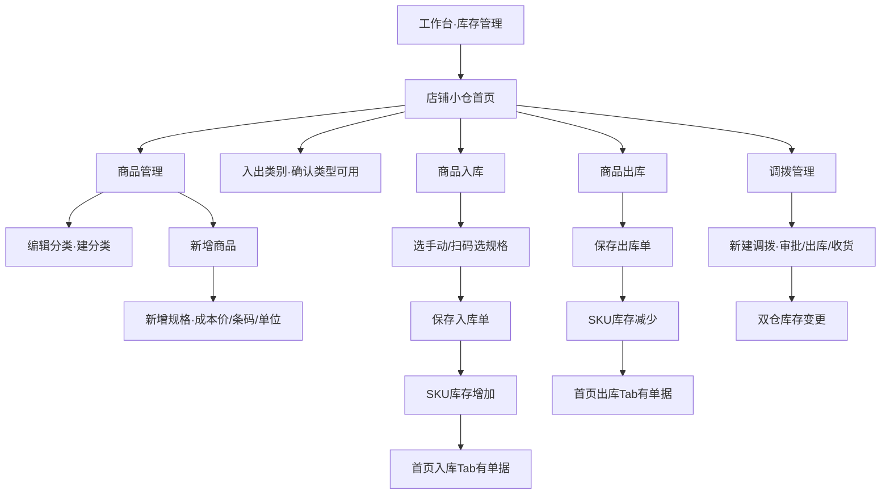

# 库存管理（店铺小仓）功能链路逻辑分析

| 字段 | 内容 |
|------|------|
| 环境 | MuMu · 剑琅联盟开发版 `com.jiyong.rta.next.debug` v5.0.10 |
| 容器 | Uni-app / DCUniMP（WebView） |
| 当前视角 | **店铺小仓（总部）** |
| 当前门店上下文 | 悦颜美肌管理中心(旗舰版体验店) |
| 分析日期 | 2026-08-03 |
| 证据目录 | `card/_figma_chk/stock_explore/`（截图 + UI dump） |
| 造数 | 曾写入商品名草稿 `RTB_TEST_STOCK_A/B`；分类弹层输入受 WebView 限制未成功落库；**未完成真实出入库单据**（无可用商品） |

**标注约定**

- **[已验证]**：界面上直接看到的文案/结构/路由  
- **[强推断]**：由字段/提示/状态机可合理推出，但未跑通保存  
- **[未验证]**：需有数据后才能确认  

---

## 1. 入口与信息架构

工作台「库存管理」进入后，主壳为 **店铺小仓**（总部视角），路由：`pages/index/index`。

```
店铺小仓（总部）
 ├─ 快捷入口（5）
 │    ├─ 商品入库 → pages/wareHouse/index
 │    ├─ 商品出库 → pages/outWarehouse/index
 │    ├─ 调拨管理 → pages/allotStock/index
 │    ├─ 商品管理 → pages/goodsList/index
 │    └─ 入出类别 → pages/stockType/index
 ├─ 搜索：商品 / 规格名称 / 规格编码（可扫码）
 └─ Tab：入库 | 出库  → 单据列表（当前空态「暂无数据~」）
```

**[已验证]** 首页空态时，列表区仅空图 +「暂无数据~」；搜索与 Tab 仍可见。

---

## 2. 核心对象模型（从 UI 反推）

| 对象 | 说明 | 关键字段（已见） |
|------|------|----------------|
| 仓库 / 小仓 | 总部视角下可对多店操作 | 入库/出库「门店」；调拨「调出/调入仓库」 |
| 商品 | 库存商品主档（**小仓自己的商品**，非价目表项目） | 名称*、是否使用、分类*、多规格*、备注 |
| 规格（SKU） | 商品下多规格；出入库最小单位 | 规格名称*、规格条码、成本价、单位（默认 ml） |
| 商品分类 | 商品必选分类；可「编辑分类 / 新增分类」 | 分类名称 |
| 入出类别 | 单据业务类型字典 | 类型名称、入库/出库、是否可用 |
| 入库单 | 增加库存 | 门店、类别、商品行、日期、备注 |
| 出库单 | 减少库存 | 门店、类别、商品行、日期、备注 |
| 调拨单 | 仓间移动 + 审批流痕迹 | 调出/调入仓、经办人、清单、状态 |

**[强推断]** 库存数量挂在 **规格（SKU）× 仓库** 上；列表「现库存总额：…元」说明还按成本价汇总金额。

**[已验证 · 与价目表关系]** 本模块商品主档字段（条码、成本价、单位、规格）与 RTB「价目表·产品」的名称/价格/选填库存 **不是同一套表单**。是否后端与价目 `stock` 打通 **[未验证]**；当前 UI 无「同步价目表」入口。

---

## 3. 功能链路分述

### 3.1 商品管理 `pages/goodsList/index`

**[已验证]**

- 标题：商品管理（总部）  
- 搜索：商品/规格名称  
- 汇总条：`现库存总额：` + 金额 + `元`  
- 底栏：`编辑分类` | `新增商品`  
- 空态时无商品行  

**编辑分类** → `pages/cateList/index`  
- 空态「暂无数据」+ 底栏「新增分类」  
- 弹层「新增分类」：分类名称 →「完成」  
- **[未验证]** 创建成功后的列表/排序/删除  

**新增商品** → `pages/handleProduct/index`  

| 字段 | 必填 | 备注 |
|------|:----:|------|
| 商品名称 | ✓ | |
| 是否使用 | — | Switch，默认开 |
| 商品分类 | ✓ | 进分类列表选择；无分类则需先建 |
| 商品多规格型号 | ✓ | 「新增规格」 |
| 备注 | — | |

**新增规格** → `pages/handleSku/index`  

| 字段 | 必填 | 备注 |
|------|:----:|------|
| 规格名称 | ✓ | |
| 规格条码 | — | 可扫 |
| 成本价 | — | |
| 单位 | — | 默认 `ml`（可改 **[未验证]**） |

**[已验证]** 首次进规格有「操作提示」：

> 点击已创建的规格可进入该规格详情页面编辑；  
> **注：未进行出入库的规格可以操作**

**[强推断] 规格编辑锁**

- 规格一旦发生过入库/出库 → 不可再改（或不可删）  
- 未出入库的规格可进详情编辑  

选择商品页（入库/出库手动添加）引导层说明 **[已验证]**：

- 左侧分类（示意：默认 / 其他）  
- 可选「单个规格」或「单商品下全选规格」  

---

### 3.2 商品入库 `pages/wareHouse/index`

**[已验证]** 标题「入库（总部）」；横幅「您正在入库～」

| 字段 | 默认/示例 | 操作 |
|------|-----------|------|
| 入库门店 | 悦颜美肌管理中心(旗舰版体验店) | 可重选 **[强推断]** |
| 入库类别 | 正常入库 | 来自入出类别·入库 |
| 添加商品 | — | 扫码添加 / 手动添加 |
| 入库日期 | 当天（如 2026-08-03） | 日期选择 **[强推断]** |
| 备注 | 空 | |
| 保存 | 底栏 | |

**手动添加** → `pages/chooseProduct/index`「选择商品（总部）」  
- 搜索商品/规格名称；右上「+」可直达新增商品  
- 空态「暂无商品」；底栏「确定」  
- 首次有图文引导层，点「知道了」关闭  

**[强推断] 保存逻辑**

1. 校验门店、类别、至少一行商品及数量  
2. 写入库单；按规格增加对应仓库库存  
3. 首页「入库」Tab 出现单据；商品管理「现库存总额」上升  
4. 涉及规格进入「已出入库」态，编辑受限  

**[未验证]** 数量字段 UI、超限、负库存、保存失败 toast。

---

### 3.3 商品出库 `pages/outWarehouse/index`

结构与入库对称 **[已验证]**：

- 标题「出库（总部）」；「您正在出库～」  
- 出库门店 / **出库类别**（默认 **销售出库**）  
- 扫码添加 / 手动添加 / 出库日期 / 备注 / 保存  

**[强推断]** 保存扣减规格库存；库存不足时拦截（文案未捕获）。

---

### 3.4 入出类别 `pages/stockType/index`

Tab：**入库 | 出库**；底栏「新增」→ `pages/addType/index`「新增类别（总部）」  

新增类别字段 **[已验证]**：类型名称、出库/入库（切换）、保存。

#### 预置·入库类型（均已启用）**[已验证]**

| 名称 |
|------|
| 正常入库 |
| 采购入库 |
| 退货入库 |
| 调拨入库 |
| 调拨退回入库 |

#### 预置·出库类型（均已启用）**[已验证]**

| 名称 |
|------|
| 销售出库 |
| 损耗出库 |
| 调拨出库 |

每条展示：类型名称、入库/出库、是否可用（已启用）。  

**[强推断]**

- 「调拨入库/出库/退回」多由调拨流程自动选用，手工单也可能可选  
- 「是否可用」关闭后单据类别选择器中隐藏  
- 预置类型是否允许改名/删除 **[未验证]**  

---

### 3.5 调拨管理 `pages/allotStock/index`

**[已验证]**

- 搜索：调拨单号  
- 「新建调拨」→ `pages/allotStock/addStock/index`  
- Tab/筛选入口：调拨入库 | 调拨出库 | 筛选  

**新建调拨（总部）**

基本信息：

| 字段 | 必填 | 备注 |
|------|:----:|------|
| 调出仓库 | ✓ | |
| 调入仓库 | ✓ | |
| 经办人 | ✓ | 默认当前账号名（如「王静」） |
| 备注 | — | 0/200 |

调拨清单：

| 列 | 含义 |
|----|------|
| 名称 | 规格/商品 |
| 单位 | |
| **调出方库存** | 按调出仓实时库存 |
| **申请调拨数** | 申请数量 |
| 操作 | 移除行等 |

空态「暂无商品」；「添加商品」加行；底栏「保存」。

**调拨筛选** **[已验证]**

- 申请时间（开始/结束）  
- 调拨仓库：从「调出仓库」调拨到「调入仓库」  
- 调拨状态：待审批、已撤回、已驳回、出库中、拒收退回、已完成  
- 调入时间（开始/结束）  
- 重置 | 保存  

**[强推断] 调拨状态机**

```
新建保存 → 待审批
  ├─ 撤回 → 已撤回
  ├─ 驳回 → 已驳回
  └─ 通过 → 出库中 →（收货/拒收）
                 ├─ 完成 → 已完成（调出减、调入加）
                 └─ 拒收退回 → 拒收退回（库存回滚或退回入库）
```

细节（是否锁库存、是否自动生成入出类别单据）**[未验证]**。

---

## 4. 端到端主路径（目标态）



**最小造数顺序（建议）**

1. 商品管理 → 编辑分类 → 新增分类  
2. 新增商品 → 选分类 → 新增规格（名称/成本价）→ 保存商品  
3. 商品入库 → 手动添加规格 → 填数量 → 保存  
4. 再测出库 / 调拨 / 首页列表 / 「未出入库才可编辑规格」  

---

## 5. 业务规则清单

| # | 规则 | 来源 |
|---|------|------|
| R1 | 库存操作最小单位是 **规格（SKU）**，不是仅商品名 | 选品引导、清单列 |
| R2 | 商品必须有分类与至少一规格才能完整使用 **[强推断]** | 表单必填 * |
| R3 | **未出入库的规格才可编辑** | 规格页操作提示 |
| R4 | 入库/出库必须带门店 + 类别 + 商品行 + 日期 | 表单结构 |
| R5 | 入出类别分入库/出库两套，可启用；系统预置多种 | 入出类别页 |
| R6 | 调拨必填双仓、经办人；清单看调出方库存与申请数 | 新建调拨 |
| R7 | 调拨有审批/出库/拒收/完成等状态 | 筛选状态枚举 |
| R8 | 「现库存总额」按金额汇总（成本价×数量）**[强推断]** | 商品管理汇总条 |
| R9 | 总部视角可代操作门店小仓 | 标题均带「（总部）」 |
| R10 | 与价目表 `stock` 的同步：本 UI **未暴露**；是否共数待联调 | 对比 RTB 价目原型 |

---

## 6. 路由一览（已捕获）

| 页面 | route |
|------|-------|
| 小仓首页 | `pages/index/index` |
| 入库 | `pages/wareHouse/index` |
| 出库 | `pages/outWarehouse/index` |
| 选择商品 | `pages/chooseProduct/index` |
| 新增/编辑商品 | `pages/handleProduct/index` |
| 新增/编辑规格 | `pages/handleSku/index` |
| 分类列表 | `pages/cateList/index` |
| 商品管理 | `pages/goodsList/index` |
| 入出类别 | `pages/stockType/index` |
| 新增类别 | `pages/addType/index` |
| 调拨列表 | `pages/allotStock/index` |
| 新建调拨 | `pages/allotStock/addStock/index` |

---

## 7. 本次未跑通项（限制）

1. WebView 弹层「新增分类」`adb input text` 无法稳定写入 → **无分类 → 无法保存完整商品**  
2. 无规格库存 → **无法验证入库/出库/调拨保存与库存扣加**  
3. 门店/类别选择器点击未稳定打开二级列表（dump 仍停在表单页）  
4. 规格「操作提示」遮罩未点「知道了」时，底层单位等字段未完全采集（单位默认 `ml` 已见）  

---

## 8. 对 RTB「价目表·库存」预埋关联的启示

| 点 | 建议 |
|----|------|
| 主数据 | 小仓以 **规格 SKU** 管库存；价目以 **产品** 管售卖价与开单限购。对接时需明确映射键（产品 id / 规格 id / 条码） |
| 数量语义 | 开单限购的 `stock` 应对齐「可售库存」而非在途/锁定库存 **[强推断]** |
| 写入权 | 上线后库存变更应以小仓入出库/调拨为主；价目表单是否仍可手工改数需产品决策（PRD 8.1 已留口） |
| 编辑锁 | 小仓「已出入库规格不可改」与价目「绑卡锁定」是不同锁；勿混用 |

---

## 9. 结论

「库存管理」在开发版中是完整 **店铺小仓** 子系统：主数据（分类→商品→规格）+ 入出类别字典 + 入出库单据 + 带审批态的调拨 + 首页入出库流水。  
本次在空仓总部视角下，**UI/路由/预置类别/调拨状态枚举/规格编辑锁提示** 已摸清；**真实库存加减与价目表打通** 需先成功建分类+规格再复测。

如需下一步：可在模拟器里手动建好一个 `RTB_` 分类+规格后告知，我继续把入库→出库→调拨全链路补成「已验证」。
